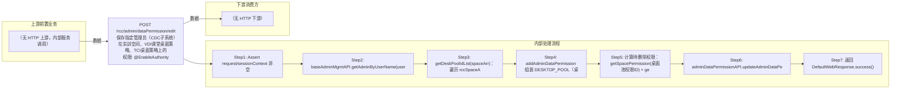

# POST /rcc/admin/dataPermission/edit

> 保存指定管理员（CDC子系统）在实训空间、VDI课堂桌面策略、TCI桌面策略上的数据权限，全量覆盖更新 ｜ @EnableAuthority ｜ sync

## 依赖关系全景图

## 接口基本信息

| 项目 | 内容 |
|---|---|
| URL | /rcc/admin/dataPermission/edit |
| Controller | RccAdminDataPermissionController |
| 方法名 | editDataPermission |
| 权限注解 | @EnableAuthority |
| 执行方式 | sync |
| 业务含义 | 保存指定管理员（CDC子系统）在实训空间、VDI课堂桌面策略、TCI桌面策略上的数据权限，全量覆盖更新 |

## 入参详情

### AdminDataPermissionRequest

| 参数名 | 类型 | 必填 | 约束 | 说明 |
|---|---|---|---|---|
| userName | String | 是 | @NotBlank 非空 | 目标管理员用户名 |
| spaceArr | UUID[] | 否 | @Nullable 可为空 | 授予权限的实训空间ID数组 |
| lessonDeskStrategyArr | UUID[] | 否 | @Nullable 可为空 | VDI课堂桌面策略ID数组 |
| tciDeskStrategyIdArr | UUID[] | 否 | @Nullable 可为空 | TCI课程桌面策略ID数组 |

## 出参详情

| 返回类型 | DefaultWebResponse |
|---|---|
| 说明 | 成功返回 SUCCESS；失败返回 status/msgKey |

## 上游前置业务

> 本接口上游为服务端内部调用（非 HTTP 端点）：
> - 
## 内部处理流程

### 处理流程

1. Assert request/sessionContext 非空
2. baseAdminMgmtAPI.getAdminByUserName(userName, SubSystem.CDC) 查管理员，为 null 抛 DataPermissionBusinessKey.RCDC_RCC_ADMIN_NOT_EXIST
3. getDeskPoolIdList(spaceArr)：遍历 rccSpaceAPI.findAllSpace()，过滤出 spaceId 在 spaceArr 中的桌面池ID
4. addAdminDataPermission 组装 DESKTOP_POOL（桌面池）、DESKTOP_STRATEGY（lessonDeskStrategyArr、tciDeskStrategyIdArr）三类 CreateAdminDataPermissionRequest
5. 计算待删除权限：getSpacePermission(桌面池权限ID) + getDeskStrategyPermission(策略组权限ID)
6. adminDataPermissionAPI.updateAdminDataPermission(adminId, 新增列表, 删除列表) 全量覆盖
7. 返回 DefaultWebResponse.success()

## 下游消费方

（本接口数据主要被自身/关联接口消费，或经 SPI 通知）
## 接口参数约束分析

| 层级 | 参数 | 规则 | 失败结果 |
|---|---|---|---|
| request | userName | @NotBlank 非空 | webmvc 参数校验异常 |
| business | userName | 管理员必须存在于CDC子系统 | rcdc_rcc_admin_not_exist |

## 参数取值策略

| 参数 | 策略 | 说明 |
|---|---|---|
| userName | user_input/from_query | 按业务构造 |
| spaceArr | user_input/from_query | 按业务构造 |
| lessonDeskStrategyArr | user_input/from_query | 按业务构造 |
| tciDeskStrategyIdArr | user_input/from_query | 按业务构造 |

## 成功/失败断言基准

> 该接口为纯操作接口（Builder.success() 无 content body），断言以 HTTP 响应为准：status==SUCCESS + content 为空。无 content body（数据权限全量更新）

### 成功场景

| 场景 | 断言点 |
|---|---|
| 管理员存在且spaceArr/策略数组包含有效ID | $.status==SUCCESS；content 为空；权限按新增+删除全量更新完成 |

### 失败场景

| 场景 | 触发条件 | 断言点 |
|---|---|---|
| 管理员不存在 | userName 对应用户在CDC不存在 | $.status==ERROR；$.msgKey==rcdc_rcc_admin_not_exist，不执行任何更新 |
| spaceArr 中空间无对应桌面池 | findAllSpace 结果不含该空间或桌面池为null | 该空间被跳过（返回null整体被忽略） |

## 环境清理机制

| 接口 | 说明 |
|---|---|
| 无对应 HTTP 清理接口 | 本接口为授权操作接口，不创建可清理资源；无对应 HTTP 删除接口 |

## 前置状态和幂等性标注

| 维度 | 结论 |
|---|---|
| 幂等性 | low |
| 说明 | 每次提交都全量重建权限集；重复提交相同参数结果一致，但实现上先删后增，存在瞬时中间态 |
