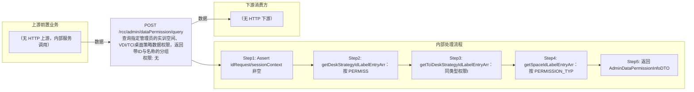

# POST /rcc/admin/dataPermission/query

> 查询指定管理员的实训空间、VDI/TCI桌面策略数据权限，返回带ID与名称的分组条目 ｜ 无特殊权限 ｜ sync

## 依赖关系全景图

## 接口基本信息

| 项目 | 内容 |
|---|---|
| URL | /rcc/admin/dataPermission/query |
| Controller | RccAdminDataPermissionController |
| 方法名 | queryPermission |
| 权限注解 | 无 |
| 执行方式 | sync |
| 业务含义 | 查询指定管理员的实训空间、VDI/TCI桌面策略数据权限，返回带ID与名称的分组条目 |

## 入参详情

### IdRequest

| 参数名 | 类型 | 必填 | 约束 | 说明 |
|---|---|---|---|---|
| id | UUID | 是 | @NotNull 非空 | 管理员ID |

## 出参详情

| 返回类型 | DefaultWebResponse<AdminDataPermissionInfoDTO> |
|---|---|

| 字段 | 类型 | 说明 |
|---|---|---|
| lessonDeskStrategyArr | GroupIdLabelEntry[] | VDI桌面策略授权项（id+label） |
| tciDeskStrategyIdArr | GroupIdLabelEntry[] | TCI桌面策略授权项（id+label） |
| spaceArr | GroupIdLabelEntry[] | 实训空间授权项（id+label） |

## 上游前置业务

> 本接口上游为服务端内部调用（非 HTTP 端点）：
> - 
## 内部处理流程

### 处理流程

1. Assert idRequest/sessionContext 非空
2. getDeskStrategyIdLabelEntryArr：按 PERMISSION_TYPE_STRATEGY_GROUP 查权限ID，VDI查名称组装 lessonDeskStrategyArr
3. getTciDeskStrategyIdLabelEntryArr：同类型权限ID经TCI API组装 tciDeskStrategyIdArr
4. getSpaceIdLabelEntryArr：按 PERMISSION_TYPE_DESKTOP_POOL 查权限ID，遍历 findAllSpace 组装 spaceArr
5. 返回 AdminDataPermissionInfoDTO

## 下游消费方

（本接口数据主要被自身/关联接口消费，或经 SPI 通知）
## 接口参数约束分析

| 层级 | 参数 | 规则 | 失败结果 |
|---|---|---|---|
| request | id | @NotNull 非空 | webmvc 参数校验异常 |

## 参数取值策略

| 参数 | 策略 | 说明 |
|---|---|---|
| id | user_input/from_query | 按业务构造 |

## 成功/失败断言基准

### 成功场景

| 场景 | 断言点 |
|---|---|
| 管理员存在且已配置权限 | $.status==SUCCESS；$.content != null（AdminDataPermissionInfoDTO 对象） |
| 管理员无任何权限 | $.status==SUCCESS；对应数组字段为 null/空 |

### 失败场景

| 场景 | 触发条件 | 断言点 |
|---|---|---|
| 策略批量查询失败 | findByIds 抛 BusinessException | 捕获并返回空列表 |

## 环境清理机制

| 接口 | 说明 |
|---|---|
| 无对应 HTTP 清理接口 | 本接口为纯查询接口，不创建可清理资源；无对应 HTTP 删除接口 |

## 前置状态和幂等性标注

| 维度 | 结论 |
|---|---|
| 幂等性 | high |
| 说明 | 纯查询接口，无副作用 |
