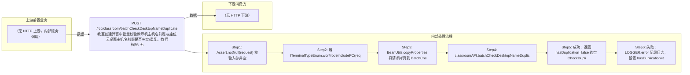

# POST /rcc/classroom/batchCheckDesktopNameDuplicate

> 教室创建弹窗中批量校验教师机主机名前缀与座位云桌面主机名前缀是否冲突/重复。教师机为非PC工作模式时教师机主机名前缀必填（为空抛 RCDC_RCC_CLASSROOM_TEACHER_PRE_NAME_MUST_NOT_BE_NULL），随后将入参拷贝为 BatchCheckDesktopNameDTO 调 classroomAPI.batchCheckDesktopNameDuplicate 做前缀冲突校验；冲突时接口仍返回成功，但 data.hasDuplication=true 并携带 i18n 错误消息。 ｜ 无特殊权限 ｜ 同步

## 依赖关系全景图

## 接口基本信息

| 项目 | 内容 |
|---|---|
| URL | /rcc/classroom/batchCheckDesktopNameDuplicate |
| Controller | RccClassroomConfigController |
| 方法名 | batchCheckDesktopNameDuplicate |
| 权限注解 | 无 |
| 执行方式 | 同步 |
| 业务含义 | 教室创建弹窗中批量校验教师机主机名前缀与座位云桌面主机名前缀是否冲突/重复。教师机为非PC工作模式时教师机主机名前缀必填（为空抛 RCDC_RCC_CLASSROOM_TEACHER_PRE_NAME_MUST_NOT_BE_NULL），随后将入参拷贝为 BatchCheckDesktopNameDTO 调 classroomAPI.batchCheckDesktopNameDuplicate 做前缀冲突校验；冲突时接口仍返回成功，但 data.hasDuplication=true 并携带 i18n 错误消息。 |

## 入参详情

### BatchCheckDesktopNameRequest

| 参数名 | 类型 | 必填 | 约束 | 说明 |
|---|---|---|---|---|
| desktopPreName | String | 是 | @NotNull @Size(max=9) | 学生机座位名前缀 |
| desktopNameStartNum | Integer | 是 | @NotNull @Range(min=1, max=65535) | 云桌面主机名起始值 |
| studentModeArr | TerminalTypeEnum[] | 是 | @NotNull | 学生机工作模式数组 |
| desktopNum | Integer | 否 | @Nullable @Range(min=1, max=1000) | 座位数量 |
| teacherPreName | String | 否 | @Nullable；教师机非PC模式时逻辑必填 | 教师机主机名前缀 |
| teacherMode | TerminalTypeEnum | 是 | @NotNull | 教师机工作模式 |

## 出参详情

| 返回类型 | DefaultWebResponse（data=CheckDuplicationResultDTO） |
|---|---|

| 字段 | 类型 | 说明 |
|---|---|---|
| hasDuplication | Boolean | 是否存在主机名前缀冲突（默认 false） |
| errorMsg | String | 冲突 i18n 错误消息 |

## 上游前置业务

（无上游数据依赖）
## 内部处理流程

### 处理流程

1. Assert.notNull(request) 校验入参非空
2. 若 !TerminalTypeEnum.worModeIncludePC(request.getTeacherMode()) 且 teacherPreName 为空，抛 BusinessException(RCDC_RCC_CLASSROOM_TEACHER_PRE_NAME_MUST_NOT_BE_NULL)
3. BeanUtils.copyProperties 将请求拷贝到 BatchCheckDesktopNameDTO
4. classroomAPI.batchCheckDesktopNameDuplicate(dto) 执行前缀冲突校验
5. 成功：返回 hasDuplication=false 的空 CheckDuplicationResultDTO
6. 失败：LOGGER.error 记录日志，设置 hasDuplication=true、errorMsg=e.getI18nMessage()，仍返回成功响应

## 下游消费方

（本接口数据主要被自身/关联接口消费，或经 SPI 通知）
## 接口参数约束分析

| 层级 | 参数 | 规则 | 失败结果 |
|---|---|---|---|
| PARAM | desktopPreName | @NotNull @Size(max=9) | 非空/长度超9校验失败 |
| PARAM | desktopNameStartNum | @NotNull @Range(1-65535) | 越界校验失败 |
| PARAM | studentModeArr | @NotNull | 缺失校验失败 |
| PARAM | teacherMode | @NotNull | 缺失校验失败 |
| BUSINESS | teacherPreName | 教师机非PC模式（worModeIncludePC=false）时必填 | 抛 RCDC_RCC_CLASSROOM_TEACHER_PRE_NAME_MUST_NOT_BE_NULL |
| BUSINESS | teacherPreName/desktopPreName | 前缀不得与已有教室/桌面冲突 | 抛 RCDC_RCC_CLASSROOM_TEACHER_PRE_NAME_EXIST / _CONFLICT_SEAT 等，接口以 hasDuplication=true 返回 |

## 参数取值策略

| 参数 | 策略 | 说明 |
|---|---|---|
| desktopPreName | user_input/from_query | 按业务构造 |
| desktopNameStartNum | user_input/from_query | 按业务构造 |
| studentModeArr | user_input/from_query | 按业务构造 |
| desktopNum | user_input/from_query | 按业务构造 |
| teacherPreName | user_input/from_query | 按业务构造 |
| teacherMode | user_input/from_query | 按业务构造 |

## 成功/失败断言基准

### 成功场景

| 场景 | 断言点 |
|---|---|
| 传入无冲突的座位名前缀与主机名前缀 | $.status=="SUCCESS"；$.content.hasDuplication==false |

### 失败场景

| 场景 | 触发条件 | 断言点 |
|---|---|---|
| 教师机为非PC模式且 teacherPreName 为空 | teacherMode=TCI/IDV 等非PC模式，teacherPreName 缺省 | status==ERROR；msgKey==RCDC_RCC_CLASSROOM_TEACHER_PRE_NAME_MUST_NOT_BE_NULL |
| 教师机主机名前缀与已有座位名冲突 | 前缀已被其他教室使用 | $.status=="SUCCESS"；$.content.hasDuplication==true；$.content.errorMsg 非空 |

## 环境清理机制

| 接口 | 说明 |
|---|---|
| 本接口创建的资源 | 通过对应 delete 接口清理 |

## 前置状态和幂等性标注

| 维度 | 结论 |
|---|---|
| 幂等性 | HIGH |
| 说明 | 只读校验接口，重复调用无副作用 |
