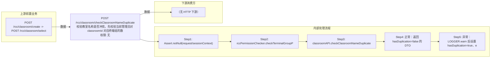

# POST /rcc/classroom/checkClassroomNameDuplicate

> 校验教室名称是否冲突。先校验当前管理员对 classroomId 对应终端组的数据权限（classroomId 可为空，创建场景传空），再调 classroomAPI.checkClassroomNameDuplicate 校验名称是否与已有教室重复；异常时仍返回成功但 hasDuplication=true 并携带 i18n 错误。 ｜ 无特殊权限 ｜ 同步

## 依赖关系全景图

## 接口基本信息

| 项目 | 内容 |
|---|---|
| URL | /rcc/classroom/checkClassroomNameDuplicate |
| Controller | RccClassroomConfigController |
| 方法名 | checkClassroomNameDuplicate |
| 权限注解 | 无 |
| 执行方式 | 同步 |
| 业务含义 | 校验教室名称是否冲突。先校验当前管理员对 classroomId 对应终端组的数据权限（classroomId 可为空，创建场景传空），再调 classroomAPI.checkClassroomNameDuplicate 校验名称是否与已有教室重复；异常时仍返回成功但 hasDuplication=true 并携带 i18n 错误。 |

## 入参详情

### ParamVerifiedNameWebRequest

| 参数名 | 类型 | 必填 | 约束 | 说明 |
|---|---|---|---|---|
| classroomId | UUID | 否 | @Nullable | 教室ID（编辑场景必传，创建场景可空） |
| classroomName | String | 是 | @NotNull | 待校验的教室名称 |

## 出参详情

| 返回类型 | DefaultWebResponse（data=ResponseHasDuplicateDTO） |
|---|---|

| 字段 | 类型 | 说明 |
|---|---|---|
| hasDuplication | Boolean | 名称是否重复（默认 false） |
| errorMsg | String | 重复时的 i18n 错误消息 |

## 上游前置业务

### 前置1：POST /rcc/classroom/create -> POST /rcc/classroom/select

create 为异步批任务，响应为 BatchTaskSubmitResult 不直接返回 ID；实际经 select 按名称查询 content[0].classroomId（由 field_map 契约映射）
## 内部处理流程

### 处理流程

1. Assert.notNull(request/sessionContext)
2. rccPermissionChecker.checkTerminalGroupPermissionByClassroomId([request.getClassroomId()], sessionContext) 数据权限校验
3. classroomAPI.checkClassroomNameDuplicate(request) 校验名称重复
4. 正常：返回 hasDuplication=false 的 DTO
5. 异常：LOGGER.warn 后设置 hasDuplication=true、errorMsg=e.getI18nMessage()，返回成功响应

## 下游消费方

（本接口数据主要被自身/关联接口消费，或经 SPI 通知）
## 接口参数约束分析

| 层级 | 参数 | 规则 | 失败结果 |
|---|---|---|---|
| PARAM | classroomName | @NotNull | 缺失时校验失败 |
| BUSINESS | classroomId | 教室必须存在且管理员有终端组数据权限 | 权限不足抛数据权限异常（非空 classroomId 时） |
| BUSINESS | classroomName | 与已有教室名称不重复（排除自身） | 抛 RCDC_RCC_CLASSROOM_NAME_DUPLICATION，接口以 hasDuplication=true 返回 |

## 参数取值策略

| 参数 | 策略 | 说明 |
|---|---|---|
| classroomId | user_input/from_query | 按业务构造 |
| classroomName | user_input/from_query | 按业务构造 |

## 成功/失败断言基准

### 成功场景

| 场景 | 断言点 |
|---|---|
| 名称未被占用 | $.status=="SUCCESS"；$.content.hasDuplication==false |

### 失败场景

| 场景 | 触发条件 | 断言点 |
|---|---|---|
| 名称已被其他教室占用 | classroomName 与其他教室同名 | $.status=="SUCCESS"；$.content.hasDuplication==true；$.content.errorMsg 非空 |
| 管理员无该教室终端组权限 | classroomId 指向无权限教室 | status==ERROR；msgKey==RCDC_SAPCE_DATA_PERMISSION_DENIED |

## 环境清理机制

| 接口 | 说明 |
|---|---|
| 本接口创建的资源 | 通过对应 delete 接口清理 |

## 前置状态和幂等性标注

| 维度 | 结论 |
|---|---|
| 幂等性 | HIGH |
| 说明 | 只读校验，无副作用 |
