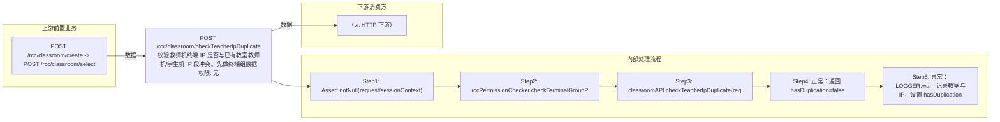

# POST /rcc/classroom/checkTeacherIpDuplicate

> 校验教师机终端 IP 是否与已有教室教师机/学生机 IP 段冲突。先做终端组数据权限校验（classroomId 可空），再调 classroomAPI.checkTeacherIpDuplicate 校验；冲突时返回 hasDuplication=true 与错误消息。 ｜ 无特殊权限 ｜ 同步

## 依赖关系全景图

## 接口基本信息

| 项目 | 内容 |
|---|---|
| URL | /rcc/classroom/checkTeacherIpDuplicate |
| Controller | RccClassroomConfigController |
| 方法名 | checkTeacherIpDuplicate |
| 权限注解 | 无 |
| 执行方式 | 同步 |
| 业务含义 | 校验教师机终端 IP 是否与已有教室教师机/学生机 IP 段冲突。先做终端组数据权限校验（classroomId 可空），再调 classroomAPI.checkTeacherIpDuplicate 校验；冲突时返回 hasDuplication=true 与错误消息。 |

## 入参详情

### ParamVerifiedIpWebRequest

| 参数名 | 类型 | 必填 | 约束 | 说明 |
|---|---|---|---|---|
| classroomId | UUID | 否 | @Nullable | 教室ID（编辑场景必传，创建场景可空） |
| teacherIp | String | 是 | @NotNull | 教师机终端IP |

## 出参详情

| 返回类型 | DefaultWebResponse（data=ResponseHasDuplicateDTO） |
|---|---|

| 字段 | 类型 | 说明 |
|---|---|---|
| hasDuplication | Boolean | IP是否冲突（默认 false） |
| errorMsg | String | 冲突的 i18n 错误消息 |

## 上游前置业务

### 前置1：POST /rcc/classroom/create -> POST /rcc/classroom/select

create 为异步批任务，响应为 BatchTaskSubmitResult 不直接返回 ID；实际经 select 按名称查询 content[0].classroomId（由 field_map 契约映射）
## 内部处理流程

### 处理流程

1. Assert.notNull(request/sessionContext)
2. rccPermissionChecker.checkTerminalGroupPermissionByClassroomId([request.getClassroomId()], sessionContext)
3. classroomAPI.checkTeacherIpDuplicate(request) 校验教师机IP
4. 正常：返回 hasDuplication=false
5. 异常：LOGGER.warn 记录教室与IP，设置 hasDuplication=true、errorMsg=e.getI18nMessage()

## 下游消费方

（本接口数据主要被自身/关联接口消费，或经 SPI 通知）
## 接口参数约束分析

| 层级 | 参数 | 规则 | 失败结果 |
|---|---|---|---|
| PARAM | teacherIp | @NotNull | 缺失校验失败 |
| BUSINESS | teacherIp | 教师机IP不得与已有教室教师机/学生机IP段冲突 | 抛 RCDC_RCC_CLASSROOM_IP_HAS_USED 等，接口以 hasDuplication=true 返回 |

## 参数取值策略

| 参数 | 策略 | 说明 |
|---|---|---|
| classroomId | user_input/from_query | 按业务构造 |
| teacherIp | user_input/from_query | 按业务构造 |

## 成功/失败断言基准

### 成功场景

| 场景 | 断言点 |
|---|---|
| 教师机IP未被占用 | $.status=="SUCCESS"；$.content.hasDuplication==false |

### 失败场景

| 场景 | 触发条件 | 断言点 |
|---|---|---|
| 教师机IP已被其他教室占用 | teacherIp 与已有教室冲突 | $.status=="SUCCESS"；$.content.hasDuplication==true；$.content.errorMsg 非空 |

## 环境清理机制

| 接口 | 说明 |
|---|---|
| 本接口创建的资源 | 通过对应 delete 接口清理 |

## 前置状态和幂等性标注

| 维度 | 结论 |
|---|---|
| 幂等性 | HIGH |
| 说明 | 只读校验，无副作用 |
