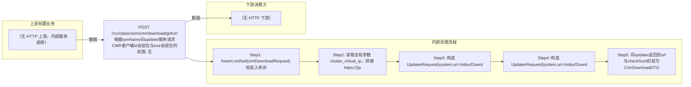

# POST /rcc/classroom/cmr/download/getUrl

> 根据rpmName向updater服务请求CMR客户端bt安装包与exe安装包的下载地址及校验值，返回给CMR客户端进行下载 ｜ 无特殊权限 ｜ sync

## 依赖关系全景图

## 接口基本信息

| 项目 | 内容 |
|---|---|
| URL | /rcc/classroom/cmr/download/getUrl |
| Controller | CmrDownloadController |
| 方法名 | getDownloadUrl |
| 权限注解 | 无 |
| 执行方式 | sync |
| 业务含义 | 根据rpmName向updater服务请求CMR客户端bt安装包与exe安装包的下载地址及校验值，返回给CMR客户端进行下载 |

## 入参详情

### CmrDownloadRequest

| 参数名 | 类型 | 必填 | 约束 | 说明 |
|---|---|---|---|---|
| rpmName | String | 是 | @NotNull，rpm包名 | 要查询下载地址的rpm包名称 |

## 出参详情

| 返回类型 | DefaultWebResponse<CmrDownloadDTO> |
|---|---|

| 字段 | 类型 | 说明 |
|---|---|---|
| btUrl | String | bt格式安装包下载地址 |
| btCheckSum | String | bt文件校验值 |
| exeUrl | String | 客户端exe文件下载地址 |
| exeCheckSum | String | 客户端exe文件校验值 |

## 上游前置业务

> 本接口上游为服务端内部调用（非 HTTP 端点）：
> - 
## 内部处理流程

### 处理流程

1. Assert.notNull(cmrDownloadRequest) 校验入参非空
2. 读取全局参数 cluster_virtual_ip，拼接 https://{ip}:9274/api 作为updater基础URL
3. 构造 UpdaterRequest{system.uri=Index/Download/getBtUrl, params=rpmName}，POST 请求updater获取bt下载地址
4. 构造 UpdaterRequest{system.uri=Index/Download/getInstallUrl, params=rpmName}，POST 请求updater获取exe下载地址
5. 将updater返回的url与checkSum封装为CmrDownloadDTO返回

## 下游消费方

（本接口数据主要被自身/关联接口消费，或经 SPI 通知）
## 接口参数约束分析

| 层级 | 参数 | 规则 | 失败结果 |
|---|---|---|---|
| request | rpmName | 必填非空 | 参数校验失败 |

## 参数取值策略

| 参数 | 策略 | 说明 |
|---|---|---|
| rpmName | user_input/from_query | 按业务构造 |

## 成功/失败断言基准

### 成功场景

| 场景 | 断言点 |
|---|---|
| updater正常返回bt和exe数据 | $.status=="SUCCESS"；$.content.btUrl 非空；$.content.exeUrl 非空 |

### 失败场景

| 场景 | 触发条件 | 断言点 |
|---|---|---|
| updater返回空或异常 | updater接口不可用或data为空 | $.status=="SUCCESS"（content 字段为 null，接口仍返回成功） |

## 环境清理机制

| 接口 | 说明 |
|---|---|
| 本接口创建的资源 | 通过对应 delete 接口清理 |

## 前置状态和幂等性标注

| 维度 | 结论 |
|---|---|
| 幂等性 | readonly |
| 说明 | 纯查询，重复调用无副作用 |
