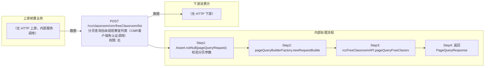

# POST /rcc/classroom/cmr/freeClassroom/list

> 分页查询自由组班教室列表（CMR客户端免认证调用） ｜ 无特殊权限 ｜ sync

## 依赖关系全景图

## 接口基本信息

| 项目 | 内容 |
|---|---|
| URL | /rcc/classroom/cmr/freeClassroom/list |
| Controller | RccFreeClassroomController |
| 方法名 | getFreeClassroomPage |
| 权限注解 | 无 |
| 执行方式 | sync |
| 业务含义 | 分页查询自由组班教室列表（CMR客户端免认证调用） |

## 入参详情

### PageQueryRequest

| 参数名 | 类型 | 必填 | 约束 | 说明 |
|---|---|---|---|---|
| rows | Integer | 否 | 分页行数 | 每页条数 |
| page | Integer | 否 | 分页页码 | 当前页 |
| condition | Object | 否 |  | 排序与过滤条件（condition） |
| sort | Object | 否 |  | 排序与过滤条件（sort） |
## 出参详情

| 返回类型 | DefaultWebResponse<PageQueryResponse<FreeClassroomDetailDTO>> |
|---|---|

| 字段 | 类型 | 说明 |
|---|---|---|
| itemArr[] | FreeClassroomDetailDTO[] | 自由组班记录列表 |
| id | UUID | 记录ID |
| password | String | 密码 |
| classroomName | String | 教室名称 |
| teacherIp | String | 教师机IP |
| cmrId | UUID | CMR ID |
| teacherMac | String | 教师机MAC |
| studentMaxLimit | Integer | 学生上限 |
| lessonDuration | Integer | 上课时长 |
| total | Long | 总记录数 |

## 上游前置业务

（无上游数据依赖）
## 内部处理流程

### 处理流程

1. Assert.notNull(pageQueryRequest) 校验分页参数
2. pageQueryBuilderFactory.newRequestBuilder(pageQueryRequest) 构造分页请求
3. rccFreeClassroomAPI.pageQueryFreeClassroom(builder.build()) 分页查询自由组班
4. 返回PageQueryResponse<FreeClassroomDetailDTO>

## 下游消费方

（本接口数据主要被自身/关联接口消费，或经 SPI 通知）
## 接口参数约束分析

| 层级 | 参数 | 规则 | 失败结果 |
|---|---|---|---|
| request | pageQueryRequest | 分页对象不能为空 | Assert校验抛异常 |

## 参数取值策略

| 参数 | 策略 | 说明 |
|---|---|---|
| rows | user_input/from_query | 按业务构造 |
| page | user_input/from_query | 按业务构造 |
| sort/condition | user_input/from_query | 按业务构造 |

## 成功/失败断言基准

### 成功场景

| 场景 | 断言点 |
|---|---|
| 自由组班存在记录 | $.status=="SUCCESS"；$.content.itemArr 非空；$.content.total 非空 |

### 失败场景

| 场景 | 触发条件 | 断言点 |
|---|---|---|
| 分页参数为空 | pageQueryRequest为null | status==ERROR（Assert 参数校验失败） |

## 环境清理机制

| 接口 | 说明 |
|---|---|
| 本接口创建的资源 | 通过对应 delete 接口清理 |

## 前置状态和幂等性标注

| 维度 | 结论 |
|---|---|
| 幂等性 | readonly |
| 说明 | 纯查询接口 |
