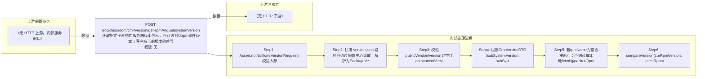

# POST /rcc/classroom/cmr/version/getRpmAndSubsystemVersion

> 获取指定子系统的服务端版本信息，并可选对比rpm组件版本与客户端当前版本的差异 ｜ 无特殊权限 ｜ sync

## 依赖关系全景图

## 接口基本信息

| 项目 | 内容 |
|---|---|
| URL | /rcc/classroom/cmr/version/getRpmAndSubsystemVersion |
| Controller | CmrVersionController |
| 方法名 | getRpmAndSubsystemVersion |
| 权限注解 | 无 |
| 执行方式 | sync |
| 业务含义 | 获取指定子系统的服务端版本信息，并可选对比rpm组件版本与客户端当前版本的差异 |

## 入参详情

### CmrVersionRequest

| 参数名 | 类型 | 必填 | 约束 | 说明 |
|---|---|---|---|---|
| rpmName | String | 否 | @Nullable，rpm包名 | 可选，传入时额外返回rpm最新版本及对比结果 |
| curRpmVersion | String | 否 | @Nullable，客户端当前版本 | 客户端当前rpm版本，用于对比 |
| subSystem | String | 是 | @NotNull，子系统标识 | 子系统名称，用于定位version.json文件 |

## 出参详情

| 返回类型 | DefaultWebResponse<CmrVersionDTO> |
|---|---|

| 字段 | 类型 | 说明 |
|---|---|---|
| latestRpmVersion | String | 服务端最新rpm版本 |
| fullRpmVersion | String | 服务端rpm完整版本号 |
| subSystemVersion | String | 子系统版本 |
| subSystemInnerVersion | String | 子系统内部版本 |
| rpmCompareResult | Integer | rpm版本对比结果（>0服务端新，<0客户端新，0相同） |

## 上游前置业务

> 本接口上游为服务端内部调用（非 HTTP 端点）：
> - 
## 内部处理流程

### 处理流程

1. Assert.notNull(cmrVersionRequest) 校验入参
2. 拼接 version.json 路径并通过配置中心读取，解析为PackageVersionDTO
3. 校验publicVersion/version非空且componentVersionList非空
4. 组装CmrVersionDTO（subSystemVersion、subSystemInnerVersion）
5. 若rpmName为空直接返回；否则读取本地/config/packet/{rpmName}.ini获取组件版本
6. compareVersion(curRpmVersion, latestRpmVersion) 计算版本对比结果并返回

## 下游消费方

（本接口数据主要被自身/关联接口消费，或经 SPI 通知）
## 接口参数约束分析

| 层级 | 参数 | 规则 | 失败结果 |
|---|---|---|---|
| upstream | subSystem | version.json必须存在且内容完整 | 63100001 SPACE_CMR_VERSION_FILE_NOT_FIND |
| upstream | componentVersionList | 依赖组件信息不能为空 | 63100002 SPACE_CMR_VERSION_FILE_NOT_EXIST_COMPONENT_INFO |
| upstream | rpmName | 对应.ini文件必须存在 | 63100003 SPACE_CMR_VERSION_FILE_NOT_FIND_COMPONENT |
| security | rpmName | 不能包含..或/，防止路径遍历 | Assert isTrue抛异常 |

## 参数取值策略

| 参数 | 策略 | 说明 |
|---|---|---|
| rpmName | user_input/from_query | 按业务构造 |
| curRpmVersion | user_input/from_query | 按业务构造 |
| subSystem | user_input/from_query | 按业务构造 |

## 成功/失败断言基准

### 成功场景

| 场景 | 断言点 |
|---|---|
| 传入rpmName且curRpmVersion | $.status=="SUCCESS"；$.content.subSystemVersion 非空；$.content.latestRpmVersion 非空 |
| 不传rpmName | $.status=="SUCCESS"；$.content.subSystemVersion 非空 |

### 失败场景

| 场景 | 触发条件 | 断言点 |
|---|---|---|
| 配置中心无version.json | configCenterKvAPI.get返回空 | status==ERROR；msgKey==63100001（SPACE_CMR_VERSION_FILE_NOT_FIND） |
| .ini文件不存在 | rpmName对应文件缺失 | status==ERROR；msgKey==63100003（SPACE_CMR_VERSION_FILE_NOT_FIND_COMPONENT） |
| 文件名含路径穿越字符 | rpmName含../ | status==ERROR（Assert 参数校验失败） |

## 环境清理机制

| 接口 | 说明 |
|---|---|
| 本接口创建的资源 | 通过对应 delete 接口清理 |

## 前置状态和幂等性标注

| 维度 | 结论 |
|---|---|
| 幂等性 | readonly |
| 说明 | 纯查询接口 |
