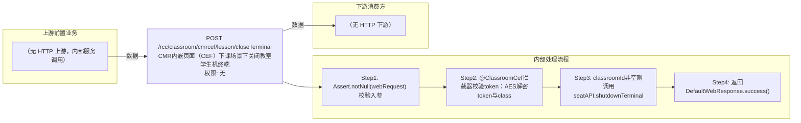

# POST /rcc/classroom/cmrcef/lesson/closeTerminal

> CMR内嵌页面（CEF）下课场景下关闭教室学生机终端 ｜ 无特殊权限 ｜ sync

## 依赖关系全景图

## 接口基本信息

| 项目 | 内容 |
|---|---|
| URL | /rcc/classroom/cmrcef/lesson/closeTerminal |
| Controller | RccClassroomCmrcefController |
| 方法名 | closeTerminalForCef |
| 权限注解 | 无 |
| 执行方式 | sync |
| 业务含义 | CMR内嵌页面（CEF）下课场景下关闭教室学生机终端 |

## 入参详情

### CefClassroomRequest

| 参数名 | 类型 | 必填 | 约束 | 说明 |
|---|---|---|---|---|
| classroomId | UUID | 是 | @NotNull，教室ID | 要关闭终端的教室 |
| token | String | 是 | @NotNull，AES加密的TOKEN | AES加密后内容为classroomId，由@ClassroomCef拦截器校验 |

## 出参详情

| 返回类型 | DefaultWebResponse |
|---|---|
| 说明 | 成功返回 SUCCESS；失败返回 status/msgKey |

## 上游前置业务

> 本接口上游为服务端内部调用（非 HTTP 端点）：
> - 
## 内部处理流程

### 处理流程

1. Assert.notNull(webRequest) 校验入参
2. @ClassroomCef拦截器校验token：AES解密token与classroomId一致，否则抛rcdc_rcc_classroom_cef_token_check_failure
3. classroomId非空则调用seatAPI.shutdownTerminal(classroomId)关闭学生机
4. 返回DefaultWebResponse.success()

## 下游消费方

（本接口数据主要被自身/关联接口消费，或经 SPI 通知）
## 接口参数约束分析

| 层级 | 参数 | 规则 | 失败结果 |
|---|---|---|---|
| auth | token | token需通过AES解密且等于classroomId | rcdc_rcc_classroom_cef_token_check_failure |
| request | classroomId | 可为空（为空时跳过关机） | 无，跳过关机直接返回成功 |

## 参数取值策略

| 参数 | 策略 | 说明 |
|---|---|---|
| classroomId | user_input/from_query | 按业务构造 |
| token | user_input/from_query | 按业务构造 |

## 成功/失败断言基准

> 该接口为纯操作接口（Builder.success() 无 content body），断言以 HTTP 响应为准：status==SUCCESS + content 为空。无 content body（CMR 教师端关闭学生机）

### 成功场景

| 场景 | 断言点 |
|---|---|
| 教室存在 | $.status==SUCCESS（content 为空，Builder.success() 无参，纯操作接口） |

### 失败场景

| 场景 | 触发条件 | 断言点 |
|---|---|---|
| 参数为空 | webRequest 为 null | $.status==ERROR（参数校验，无固定 msgKey） |
| token非法 | token缺失/解密失败/与classroomId不一致 | $.status==ERROR && $.msgKey==rcdc_rcc_classroom_cef_token_check_failure |

## 环境清理机制

| 接口 | 说明 |
|---|---|
| 本接口创建的资源 | 通过对应 delete 接口清理 |

## 前置状态和幂等性标注

| 维度 | 结论 |
|---|---|
| 幂等性 | low |
| 说明 | 关机指令重复下发无校验，非严格幂等 |
