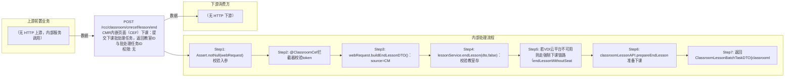

# POST /rcc/classroom/cmrcef/lesson/end

> CMR内嵌页面（CEF）下课：提交下课批处理任务，返回教室ID与批处理任务ID ｜ 无特殊权限 ｜ async

## 依赖关系全景图

## 接口基本信息

| 项目 | 内容 |
|---|---|
| URL | /rcc/classroom/cmrcef/lesson/end |
| Controller | RccClassroomCmrcefController |
| 方法名 | endLessonForCef |
| 权限注解 | 无 |
| 执行方式 | async |
| 业务含义 | CMR内嵌页面（CEF）下课：提交下课批处理任务，返回教室ID与批处理任务ID |

## 入参详情

### CefEndLessonWebRequest

| 参数名 | 类型 | 必填 | 约束 | 说明 |
|---|---|---|---|---|
| classroomId | UUID | 是 | @NotNull，教室ID | 要下课的教室 |
| token | String | 是 | @NotNull，AES加密TOKEN | 由@ClassroomCef拦截器校验 |
| closeTerminal | Boolean | 否 | @Nullable，默认false | 是否同时关闭终端 |

## 出参详情

| 返回类型 | DefaultWebResponse<ClassroomLessonBatchTaskDTO> |
|---|---|

| 字段 | 类型 | 说明 |
|---|---|---|
| classroomId | UUID | 教室ID |
| lessonTaskId | UUID | 下课批处理任务ID |

## 上游前置业务

> 本接口上游为服务端内部调用（非 HTTP 端点）：
> - 
## 内部处理流程

### 批量处理器：LessonFactory创建的下课BatchTaskHandler（按CbbImageType分VDI/VOI等实现）

| 步骤 | 说明 |
|---|---|
| 1 | 检查云平台/资源可用性后批量执行各座位关机/回收桌面 |
| 2 | 通过批处理消息通知课堂进度 |

### 处理流程

1. Assert.notNull(webRequest) 校验入参
2. @ClassroomCef拦截器校验token
3. webRequest.buildEndLessonDTO()：source=CMR，closeTerminal默认false
4. lessonService.endLesson(dto,false)：校验教室存在与上课镜像、checkCanEndLesson、检查上课时长限制
5. 若VDI云平台不可用则走强制下课链路（endLessonWithoutSeat + notifyClassroomInfoChange）并抛业务异常
6. classroomLessonAPI.prepareEndLesson 准备下课，lessonFactory按镜像类型创建下课批处理任务
7. 返回ClassroomLessonBatchTaskDTO{classroomId,lessonTaskId}

## 下游消费方

（本接口数据主要被自身/关联接口消费，或经 SPI 通知）
## 接口参数约束分析

| 层级 | 参数 | 规则 | 失败结果 |
|---|---|---|---|
| auth | token | AES解密等于classroomId | rcdc_rcc_classroom_cef_token_check_failure |
| business | classroomId | 上课镜像必须存在 | rcdc_rcc_classroom_ending_class_fail_desc_for_classroom_image_not_in_class |
| business | classroomId | 教室信息必须存在 | rcdc_rcc_classroom_ending_class_fail_desc_for_no_classroom |
| business | seat | 无座位时直接强制下课 | rcdc_rcc_classroom_ending_class_force_desc_for_classroom_no_seat（返回成功消息） |
| business | 上课时长 | 上课未满3分钟不允许下课 | checkIsTimeToEndLesson抛异常 |
| business | cloudPlatform | VDI云平台不可用时需允许强制删除 | rcdc_rcc_classroom_validate_force_ending_class_desc_for_platform_unavailable_cmr / rcdc_rcc_classroom_force_ending_class_desc_for_platform_unavailable |

## 参数取值策略

| 参数 | 策略 | 说明 |
|---|---|---|
| classroomId | user_input/from_query | 按业务构造 |
| token | user_input/from_query | 按业务构造 |
| closeTerminal | user_input/from_query | 按业务构造 |

## 成功/失败断言基准

### 成功场景

| 场景 | 断言点 |
|---|---|
| 教室正在上课且时长满足要求 | $.status==SUCCESS && $.content.classroomId 非空 && $.content.lessonTaskId 非空（Builder.success(ClassroomLessonBatchTaskDTO)） |

### 失败场景

| 场景 | 触发条件 | 断言点 |
|---|---|---|
| token非法 | token解密失败 | $.status==ERROR && $.msgKey==rcdc_rcc_classroom_cef_token_check_failure |
| 教室无上课镜像 | getCurrentLessonImageByClassroomId返回null | $.status==ERROR && $.msgKey==rcdc_rcc_classroom_ending_class_fail_desc_for_classroom_image_not_in_class |
| VDI平台不可用且不允许强制删除 | validForForceDelete失败 | $.status==ERROR && $.msgKey==rcdc_rcc_classroom_validate_force_ending_class_desc_for_platform_unavailable_cmr |

## 环境清理机制

| 接口 | 说明 |
|---|---|
| 本接口创建的资源 | 通过对应 delete 接口清理 |

## 前置状态和幂等性标注

| 维度 | 结论 |
|---|---|
| 幂等性 | medium |
| 说明 | 重复下课由classroomLessonAPI.checkCanEndLesson状态校验拦截，非严格幂等 |
