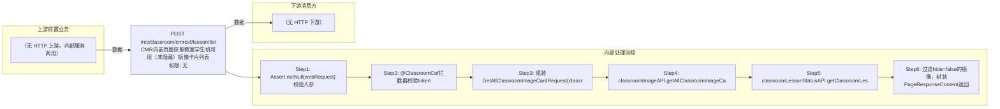

# POST /rcc/classroom/cmrcef/lesson/list

> CMR内嵌页面获取教室学生机可用（未隐藏）镜像卡片列表 ｜ 无特殊权限 ｜ sync

## 依赖关系全景图

## 接口基本信息

| 项目 | 内容 |
|---|---|
| URL | /rcc/classroom/cmrcef/lesson/list |
| Controller | RccClassroomCmrcefController |
| 方法名 | getCefLessonList |
| 权限注解 | 无 |
| 执行方式 | sync |
| 业务含义 | CMR内嵌页面获取教室学生机可用（未隐藏）镜像卡片列表 |

## 入参详情

### CefGetClassroomImageListRequest

| 参数名 | 类型 | 必填 | 约束 | 说明 |
|---|---|---|---|---|
| classroomId | UUID | 是 | @NotNull，教室ID | 教室ID |
| token | String | 是 | @NotNull，AES加密TOKEN | 由@ClassroomCef拦截器校验 |

## 出参详情

| 返回类型 | DefaultWebResponse<PageResponseContent<ClassroomImageCardInfoDTO>> |
|---|---|

| 字段 | 类型 | 说明 |
|---|---|---|
| itemArr[] | ClassroomImageCardInfoDTO[] | 镜像卡片数组（仅未隐藏） |
| id | UUID | 镜像ID |
| imageName | String | 镜像名称 |
| classroomState | ClassroomLessonStatusEnum | 当前教室上课状态 |
| beingUsedInLesson | Boolean | 是否正在被当前上课使用 |
| cbbImageType | CbbImageType | 镜像类型（VDI/IDV/VOI） |
| imageTemplateState | ImageTemplateState | 镜像模板状态 |
| total | Integer | 总数 |

## 上游前置业务

> 本接口上游为服务端内部调用（非 HTTP 端点）：
> - 
## 内部处理流程

### 处理流程

1. Assert.notNull(webRequest) 校验入参
2. @ClassroomCef拦截器校验token
3. 组装GetAllClassroomImageCardRequest{classroomId,teacherTerminal=false}
4. classroomImageAPI.getAllClassroomImageCardByCrIdAndTeaTerminal 查询学生机镜像卡片
5. classroomLessonStatusAPI.getClassroomLessonInfo 校验教室存在，不存在则抛RCDC_RCC_CLASSROOM_GET_CLASS_PROGRESS_FAIL_DESC_FOR_NO_CLASSROOM
6. 过滤hide=false的镜像，封装PageResponseContent返回

## 下游消费方

（本接口数据主要被自身/关联接口消费，或经 SPI 通知）
## 接口参数约束分析

| 层级 | 参数 | 规则 | 失败结果 |
|---|---|---|---|
| auth | token | AES解密等于classroomId | rcdc_rcc_classroom_cef_token_check_failure |
| business | classroomId | 教室必须存在 | rcdc_rcc_classroom_get_class_progress_fail_desc_for_no_classroom |

## 参数取值策略

| 参数 | 策略 | 说明 |
|---|---|---|
| classroomId | user_input/from_query | 按业务构造 |
| token | user_input/from_query | 按业务构造 |

## 成功/失败断言基准

### 成功场景

| 场景 | 断言点 |
|---|---|
| 教室存在且有镜像 | $.status==SUCCESS && $.content.itemArr 非空（PageResponseContent 分页框架字段为 itemArr/total） |

### 失败场景

| 场景 | 触发条件 | 断言点 |
|---|---|---|
| token非法 | token校验失败 | $.status==ERROR && $.msgKey==rcdc_rcc_classroom_cef_token_check_failure |
| 教室不存在 | classroomLessonStatusAPI返回null | $.status==ERROR && $.msgKey==rcdc_rcc_classroom_get_class_progress_fail_desc_for_no_classroom |

## 环境清理机制

| 接口 | 说明 |
|---|---|
| 本接口创建的资源 | 通过对应 delete 接口清理 |

## 前置状态和幂等性标注

| 维度 | 结论 |
|---|---|
| 幂等性 | readonly |
| 说明 | 纯查询接口 |
