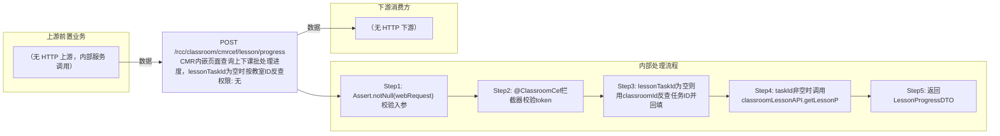

# POST /rcc/classroom/cmrcef/lesson/progress

> CMR内嵌页面查询上下课批处理进度，lessonTaskId为空时按教室ID反查 ｜ 无特殊权限 ｜ sync

## 依赖关系全景图

## 接口基本信息

| 项目 | 内容 |
|---|---|
| URL | /rcc/classroom/cmrcef/lesson/progress |
| Controller | RccClassroomCmrcefController |
| 方法名 | getCefLessonProgress |
| 权限注解 | 无 |
| 执行方式 | sync |
| 业务含义 | CMR内嵌页面查询上下课批处理进度，lessonTaskId为空时按教室ID反查 |

## 入参详情

### CefLessonProgressWebRequest

| 参数名 | 类型 | 必填 | 约束 | 说明 |
|---|---|---|---|---|
| classroomId | UUID | 是 | @NotNull，教室ID | 教室ID |
| token | String | 是 | @NotNull，AES加密TOKEN | 由@ClassroomCef拦截器校验 |
| lessonTaskId | UUID | 否 | @Nullable，上下课批处理任务ID | 为空时通过classroomLessonAPI.getTaskIdByClassroomId反查 |

## 出参详情

| 返回类型 | DefaultWebResponse<LessonProgressDTO> |
|---|---|

| 字段 | 类型 | 说明 |
|---|---|---|
| progress | Integer | 任务进度（0-100） |
| customerTaskId | UUID | 回传的上下课任务ID |

## 上游前置业务

> 本接口上游为服务端内部调用（非 HTTP 端点）：
> - 
## 内部处理流程

### 处理流程

1. Assert.notNull(webRequest) 校验入参
2. @ClassroomCef拦截器校验token
3. lessonTaskId为空则用classroomId反查任务ID并回填
4. taskId非空时调用classroomLessonAPI.getLessonProgress查询进度并设置customerTaskId
5. 返回LessonProgressDTO

## 下游消费方

（本接口数据主要被自身/关联接口消费，或经 SPI 通知）
## 接口参数约束分析

| 层级 | 参数 | 规则 | 失败结果 |
|---|---|---|---|
| auth | token | AES解密等于classroomId | rcdc_rcc_classroom_cef_token_check_failure |

## 参数取值策略

| 参数 | 策略 | 说明 |
|---|---|---|
| classroomId | user_input/from_query | 按业务构造 |
| token | user_input/from_query | 按业务构造 |
| lessonTaskId | user_input/from_query | 按业务构造 |

## 成功/失败断言基准

### 成功场景

| 场景 | 断言点 |
|---|---|
| taskId存在 | $.status==SUCCESS && $.content.customerTaskId 非空 && $.content.progress 存在（Builder.success(LessonProgressDTO)） |
| taskId为空且反查不到 | $.status==SUCCESS && $.content.progress==0（默认对象） |

### 失败场景

| 场景 | 触发条件 | 断言点 |
|---|---|---|
| token非法 | token校验失败 | $.status==ERROR && $.msgKey==rcdc_rcc_classroom_cef_token_check_failure |

## 环境清理机制

| 接口 | 说明 |
|---|---|
| 本接口创建的资源 | 通过对应 delete 接口清理 |

## 前置状态和幂等性标注

| 维度 | 结论 |
|---|---|
| 幂等性 | readonly |
| 说明 | 纯查询接口 |
