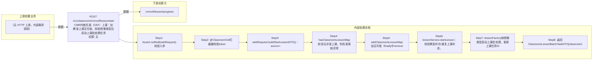

# POST /rcc/classroom/cmrcef/lesson/start

> CMR内嵌页面（CEF）上课：加教室上课互斥锁、校验镜像类型后启动上课批处理任务 ｜ 无特殊权限 ｜ async

## 依赖关系全景图

## 接口基本信息

| 项目 | 内容 |
|---|---|
| URL | /rcc/classroom/cmrcef/lesson/start |
| Controller | RccClassroomCmrcefController |
| 方法名 | startLessonForCef |
| 权限注解 | 无 |
| 执行方式 | async |
| 业务含义 | CMR内嵌页面（CEF）上课：加教室上课互斥锁、校验镜像类型后启动上课批处理任务 |

## 入参详情

### CefStartLessonWebRequest

| 参数名 | 类型 | 必填 | 约束 | 说明 |
|---|---|---|---|---|
| classroomId | UUID | 是 | @NotNull，教室ID | 要上课的教室 |
| token | String | 是 | @NotNull，AES加密TOKEN | 由@ClassroomCef拦截器校验 |
| imageId | UUID | 是 | @NotNull，镜像ID | 上课使用的镜像 |
| macArr | String[] | 否 | @Nullable，终端mac数组 | 指定上课的终端MAC列表 |

## 出参详情

| 返回类型 | DefaultWebResponse<ClassroomLessonBatchTaskDTO> |
|---|---|

| 字段 | 类型 | 说明 |
|---|---|---|
| classroomId | UUID | 教室ID |
| lessonTaskId | UUID | 上课批处理任务ID |

## 上游前置业务

> 本接口上游为服务端内部调用（非 HTTP 端点）：
> - 
## 内部处理流程

### 批量处理器：LessonFactory创建的上课BatchTaskHandler（按CbbImageType分VDI/VOI等实现）

| 步骤 | 说明 |
|---|---|
| 1 | checkBeforeStartLesson校验镜像状态与策略 |
| 2 | 批量对座位下发开机/启动云桌面指令 |
| 3 | 批处理消息实时更新进度 |

### 处理流程

1. Assert.notNull(webRequest) 校验入参
2. @ClassroomCef拦截器校验token
3. webRequest.buildStartLessonDTO()：source=CMR，含classroomId/imageId/macArr
4. hasClassroomLessonMap校验无并发上课，失败直接抛异常
5. addClassroomLessonMap加互斥锁（finally中removeClassroomLessonMap释放）
6. lessonService.startLesson：校验教室存在/重复上课状态，若上课中则先下课并等待完成（切课），再prepareStartLesson
7. lessonFactory按镜像类型启动上课批处理，更新上课任务ID
8. 返回ClassroomLessonBatchTaskDTO{classroomId,lessonTaskId}

## 下游消费方

（本接口数据主要被自身/关联接口消费，或经 SPI 通知）
## 接口参数约束分析

| 层级 | 参数 | 规则 | 失败结果 |
|---|---|---|---|
| auth | token | AES解密等于classroomId | rcdc_rcc_classroom_cef_token_check_failure |
| concurrency | classroomId | 同一教室不允许并发上课 | hasClassroomLessonMap抛异常 |
| business | classroomId | 教室必须存在 | rcdc_rcc_classroom_starting_class_fail_desc_for_no_classroom |
| business | classroomId | 准备上课中不允许重复上课 | rcdc_rcc_classroom_starting_class_fail_desc_for_repeat_starting |
| business | imageId | 已上课中且镜像相同不允许重复上课 | rcdc_rcc_classroom_starting_class_fail_desc_for_the_same |

## 参数取值策略

| 参数 | 策略 | 说明 |
|---|---|---|
| classroomId | user_input/from_query | 按业务构造 |
| token | user_input/from_query | 按业务构造 |
| imageId | user_input/from_query | 按业务构造 |
| macArr | user_input/from_query | 按业务构造 |

## 成功/失败断言基准

### 成功场景

| 场景 | 断言点 |
|---|---|
| 教室空闲且镜像合法 | $.status==SUCCESS && $.content.classroomId 非空 && $.content.lessonTaskId 非空（Builder.success(ClassroomLessonBatchTaskDTO)） |

### 失败场景

| 场景 | 触发条件 | 断言点 |
|---|---|---|
| token非法 | token解密失败 | $.status==ERROR && $.msgKey==rcdc_rcc_classroom_cef_token_check_failure |
| 教室正在准备上课 | 重复点击上课 | $.status==ERROR && $.msgKey==rcdc_rcc_classroom_starting_class_fail_desc_for_repeat_starting |
| 正在上课中且重复选择同一镜像 | 再点同一镜像上课 | $.status==ERROR && $.msgKey==rcdc_rcc_classroom_starting_class_fail_desc_for_the_same |
| 上课过程中异常 | lessonService.startLesson抛异常 | $.status==ERROR（异常向上抛出，无固定 msgKey）；finally 释放教室锁 |

## 环境清理机制

| 接口 | 说明 |
|---|---|
| 本接口创建的资源 | 通过对应 delete 接口清理 |

## 前置状态和幂等性标注

| 维度 | 结论 |
|---|---|
| 幂等性 | medium |
| 说明 | addClassroomLessonMap互斥防止并发，但同镜像重复上课被状态校验拦截；结果不保证幂等 |
