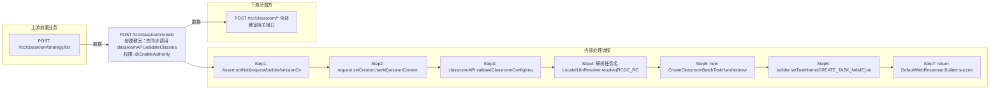

# POST /rcc/classroom/create

> 创建教室：先同步调用 classroomAPI.validateClassroomConfig 做参数/冲突校验，通过后把 creatorUserId 写入请求，构造单任务项提交 CreateClassroomBatchTaskHandler 异步批任务；任务内 processItem 调 classroomAPI.createNewClassroomInfo 启动创建教室状态机（保存教室、建终端组、建教师机、批量建座位、建默认禁网白名单、建虚拟机组、断开冲突在线终端、授权管理员数据权限、完成审计日志），接口立即返回 BatchTaskSubmitResult。 ｜ @EnableAuthority ｜ 异步批处理任务（BatchTask，CreateClassroomBatchTaskHandler）→ 状态机 CreateClassroomStateHandler（processItem 内同步执行）

## 依赖关系全景图

## 接口基本信息

| 项目 | 内容 |
|---|---|
| URL | /rcc/classroom/create |
| Controller | RccClassroomConfigController |
| 方法名 | createNewClassroom |
| 权限注解 | @EnableAuthority |
| 执行方式 | 异步批处理任务（BatchTask，CreateClassroomBatchTaskHandler）→ 状态机 CreateClassroomStateHandler（processItem 内同步执行） |
| 业务含义 | 创建教室：先同步调用 classroomAPI.validateClassroomConfig 做参数/冲突校验，通过后把 creatorUserId 写入请求，构造单任务项提交 CreateClassroomBatchTaskHandler 异步批任务；任务内 processItem 调 classroomAPI.createNewClassroomInfo 启动创建教室状态机（保存教室、建终端组、建教师机、批量建座位、建默认禁网白名单、建虚拟机组、断开冲突在线终端、授权管理员数据权限、完成审计日志），接口立即返回 BatchTaskSubmitResult。 |

## 入参详情

### CreateClassroomWebRequest

| 参数名 | 类型 | 必填 | 约束 | 说明 |
|---|---|---|---|---|
| classroomName | String | 是 | @NotNull @Size(min=3, max=20) | 教室名称 |
| classroomDesc | String | 否 | @Nullable @Size(max=200) | 教室描述 |
| teacherMode | TerminalTypeEnum | 是 | @NotNull | 教师机工作模式（PC/VDI/IDV/TCI）；默认 PC（无需分配镜像） |
| teacherIp | String | 是 | @NotNull | 教师机终端IP |
| teacherPreName | String | 否 | @Nullable | 教师机主机名前缀 |
| diskRequiredSize | Integer | 否 | @Nullable @Range(min=59, max=10000) | 学生机终端磁盘容量要求（GB） |
| studentModeArr | TerminalTypeEnum[] | 是 | @NotEmpty | 学生机类型数组 |
| studentStartIp | String | 是 | @NotNull（字段声明；getter 标注 @Nullable） | 学生机可接入终端起始IP |
| studentEndIp | String | 是 | @NotNull（字段声明；getter 标注 @Nullable） | 学生机可接入终端终止IP |
| desktopPreName | String | 是 | @NotNull @Size(min=1, max=5) | 学生云桌面主机名前缀 |
| desktopNameStartNum | Integer | 是 | @NotNull @Range(min=1, max=999) | 学生云桌面主机名起始序号 |
| desktopNum | Integer | 是 | @NotNull @Range(min=1, max=999) | 学生云桌面数量 |
| teacherVlanId | Integer | 否 | @Nullable @Range(min=2, max=4094) | 教师机VLAN ID |
| studentVlanId | Integer | 否 | @Nullable @Range(min=2, max=4094) | 学生机VLAN ID |
| teacherClassroomStrategyId | UUID | 否 | @Nullable | 教师机教室策略ID |
| studentClassroomStrategyId | UUID | 是 | @NotNull（字段声明；getter 标注 @Nullable） | 学生机教室策略ID |
| creatorUserId | UUID | 否 | @Nullable；服务端从 sessionContext.getUserId() 注入 | 创建者用户ID |

## 出参详情

| 返回类型 | DefaultWebResponse（data=BatchTaskSubmitResult） |
|---|---|

| 字段 | 类型 | 说明 |
|---|---|---|
| taskId | UUID | 批任务ID（生成新随机UUID） |
| taskName | String | 任务名称（创建教室任务） |
| taskDesc | String | 任务描述（创建教室任务） |

## 上游前置业务

### 前置1：POST /rcc/classroom/strategy/list

教师机教室策略ID（可选）（由 field_map 契约映射）
## 内部处理流程

### 批量处理器：CreateClassroomBatchTaskHandler（extends AbstractSingleTaskHandler）

| 步骤 | 说明 |
|---|---|
| 1 | processItem：Assert batchTaskItem 非空 |
| 2 | 调用 classroomAPI.createNewClassroomInfo(request) → 创建教室状态机同步执行（保存教室→建终端组→建教师机→批量建座位→建默认禁网白名单→建虚拟机组→断开冲突在线终端→授权管理员数据权限→完成审计日志） |
| 3 | 成功：返回 SUCCESS，msgKey=RCDC_RCC_CLASSROOM_CREATE_SUCCESS_LOG |
| 4 | 失败：捕获 BusinessException 返回 FAILURE，msgKey=RCDC_RCC_CLASSROOM_CREATE_FAIL_LOG，args=e.getI18nMessage() |
| 5 | onFinish：failCount==0 → SUCCESS(RCDC_RCC_CLASSROOM_CREATE_TASK_SUCCESS)；否则 FAILURE(RCDC_RCC_CLASSROOM_CREATE_TASK_FAIL) |

### 处理流程

1. Assert.notNull(request/builder/sessionContext)
2. request.setCreatorUserId(sessionContext.getUserId())
3. classroomAPI.validateClassroomConfig(request) 同步校验参数与冲突
4. 解析任务名 LocaleI18nResolver.resolve(RCDC_RCC_CLASSROOM_CREATE_TASK_NAME)，生成 UUID.randomUUID() itemId
5. new CreateClassroomBatchTaskHandler(new DefaultBatchTaskItem(itemId, itemName), classroomAPI, request)
6. builder.setTaskName(CREATE_TASK_NAME).setTaskDesc(CREATE_TASK_DESC).setUniqueId(itemId).registerHandler(handler).start() 提交批任务
7. return DefaultWebResponse.Builder.success(result) 立即返回任务结果

## 下游消费方

### 消费1：POST /rcc/classroom/* 全部教室相关接口

创建教室产出 classroomId；因 create 为异步批任务，实际经 select 按名称查询获得（由 field_map 契约映射）
## 接口参数约束分析

| 层级 | 参数 | 规则 | 失败结果 |
|---|---|---|---|
| PARAM | classroomName | @NotNull @Size(3-20) | 非空/长度校验失败 |
| PARAM | teacherMode | @NotNull | 缺失校验失败 |
| PARAM | teacherIp | @NotNull | 缺失校验失败 |
| PARAM | studentModeArr | @NotEmpty | 至少一个学生机模式 |
| PARAM | studentStartIp/studentEndIp | @NotNull | 缺失校验失败 |
| PARAM | desktopPreName | @NotNull @Size(1-5) | 长度超限校验失败 |
| PARAM | desktopNameStartNum | @NotNull @Range(1-999) | 越界校验失败 |
| PARAM | desktopNum | @NotNull @Range(1-999) | 越界校验失败 |
| PARAM | studentClassroomStrategyId | @NotNull | 学生机策略必填 |
| BUSINESS | 全部 | validateClassroomConfig 内置校验：教室数量上限 RCDC_RCC_CLASSROOM_NUM_MAX、名称重复 RCDC_RCC_CLASSROOM_NAME_DUPLICATION、名称不合法 RCDC_RCC_CLASSROOM_NAME_NOT_AVAILABLE、教师机/学生机IP冲突 CLASSROOM_IP_CHECK_*、工作模式非法 RCDC_RCC_CLASSROOM_TEACHER_WORK_MODE_ILLEGAL / _STUDENT_WORK_MODE_ILLEGAL、镜像/存储/网络策略等 | 抛对应 BusinessException，创建失败且不提交任务 |

## 参数取值策略

| 参数 | 策略 | 说明 |
|---|---|---|
| classroomName | user_input/from_query | 按业务构造 |
| classroomDesc | user_input/from_query | 按业务构造 |
| teacherMode | user_input/from_query | 按业务构造 |
| teacherIp | user_input/from_query | 按业务构造 |
| teacherPreName | user_input/from_query | 按业务构造 |
| diskRequiredSize | user_input/from_query | 按业务构造 |
| studentModeArr | user_input/from_query | 按业务构造 |
| studentStartIp | user_input/from_query | 按业务构造 |
| studentEndIp | user_input/from_query | 按业务构造 |
| desktopPreName | user_input/from_query | 按业务构造 |
| desktopNameStartNum | user_input/from_query | 按业务构造 |
| desktopNum | user_input/from_query | 按业务构造 |
| teacherVlanId | user_input/from_query | 按业务构造 |
| studentVlanId | user_input/from_query | 按业务构造 |
| teacherClassroomStrategyId | user_input/from_query | 按业务构造 |
| studentClassroomStrategyId | user_input/from_query | 按业务构造 |
| creatorUserId | user_input/from_query | 按业务构造 |

## 成功/失败断言基准

### 成功场景

| 场景 | 断言点 |
|---|---|
| 参数全部合法且无冲突 | 返回 HTTP 200 + BatchTaskSubmitResult，异步创建教室并最终成功（任务 SUCCESS） |

### 失败场景

| 场景 | 触发条件 | 断言点 |
|---|---|---|
| 教室名称重复 | classroomName 与已有教室相同 | status==ERROR；msgKey==RCDC_RCC_CLASSROOM_NAME_DUPLICATION |
| 教室数量达到上限 | 已有教室数达上限 | status==ERROR；msgKey==RCDC_RCC_CLASSROOM_NUM_MAX |
| 教师机IP冲突 | teacherIp 被占用 | status==ERROR；msgKey==CLASSROOM_IP_CHECK_CONFLICT_WITH_CLASSROOM |

## 环境清理机制

| 接口 | 说明 |
|---|---|
| 本接口创建的资源 | 通过对应 delete 接口清理 |

## 前置状态和幂等性标注

| 维度 | 结论 |
|---|---|
| 幂等性 | LOW |
| 说明 | 每次请求生成新随机 itemId 并完整创建新教室；重复提交会重复创建，仅靠名称唯一校验兜底 |
