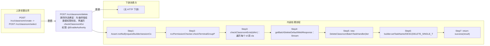

# POST /rcc/classroom/delete

> 删除所选教室：先做终端组数据权限校验，再遍历 checkClassroomExist 确认每个教室存在，随后为每个教室构造批任务项提交 DeleteClassroomBatchTaskHandler 并行执行；processItem 构造 DeleteClassroomDTO 调 classroomAPI.deleteClassroom 启动删除状态机（校验→初始化→删教师/学生VDI磁盘池→删TCI镜像→删座位列表→删教师机桌面→删虚拟机组→删默认白名单→删网络关系释放IP段→删课程镜像→删教室记录），接口立即返回 BatchTaskSubmitResult。 ｜ @EnableAuthority ｜ 异步批处理任务（BatchTask，DeleteClassroomBatchTaskHandler，enableParallel 每教室并行）→ 状态机 DeleteClassroomStateHandler

## 依赖关系全景图

## 接口基本信息

| 项目 | 内容 |
|---|---|
| URL | /rcc/classroom/delete |
| Controller | RccClassroomConfigController |
| 方法名 | deleteClassroom |
| 权限注解 | @EnableAuthority |
| 执行方式 | 异步批处理任务（BatchTask，DeleteClassroomBatchTaskHandler，enableParallel 每教室并行）→ 状态机 DeleteClassroomStateHandler |
| 业务含义 | 删除所选教室：先做终端组数据权限校验，再遍历 checkClassroomExist 确认每个教室存在，随后为每个教室构造批任务项提交 DeleteClassroomBatchTaskHandler 并行执行；processItem 构造 DeleteClassroomDTO 调 classroomAPI.deleteClassroom 启动删除状态机（校验→初始化→删教师/学生VDI磁盘池→删TCI镜像→删座位列表→删教师机桌面→删虚拟机组→删默认白名单→删网络关系释放IP段→删课程镜像→删教室记录），接口立即返回 BatchTaskSubmitResult。 |

## 入参详情

### ClassroomIdArrWebRequest

| 参数名 | 类型 | 必填 | 约束 | 说明 |
|---|---|---|---|---|
| idArr | UUID[] | 是 | @NotEmpty | 待删除教室ID数组 |

## 出参详情

| 返回类型 | DefaultWebResponse（data=BatchTaskSubmitResult） |
|---|---|

| 字段 | 类型 | 说明 |
|---|---|---|
| taskId | UUID | 批任务ID |
| taskName | String | 删除教室任务名称 |
| taskDesc | String | 删除教室任务描述 |

## 上游前置业务

### 前置1：POST /rcc/classroom/create -> POST /rcc/classroom/select

create 为异步批任务，响应为 BatchTaskSubmitResult 不直接返回 ID；实际经 select 按名称查询 content[0].classroomId（由 field_map 契约映射）
## 内部处理流程

### 批量处理器：DeleteClassroomBatchTaskHandler（extends AbstractBatchTaskHandler，每教室一项，并行）

| 步骤 | 说明 |
|---|---|
| 1 | processItem：Assert taskItem 非空 |
| 2 | 构造 DeleteClassroomDTO，classroomId=taskItem.getItemID() |
| 3 | classroomAPI.getClassroomName(classroomId) 取教室名并 set 到 DTO |
| 4 | classroomAPI.deleteClassroom(dto) → DeleteClassroomStateHandler 状态机同步执行（校验→初始化→删教师/学生VDI磁盘池→删TCI镜像→删座位列表→删教师机桌面→删虚拟机组→删默认白名单→删网络关系释放IP段→删课程镜像→删教室记录） |
| 5 | 成功：返回 SUCCESS，msgKey=RCDC_RCC_CLASSROOM_OPERATE_CLASSROOM_DELETE_SINGLE_SUC_LOG，args=教室名 |
| 6 | 失败：捕获 BusinessException 返回 FAILURE，msgKey=..._DELETE_SINGLE_FAIL_LOG，args=教室名+错误 |
| 7 | onFinish：failCount==0 → SUCCESS(DELETE_SINGLE_SUC)；sucCount==0 → FAILURE(DELETE_SINGLE_FAIL)；否则 PARTIAL_SUCCESS(DELETE_SINGLE_PARTIAL_SUC) |

### 处理流程

1. Assert.notNull(request/builder/sessionContext)
2. rccPermissionChecker.checkTerminalGroupPermissionByClassroomId(Arrays.asList(request.getIdArr()), sessionContext)
3. checkClassroomExist(idArr)：遍历每个 id 调 classroomAPI.getClassroomName(id)，不存在抛异常
4. getBatchDeleteDefaultWebResponse：Stream 映射每个 id 为 DefaultBatchTaskItem（itemName=DELETE_SINGLE_ITEM_NAME）
5. new DeleteClassroomBatchTaskHandler(iterator, classroomAPI)
6. builder.setTaskName/DESC(DELETE_SINGLE_TASK_NAME/DESC).enableParallel().registerHandler(handler).start()
7. return success(result)

## 下游消费方

（本接口数据主要被自身/关联接口消费，或经 SPI 通知）
## 接口参数约束分析

| 层级 | 参数 | 规则 | 失败结果 |
|---|---|---|---|
| PARAM | idArr | @NotEmpty | 空数组校验失败 |
| BUSINESS | idArr | 每个教室必须存在 | checkClassroomExist 抛 RCDC_CLASSROOM_NOT_FIND |
| BUSINESS | classroomId | 管理员有对应终端组数据权限 | 数据权限校验抛异常 |
| BUSINESS | 教室状态 | 教室无上课中/桌面运行等占用 | 删除状态机内抛 CLASSROOM_TIP_CLASSROOM_STATE_NOT_NONE_CLASS / RCDC_RCC_CLASSROOM_DESKTOP_USED 等，单项 FAILURE |

## 参数取值策略

| 参数 | 策略 | 说明 |
|---|---|---|
| idArr | user_input/from_query | 按业务构造 |

## 成功/失败断言基准

### 成功场景

| 场景 | 断言点 |
|---|---|
| 有效教室ID数组 | 返回 HTTP 200 + BatchTaskSubmitResult，并行异步删除并最终成功 |

### 失败场景

| 场景 | 触发条件 | 断言点 |
|---|---|---|
| idArr 含不存在教室 | 传入已删除/伪造ID | status==ERROR；msgKey==RCDC_CLASSROOM_NOT_FIND |
| 教室正在上课 | 教室状态非空闲 | $.status=="SUCCESS"；content.taskId 非空；轮询终态对应项 batchTaskItemStatus==FAILURE；msgKey==RCDC_RCC_CLASSROOM_OPERATE_CLASSROOM_DELETE_SINGLE_FAIL_LOG |

## 环境清理机制

| 接口 | 说明 |
|---|---|
| 本接口创建的资源 | 通过对应 delete 接口清理 |

## 前置状态和幂等性标注

| 维度 | 结论 |
|---|---|
| 幂等性 | LOW |
| 说明 | 删除为破坏性非幂等操作；重复删除已删除教室会报不存在；部分教室删除失败时为 PARTIAL_SUCCESS |
