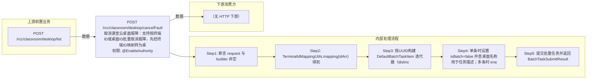

# POST /rcc/classroom/desktop/cancelFault

> 取消课堂云桌面报障：支持按终端ID或桌面ID批量取消报障，先经终端ID映射转为桌面UUID，再提交批量任务逐台校验并取消报障。 ｜ @EnableAuthority ｜ batch

## 依赖关系全景图

## 接口基本信息

| 项目 | 内容 |
|---|---|
| URL | /rcc/classroom/desktop/cancelFault |
| Controller | RccClassroomDesktopController |
| 方法名 | cancelFault |
| 权限注解 | @EnableAuthority |
| 执行方式 | batch |
| 业务含义 | 取消课堂云桌面报障：支持按终端ID或桌面ID批量取消报障，先经终端ID映射转为桌面UUID，再提交批量任务逐台校验并取消报障。 |

## 入参详情

### RccDesktopCancelFaultWebRequest

| 参数名 | 类型 | 必填 | 约束 | 说明 |
|---|---|---|---|---|
| idArr | String[] | 是 | @NotEmpty 非空 | 云桌面ID数组，支持终端ID或桌面ID，通过 TerminalIdMappingUtils 映射为桌面UUID |

## 出参详情

| 返回类型 | DefaultWebResponse |
|---|---|

| 字段 | 类型 | 说明 |
|---|---|---|
| msg | String | 提示信息 |
| content | BatchTaskSubmitResult | 批量任务提交结果（taskId等），实际取消报障由后台批任务异步执行 |

## 上游前置业务

### 前置1：POST /rcc/classroom/desktop/list

推断：桌面ID数组（报障中的桌面）来自桌面列表查询出参（ViewDesktopResultDTO.desktopId）（由 field_map 契约映射）
## 内部处理流程

### 批量处理器：RccCancelFaultDesktopBatchTaskHandler

| 步骤 | 说明 |
|---|---|
| 1 | 取桌面UUID，cbbDeskMgmtAPI.findById 获取桌面，得到桌面名与MAC |
| 2 | spaceClassroomDeskUserRelationAPI.findTerminalIdByDeskId 取绑定终端ID（可为空） |
| 3 | 校验桌面 createSource==CLASSROOM 且 businessType==RCC，否则抛 RCDC_RCC_DESKTOP_BUSINESS_TYPE_OR_CREATE_SOURCE_NOT_SUPPORT |
| 4 | deskFaultInfoAPI.findFaultInfoByMac(deskMac)，无报障记录则抛 RCDC_RCC_DESKTOP_FAULT_NULL |
| 5 | 终端ID为空则 seatAPI.getTerminalIdByDesktopId 兜底 |
| 6 | deskFaultInfoAPI.cancelFaultForSpace（deskId+terminalId+报障userId） |
| 7 | 成功记 RCDC_RCC_DESKTOP_RELIEVE_FAULT_SUCCESS 审计，失败记 RELIEVE_FAULT_FAIL 并返回 FAILURE 项 |

### 处理流程

1. 断言 request 与 builder 非空
2. TerminalIdMappingUtils.mapping(idArr) 得到桌面UUID->原始ID映射，extractUUID 得到 UUID[]
3. 按UUID构建 DefaultBatchTaskItem 迭代器（distinct去重），创建 RccCancelFaultDesktopBatchTaskHandler 并注入 deskFaultInfoAPI/cbbDeskMgmtAPI/seatAPI/spaceClassroomDeskUserRelationAPI
4. 单条时设置 isBatch=false 并查桌面名称用于任务描述；多条时 enableParallel 并行
5. 提交批量任务并返回 BatchTaskSubmitResult

## 下游消费方

（本接口数据主要被自身/关联接口消费，或经 SPI 通知）
## 接口参数约束分析

| 层级 | 参数 | 规则 | 失败结果 |
|---|---|---|---|
| PARAM | idArr | 非空 | 参数校验失败（@NotEmpty） |
| BIZ | desktop | createSource必须为CLASSROOM且businessType必须为RCC | RCDC_RCC_DESKTOP_BUSINESS_TYPE_OR_CREATE_SOURCE_NOT_SUPPORT（仅支持RCC课堂桌面） |
| BIZ | desktop | 必须存在报障记录 | RCDC_RCC_DESKTOP_FAULT_NULL（未找到报障信息） |

## 参数取值策略

| 参数 | 策略 | 说明 |
|---|---|---|
| idArr | user_input/from_query | 按业务构造 |

## 成功/失败断言基准

### 成功场景

| 场景 | 断言点 |
|---|---|
| 课堂桌面存在报障记录且为RCC业务类型 | 批量任务提交成功，后台逐台取消报障成功，返回成功项；轮询 content.taskId 至终态 batchTaskItemStatus∈["SUCCESS"] |

### 失败场景

| 场景 | 触发条件 | 断言点 |
|---|---|---|
| 桌面非RCC课堂桌面（createSource/businessType不符） | 桌面由其他来源创建或业务类型非RCC | $.status=="SUCCESS"；content.taskId 非空；轮询终态对应项 batchTaskItemStatus==FAILURE；msgKey==rcdc_rcc_desktop_business_type_or_create_source_not_support |
| 桌面无报障记录 | findFaultInfoByMac 返回空 | $.status=="SUCCESS"；content.taskId 非空；轮询终态对应项 batchTaskItemStatus==FAILURE；msgKey==rcdc_rcc_desktop_fault_null |

## 环境清理机制

| 接口 | 说明 |
|---|---|
| 无对应 HTTP 清理接口 | 本接口为纯操作接口，不创建可清理资源；无对应 HTTP 删除/回滚接口 |

## 前置状态和幂等性标注

| 维度 | 结论 |
|---|---|
| 幂等性 | low |
| 说明 | 对已有报障的桌面重复调用结果一致（取消后再调用会报 FAULT_NULL）；批量任务每次提交生成新任务，不保证任务级幂等 |
