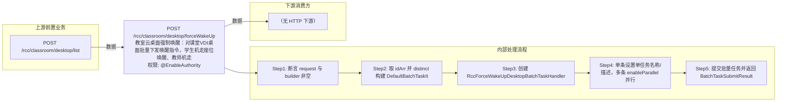

# POST /rcc/classroom/desktop/forceWakeUp

> 教室云桌面强制唤醒：对课堂VDI桌面批量下发唤醒指令，学生机走座位唤醒、教师机走教师唤醒。 ｜ @EnableAuthority ｜ batch

## 依赖关系全景图

## 接口基本信息

| 项目 | 内容 |
|---|---|
| URL | /rcc/classroom/desktop/forceWakeUp |
| Controller | RccClassroomDesktopController |
| 方法名 | forceWakeUp |
| 权限注解 | @EnableAuthority |
| 执行方式 | batch |
| 业务含义 | 教室云桌面强制唤醒：对课堂VDI桌面批量下发唤醒指令，学生机走座位唤醒、教师机走教师唤醒。 |

## 入参详情

### IdArrWebRequest

| 参数名 | 类型 | 必填 | 约束 | 说明 |
|---|---|---|---|---|
| idArr | UUID[] | 是 | @NotEmpty 非空 | 云桌面ID数组 |

## 出参详情

| 返回类型 | DefaultWebResponse |
|---|---|

| 字段 | 类型 | 说明 |
|---|---|---|
| content | BatchTaskSubmitResult | 批量任务提交结果（taskId等），唤醒指令由后台批任务异步下发 |

## 上游前置业务

### 前置1：POST /rcc/classroom/desktop/list

桌面ID数组来自桌面列表查询出参（ViewDesktopResultDTO.desktopId）（由 field_map 契约映射）
## 内部处理流程

### 批量处理器：RccForceWakeUpDesktopBatchTaskHandler

| 步骤 | 说明 |
|---|---|
| 1 | deskMgmtAPI.findById(id) 取桌面名 |
| 2 | classroomDesktopRelationAPI.isTeacherDesk(id) 判断教师桌面 |
| 3 | 学生桌面：seatAPI.getSeatInfoByVDIDesktopId 后 seatAPI.wakeUpDesktop(seatId) |
| 4 | 教师桌面：teacherOperateAPI.wakeUpDesktop(id) |
| 5 | 成功记 RCDC_RCC_DESKTOP_FORCE_WAKE_UP_SUC_LOG，失败记 FAIL_LOG 并返回 FAILURE 项 |

### 处理流程

1. 断言 request 与 builder 非空
2. 取 idArr 并 distinct 构建 DefaultBatchTaskItem 迭代器
3. 创建 RccForceWakeUpDesktopBatchTaskHandler 并注入 deskMgmtAPI/seatAPI/auditLogAPI/classroomDesktopRelationAPI/teacherOperateAPI
4. 单条设置单任务名称/描述，多条 enableParallel 并行
5. 提交批量任务并返回 BatchTaskSubmitResult

## 下游消费方

（本接口数据主要被自身/关联接口消费，或经 SPI 通知）
## 接口参数约束分析

| 层级 | 参数 | 规则 | 失败结果 |
|---|---|---|---|
| PARAM | idArr | 非空 | 参数校验失败（@NotEmpty） |
| BIZ | desktop | 桌面必须存在且能查询到 | 单项失败 rcdc_rcc_desktop_force_wake_up_item_fail_desc |

## 参数取值策略

| 参数 | 策略 | 说明 |
|---|---|---|
| idArr | user_input/from_query | 按业务构造 |

## 成功/失败断言基准

> ⚠️ 断言以 HTTP 响应为准（status + msgKey / BatchTaskSubmitResult），非服务端审计日志。

### 成功场景

| 场景 | 断言点 |
|---|---|
| 课堂桌面存在且可唤醒 | 批量任务提交成功，逐台唤醒成功返回成功项；轮询 content.taskId 至终态 batchTaskItemStatus∈["SUCCESS"] |

### 失败场景

| 场景 | 触发条件 | 断言点 |
|---|---|---|
| 桌面不存在或唤醒失败 | 桌面已删除/离线或平台唤醒命令异常 | $.status=="SUCCESS"；content.taskId 非空；轮询终态对应项 batchTaskItemStatus==FAILURE；审计 rcdc_rcc_desktop_force_wake_up_fail_log |
## 环境清理机制

| 接口 | 说明 |
|---|---|
| 本接口创建的资源 | 通过对应 delete 接口清理 |

## 前置状态和幂等性标注

| 维度 | 结论 |
|---|---|
| 幂等性 | medium |
| 说明 | 唤醒对已唤醒桌面重复执行通常无害（状态已一致），但每次提交都会新建批任务并重新下发指令 |
