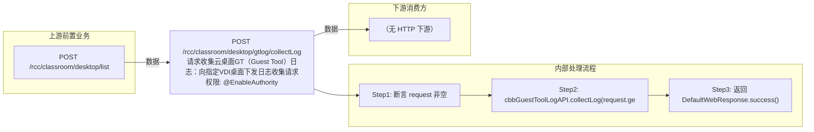

# POST /rcc/classroom/desktop/gtlog/collectLog

> 请求收集云桌面GT（Guest Tool）日志：向指定VDI桌面下发日志收集请求。 ｜ @EnableAuthority ｜ sync

## 依赖关系全景图

## 接口基本信息

| 项目 | 内容 |
|---|---|
| URL | /rcc/classroom/desktop/gtlog/collectLog |
| Controller | RccClassroomDesktopController |
| 方法名 | collect |
| 权限注解 | @EnableAuthority |
| 执行方式 | sync |
| 业务含义 | 请求收集云桌面GT（Guest Tool）日志：向指定VDI桌面下发日志收集请求。 |

## 入参详情

### IdWebRequest

| 参数名 | 类型 | 必填 | 约束 | 说明 |
|---|---|---|---|---|
| id | UUID | 是 | @NotNull 非空 | 云桌面ID |

## 出参详情

| 返回类型 | DefaultWebResponse（成功，无 data） |
| 说明 | 纯操作接口：content 为空（Builder.success() 无参）；成功返回 SUCCESS；失败返回 status/msgKey |
|---|---|

| 字段 | 类型 | 说明 |
|---|---|---|

## 上游前置业务

### 前置1：POST /rcc/classroom/desktop/list

桌面ID来自桌面列表查询出参（ViewDesktopResultDTO.desktopId）（由 field_map 契约映射）
## 内部处理流程

### 处理流程

1. 断言 request 非空
2. cbbGuestToolLogAPI.collectLog(request.getId()) 下发日志收集请求
3. 返回 DefaultWebResponse.success()

## 下游消费方

（本接口数据主要被自身/关联接口消费，或经 SPI 通知）
## 接口参数约束分析

| 层级 | 参数 | 规则 | 失败结果 |
|---|---|---|---|
| PARAM | id | 非空 | 参数校验失败（@NotNull） |
| BIZ | desktop | 桌面需在线且GT可用 | rcdc_clouddesktop_gt_log_send_request_fail（发送GT日志收集请求失败） |

## 参数取值策略

| 参数 | 策略 | 说明 |
|---|---|---|
| id | user_input/from_query | 按业务构造 |

## 成功/失败断言基准

### 成功场景

| 场景 | 断言点 |
|---|---|
| 桌面在线且GT正常 | status==SUCCESS；content 为空（Builder.success() 无参） |

### 失败场景

| 场景 | 触发条件 | 断言点 |
|---|---|---|
| 桌面离线或GT不可用 | collectLog 抛 BusinessException | status==ERROR；msgKey==rcdc_clouddesktop_gt_log_send_request_fail |

## 环境清理机制

| 接口 | 说明 |
|---|---|
| 本接口创建的资源 | 通过对应 delete 接口清理 |

## 前置状态和幂等性标注

| 维度 | 结论 |
|---|---|
| 幂等性 | medium |
| 说明 | 重复下发会产生多次日志收集任务；状态结果以最新一次为准 |
