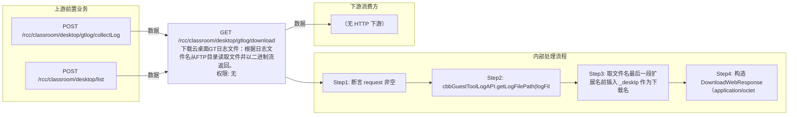

# GET /rcc/classroom/desktop/gtlog/download

> 下载云桌面GT日志文件：根据日志文件名从FTP目录读取文件并以二进制流返回。 ｜ 无特殊权限 ｜ sync

## 依赖关系全景图

## 接口基本信息

| 项目 | 内容 |
|---|---|
| URL | /rcc/classroom/desktop/gtlog/download |
| Controller | RccClassroomDesktopController |
| 方法名 | download |
| 权限注解 | 无 |
| 执行方式 | sync |
| 业务含义 | 下载云桌面GT日志文件：根据日志文件名从FTP目录读取文件并以二进制流返回。 |

## 入参详情

### DownloadGtLogWebRequest (GET 查询参数)

| 参数名 | 类型 | 必填 | 约束 | 说明 |
|---|---|---|---|---|
| logFileName | String | 是 | @NotBlank 非空白 | 日志文件名（带后缀） |
| deskId | UUID | 是 | @NotNull 非空 | 云桌面ID |

## 出参详情

| 返回类型 | DownloadWebResponse |
|---|---|

| 字段 | 类型 | 说明 |
|---|---|---|
| file | File | 日志文件二进制流 |
| contentType | String | application/octet-stream |
| fileName | String | 在原文件名下划线位置插入 _deskIp 重命名后的文件名 |
| suffix | String | 原文件后缀 |

## 上游前置业务

### 前置1：POST /rcc/classroom/desktop/gtlog/collectLog

推断：日志文件名由GT日志收集接口产出，字段名为推断（由 field_map 契约映射）

### 前置2：POST /rcc/classroom/desktop/list

桌面ID来自桌面列表查询出参（ViewDesktopResultDTO.desktopId）（由 field_map 契约映射）
## 内部处理流程

### 处理流程

1. 断言 request 非空
2. cbbGuestToolLogAPI.getLogFilePath(logFileName) 获取文件路径
3. 取文件名最后一段扩展名前插入 _deskIp 作为下载名
4. 构造 DownloadWebResponse（application/octet-stream）返回文件

## 下游消费方

（本接口数据主要被自身/关联接口消费，或经 SPI 通知）
## 接口参数约束分析

| 层级 | 参数 | 规则 | 失败结果 |
|---|---|---|---|
| PARAM | logFileName | 非空白 | 参数校验失败（@NotBlank） |
| BIZ | logFileName | 日志文件必须存在 | rcdc_clouddesktop_gt_log_download_file_not_exist 或 rcdc_clouddesktop_gt_log_ftp_directory_not_configured |

## 参数取值策略

| 参数 | 策略 | 说明 |
|---|---|---|
| logFileName | user_input/from_query | 按业务构造 |
| deskId | user_input/from_query | 按业务构造 |

## 成功/失败断言基准

### 成功场景

| 场景 | 断言点 |
|---|---|
| 日志文件存在 | HTTP 200，返回文件流（content-type: application/octet-stream） |

### 失败场景

| 场景 | 触发条件 | 断言点 |
|---|---|---|
| 日志文件不存在 | getLogFilePath 抛 BusinessException 或文件为空 | status==ERROR；msgKey==rcdc_clouddesktop_gt_log_download_file_not_exist |

## 环境清理机制

| 接口 | 说明 |
|---|---|
| 本接口创建的资源 | 通过对应 delete 接口清理 |

## 前置状态和幂等性标注

| 维度 | 结论 |
|---|---|
| 幂等性 | high |
| 说明 | 只读下载接口，可重复调用 |
