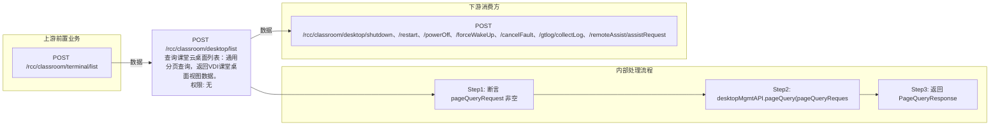

# POST /rcc/classroom/desktop/list

> 查询课堂云桌面列表：通用分页查询，返回VDI课堂桌面视图数据。 ｜ 无特殊权限 ｜ sync

## 依赖关系全景图

## 接口基本信息

| 项目 | 内容 |
|---|---|
| URL | /rcc/classroom/desktop/list |
| Controller | RccClassroomDesktopController |
| 方法名 | list |
| 权限注解 | 无 |
| 执行方式 | sync |
| 业务含义 | 查询课堂云桌面列表：通用分页查询，返回VDI课堂桌面视图数据。 |

## 入参详情

### PageQueryRequest

| 参数名 | 类型 | 必填 | 约束 | 说明 |
|---|---|---|---|---|
| matchArr | Match[] | 否 | 可选，精确/模糊匹配条件 | 查询过滤条件数组 |
| sortArr | Sort[] | 否 | 可选 | 排序条件 |
| limit | Integer | 否 |  | 页码与每页条数（limit） |
| page | Integer | 否 |  | 页码与每页条数（page） |
## 出参详情

| 返回类型 | DefaultWebResponse（data=PageQueryResponse<ViewDesktopResultDTO>） |
|---|---|

| 字段 | 类型 | 说明 |
|---|---|---|
| itemArr | ViewDesktopResultDTO[] | 桌面列表项（元素字段见下） |
| total | long | 总记录数 |
| desktopId | UUID | 云桌面ID |
| strategyId | UUID | 云桌面策略ID |
| computerName | String | 云桌面主机名 |
| desktopPreName | String | 主机名前缀（教师机名前缀或座位名） |
| desktopState | CbbCloudDeskState | 云桌面状态 |
| disableNetwork | Boolean | 是否禁网 |
| desktopType | CbbCloudDeskType | 云桌面类型（IDV/VDI） |
| desktopRole | DesktopRoleEnum | 云桌面角色（学生机/教师机） |
| desktopMac | String | 云桌面MAC |
| desktopIp | String | 云桌面IP |
| desktopIpv6 | String | 云桌面IPv6地址 |
| guestToolVersion | String | 云桌面安装的工具版本 |
| vgpuType | VgpuType | vGPU类型 |
| vgpuExtraInfo | String | vGPU附加信息 |
| osVersion | String | 系统版本 |
| desktopImageName | String | 镜像名称 |
| desktopRootImageName | String | 根镜像模板名称 |
| desktopImageRoleType | ImageRoleType | 镜像角色类型 |
| imageType | CbbImageType | 镜像类型 |
| osType | CbbOsType | 操作系统类型 |
| cpu | Integer | CPU核数 |
| memory | Double | 内存大小（GB） |
| systemDisk | Integer | 系统分区大小 |
| desktopCategory | String | 云桌面容量类型（PERSON/RESTORE） |
| terminalIp | String | 终端IP |
| classroomId | UUID | 教室ID |
| seatNum | Integer | 座位号 |
| targetComputerName | String | 目标计算机名称（计算机名不存在时的提示） |
| faultState | Boolean | 云桌面报障状态 |
| faultDescription | String | 云桌面报障内容 |
| version | Integer | 版本号 |
| registerState | CbbDeskRegisterState | 云桌面注册状态 |
| platformId | UUID | 云平台ID |
| platformType | CloudPlatformType | 云平台类型 |
| platformName | String | 云平台名称 |
| platformStatus | CloudPlatformStatus | 云平台状态 |
| vgpuDesktop | Boolean | 是否vGPU桌面 |
| vgpuModel | String | vGPU型号 |

## 上游前置业务

### 前置1：POST /rcc/classroom/terminal/list

推断：可选过滤条件：教室ID，字段名为推断（由 field_map 契约映射）
## 内部处理流程

### 处理流程

1. 断言 pageQueryRequest 非空
2. desktopMgmtAPI.pageQuery(pageQueryRequest) 分页查询
3. 返回 PageQueryResponse

## 下游消费方

### 消费1：POST /rcc/classroom/desktop/shutdown、/restart、/powerOff、/forceWakeUp、/cancelFault、/gtlog/collectLog、/remoteAssist/assistRequest

桌面列表出参ViewDesktopResultDTO.desktopId（由 field_map 契约映射）
## 接口参数约束分析

| 层级 | 参数 | 规则 | 失败结果 |
|---|---|---|---|
| PARAM | pageQueryRequest | 非空且分页参数合法 | 参数校验失败 |

## 参数取值策略

| 参数 | 策略 | 说明 |
|---|---|---|
| page/limit | user_input/from_query | 按业务构造 |
| matchArr | user_input/from_query | 按业务构造 |
| sortArr | user_input/from_query | 按业务构造 |

## 成功/失败断言基准

### 成功场景

| 场景 | 断言点 |
|---|---|
| 分页参数合法 | $.status=="SUCCESS"；$.content.itemArr 存在 |

### 失败场景

| 场景 | 触发条件 | 断言点 |
|---|---|---|
| 分页参数不合法 | page/limit非法或dmql解析失败 | status==ERROR（查询异常） |

## 环境清理机制

| 接口 | 说明 |
|---|---|
| 本接口创建的资源 | 通过对应 delete 接口清理 |

## 前置状态和幂等性标注

| 维度 | 结论 |
|---|---|
| 幂等性 | high |
| 说明 | 只读查询接口，天然幂等 |
