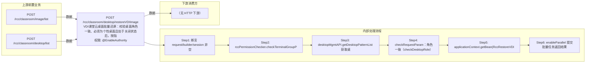

# POST /rcc/classroom/desktop/restoreVDIImage

> VDI课堂云桌面批量还原：校验桌面角色一致、必须为个性桌面且处于关闭状态后，按指定镜像批量还原桌面系统盘。 ｜ @EnableAuthority ｜ batch

## 依赖关系全景图

## 接口基本信息

| 项目 | 内容 |
|---|---|
| URL | /rcc/classroom/desktop/restoreVDIImage |
| Controller | RccClassroomDesktopController |
| 方法名 | restoreVDIImage |
| 权限注解 | @EnableAuthority |
| 执行方式 | batch |
| 业务含义 | VDI课堂云桌面批量还原：校验桌面角色一致、必须为个性桌面且处于关闭状态后，按指定镜像批量还原桌面系统盘。 |

## 入参详情

### RccRestoreVDIImageWebRequest

| 参数名 | 类型 | 必填 | 约束 | 说明 |
|---|---|---|---|---|
| imageId | UUID | 是 | @NotNull 非空 | 目标镜像模板ID |
| desktopIdList | List<UUID> | 是 | @NotEmpty 非空 | 待还原的桌面ID列表 |

## 出参详情

| 返回类型 | DefaultWebResponse |
|---|---|

| 字段 | 类型 | 说明 |
|---|---|---|
| content | BatchTaskSubmitResult | 批量任务提交结果（还原由后台异步执行） |

## 上游前置业务

### 前置1：POST /rcc/classroom/image/list

推断：镜像ID来源，字段名为推断（由 field_map 契约映射）

### 前置2：POST /rcc/classroom/desktop/list

推断：待还原桌面ID列表来自桌面列表查询出参（ViewDesktopResultDTO.desktopId）（由 field_map 契约映射）
## 内部处理流程

### 批量处理器：RccRestoreVDIDesktopHandler

| 步骤 | 说明 |
|---|---|
| 1 | getHandlerParam 构造 RestoreDesktopDTO{desktopId, imageId} |
| 2 | desktopMgmtAPI.getDesktopById 取桌面名 |
| 3 | desktopOperateAPI.restoreVDIDesktop(param) 执行还原 |
| 4 | 成功记 RCDC_RCC_DESKTOP_REVERT_SUC_LOG，失败记 FAIL_LOG 并返回 FAILURE 项 |

### 处理流程

1. 断言 request/builder/session 非空
2. rccPermissionChecker.checkTerminalGroupPermissionByDeskId(desktopIdList, session) 权限校验
3. desktopMgmtAPI.getDesktopPatternList 获取桌面详情列表
4. checkRequestParam：角色一致（checkDesktopRole）、个性桌面（checkDesktopPattern）、关闭状态（checkDesktopStatus）
5. applicationContext.getBean(RccRestoreVDIDesktopHandler) 构建批量处理器
6. enableParallel 提交批量任务返回结果

## 下游消费方

（本接口数据主要被自身/关联接口消费，或经 SPI 通知）
## 接口参数约束分析

| 层级 | 参数 | 规则 | 失败结果 |
|---|---|---|---|
| PARAM | imageId | 非空 | 参数校验失败（@NotNull） |
| PARAM | desktopIdList | 非空 | 参数校验失败（@NotEmpty） |
| BIZ | desktopList | 所有桌面必须同为教师机或学生机角色且角色一致 | RCDC_CLOUDDESKTOP_DESK_ROLE_ERROR（桌面角色不一致） |
| BIZ | desktopList | 桌面必须为个性桌面（PERSONAL） | RCDC_CLOUDDESKTOP_HAVE_NOT_PERSONAL_DESKTOP（存在非个性桌面） |
| STATE | desktop | 桌面必须处于关闭（CLOSE）状态 | RCDC_CLOUDDESKTOP_DESKINFO_NOT_CLOSE_STATE_RESTORE_FORBID（非关闭状态禁止还原） |
| BIZ | desktopList | 桌面详情或角色不能为空 | RCDC_CLOUDDESKTOP_INFO_IS_EMPTY |

## 参数取值策略

| 参数 | 策略 | 说明 |
|---|---|---|
| imageId | user_input/from_query | 按业务构造 |
| desktopIdList | user_input/from_query | 按业务构造 |

## 成功/失败断言基准

### 成功场景

| 场景 | 断言点 |
|---|---|
| 全部桌面为同角色个性桌面且关闭 | 批量任务提交成功，逐台还原成功；轮询 content.taskId 至终态 batchTaskItemStatus∈["SUCCESS"] |

### 失败场景

| 场景 | 触发条件 | 断言点 |
|---|---|---|
| 存在桌面非关闭状态 | 任一桌面状态非 CLOSE | status==ERROR；msgKey==rcdc-clouddesktop_deskinfo_not_close_state_restore_forbid |
| 存在非个性桌面 | desktopPattern 非 PERSONAL | status==ERROR；msgKey==rcdc-clouddesktop_have_not_personal_desktop |
| 桌面角色不一致 | 桌面角色与首台不一致或为空 | status==ERROR；msgKey∈{rcdc-clouddesktop_desk_role_error, rcdc-clouddesktop_info_is_empty} |

## 环境清理机制

| 接口 | 说明 |
|---|---|
| 本接口创建的资源 | 通过对应 delete 接口清理 |

## 前置状态和幂等性标注

| 维度 | 结论 |
|---|---|
| 幂等性 | low |
| 说明 | 还原会覆盖桌面系统盘数据，重复执行会再次还原；执行前必须确认桌面为关闭状态 |
