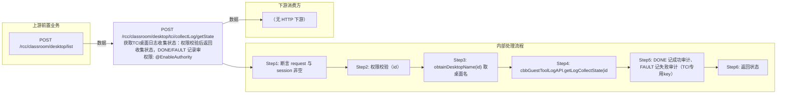

# POST /rcc/classroom/desktop/tci/collectLog/getState

> 获取TCI桌面日志收集状态：权限校验后返回收集状态，DONE/FAULT 记录审计日志。 ｜ @EnableAuthority ｜ sync

## 依赖关系全景图

## 接口基本信息

| 项目 | 内容 |
|---|---|
| URL | /rcc/classroom/desktop/tci/collectLog/getState |
| Controller | TCIDesktopOperateController |
| 方法名 | getCollectTCIDesktopLogState |
| 权限注解 | @EnableAuthority |
| 执行方式 | sync |
| 业务含义 | 获取TCI桌面日志收集状态：权限校验后返回收集状态，DONE/FAULT 记录审计日志。 |

## 入参详情

### IdWebRequest

| 参数名 | 类型 | 必填 | 约束 | 说明 |
|---|---|---|---|---|
| id | UUID | 是 | @NotNull 非空 | TCI云桌面ID |

## 出参详情

| 返回类型 | DefaultWebResponse |
|---|---|

| 字段 | 类型 | 说明 |
|---|---|---|
| content | CbbGtLogCollectStateDTO | 日志收集状态（元素字段见下） |
| content.deskId | UUID | 云桌面ID |
| content.state | GtLogCollectState | 收集状态：DOING/DONE/FAULT |
| content.logFileName | String | 日志文件名 |
| content.message | String | 失败时的错误信息 |

## 上游前置业务

### 前置1：POST /rcc/classroom/desktop/list

桌面ID来自桌面列表查询出参（ViewDesktopResultDTO.desktopId）（由 field_map 契约映射）
## 内部处理流程

### 处理流程

1. 断言 request 与 session 非空
2. 权限校验（id）
3. obtainDesktopName(id) 取桌面名
4. cbbGuestToolLogAPI.getLogCollectState(id) 查询状态
5. DONE 记成功审计、FAULT 记失败审计（TCI专用key）
6. 返回状态

## 下游消费方

（本接口数据主要被自身/关联接口消费，或经 SPI 通知）
## 接口参数约束分析

| 层级 | 参数 | 规则 | 失败结果 |
|---|---|---|---|
| PARAM | id | 非空 | 参数校验失败（@NotNull） |
| PERM | session | 当前用户需有对应终端分组权限 | 权限不足抛异常 |

## 参数取值策略

| 参数 | 策略 | 说明 |
|---|---|---|
| id | user_input/from_query | 按业务构造 |

## 成功/失败断言基准

### 成功场景

| 场景 | 断言点 |
|---|---|
| 日志收集完成 | $.status=="SUCCESS"；$.content.state==DONE |

### 失败场景

| 场景 | 触发条件 | 断言点 |
|---|---|---|
| 日志收集失败 | 收集过程异常 | $.status=="SUCCESS"；$.content.state==FAULT（审计 rcdc_rcc_tci_desktop_collect_log_fail） |

## 环境清理机制

| 接口 | 说明 |
|---|---|
| 本接口创建的资源 | 通过对应 delete 接口清理 |

## 前置状态和幂等性标注

| 维度 | 结论 |
|---|---|
| 幂等性 | high |
| 说明 | 只读查询，可轮询 |
