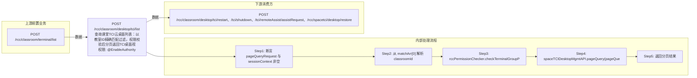

# POST /rcc/classroom/desktop/tci/list

> 查询课堂TCI云桌面列表：以教室ID精确匹配过滤，权限校验后分页返回TCI桌面视图。 ｜ @EnableAuthority ｜ sync

## 依赖关系全景图

## 接口基本信息

| 项目 | 内容 |
|---|---|
| URL | /rcc/classroom/desktop/tci/list |
| Controller | RccClassroomTCIDesktopController |
| 方法名 | list |
| 权限注解 | @EnableAuthority |
| 执行方式 | sync |
| 业务含义 | 查询课堂TCI云桌面列表：以教室ID精确匹配过滤，权限校验后分页返回TCI桌面视图。 |

## 入参详情

### PageQueryRequest

| 参数名 | 类型 | 必填 | 约束 | 说明 |
|---|---|---|---|---|
| matchArr[0] | DefaultExactMatch | 是 | 首个match必须是classroomId的精确匹配 | 包含 classroomId 精确匹配条件 |
| sortArr | Sort[] | 否 | 可选 | 排序条件 |
| limit | Integer | 否 |  | 页码与每页条数（limit） |
| page | Integer | 否 |  | 页码与每页条数（page） |## 出参详情

| 返回类型 | DefaultWebResponse（data=PageQueryResponse<ViewTCIDesktopResultDTO>） |
|---|---|

| 字段 | 类型 | 说明 |
|---|---|---|
| itemArr | ViewTCIDesktopResultDTO[] | TCI桌面列表项（元素字段见下） |
| total | long | 总记录数 |
| desktopId | UUID | 云桌面ID |
| computerName | String | 云桌面主机名 |
| desktopPreName | String | 主机名前缀（教师机名前缀或座位名） |
| desktopState | CbbCloudDeskState | 云桌面状态 |
| disableNetwork | Boolean | 是否禁网 |
| desktopType | CbbCloudDeskType | 云桌面类型（IDV/VDI） |
| desktopRole | String | 云桌面角色（学生机/教师机） |
| desktopMac | String | 云桌面MAC |
| desktopIp | String | 云桌面IP |
| desktopImageName | String | 镜像名称 |
| desktopRootImageName | String | 根镜像名称 |
| imageType | CbbImageType | 镜像类型 |
| osType | CbbOsType | 操作系统类型 |
| osVersion | String | 系统版本 |
| systemDisk | Integer | 系统分区大小 |
| diskSize | Integer | 数据盘大小 |
| desktopCategory | String | 云桌面容量类型（PERSON/RESTORE） |
| terminalIp | String | 终端IP |
| classroomId | UUID | 教室ID |
| seatNum | Integer | 座位号 |
| hostName | String | 主机名 |
| terminalState | CbbTerminalStateEnums | 终端状态 |
| targetComputerName | String | 目标计算机名称（计算机名不存在时的提示） |
| registerState | CbbDeskRegisterState | 云桌面注册状态 |
| desktopIpv6 | String | 云桌面IPv6地址 |
| guestToolVersion | String | 云桌面安装的工具版本 |

## 上游前置业务

### 前置1：POST /rcc/classroom/terminal/list

推断：可选过滤条件：教室ID，字段名为推断（由 field_map 契约映射）
## 内部处理流程

### 处理流程

1. 断言 pageQueryRequest 与 sessionContext 非空
2. 从 matchArr[0] 解析 classroomId
3. rccPermissionChecker.checkTerminalGroupPermissionByClassroomId(classroomId) 权限校验
4. spaceTCIDesktopMgmtAPI.pageQuery(pageQueryRequest) 分页查询
5. 返回分页结果

## 下游消费方

### 消费1：POST /rcc/classroom/desktop/tci/restart、/tci/shutdown、/tci/remoteAssist/assistRequest、/rcc/spacetci/desktop/restore

TCI桌面列表出参ViewDesktopResultDTO.desktopId（由 field_map 契约映射）
## 接口参数约束分析

| 层级 | 参数 | 规则 | 失败结果 |
|---|---|---|---|
| PARAM | pageQueryRequest | 非空，且 matchArr[0] 必须为 classroomId 精确匹配 | 参数校验失败或matchArr为空时数组越界 |
| PERM | classroomId | 当前用户需有该教室对应终端分组权限 | 权限校验抛异常 |

## 参数取值策略

| 参数 | 策略 | 说明 |
|---|---|---|
| page/limit | user_input/from_query | 按业务构造 |
| matchArr[0] | user_input/from_query | 按业务构造 |
| sortArr | user_input/from_query | 按业务构造 |

## 成功/失败断言基准

### 成功场景

| 场景 | 断言点 |
|---|---|
| 用户有教室权限且分页参数合法 | $.status=="SUCCESS"；$.content.itemArr 存在 |

### 失败场景

| 场景 | 触发条件 | 断言点 |
|---|---|---|
| matchArr为空或非classroomId精确匹配 | 前端未传classroomId精确匹配条件 | status==ERROR（参数校验，matchArr[0] 越界） |
| 无教室权限 | 用户终端分组不含该教室 | status==ERROR；msgKey==RCDC_SAPCE_DATA_PERMISSION_DENIED |

## 环境清理机制

| 接口 | 说明 |
|---|---|
| 本接口创建的资源 | 通过对应 delete 接口清理 |

## 前置状态和幂等性标注

| 维度 | 结论 |
|---|---|
| 幂等性 | high |
| 说明 | 只读查询接口 |
