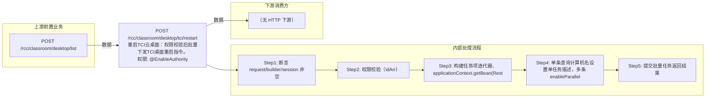

# POST /rcc/classroom/desktop/tci/restart

> 重启TCI云桌面：权限校验后批量下发TCI桌面重启指令。 ｜ @EnableAuthority ｜ batch

## 依赖关系全景图

## 接口基本信息

| 项目 | 内容 |
|---|---|
| URL | /rcc/classroom/desktop/tci/restart |
| Controller | TCIDesktopOperateController |
| 方法名 | restartTCIDesktop |
| 权限注解 | @EnableAuthority |
| 执行方式 | batch |
| 业务含义 | 重启TCI云桌面：权限校验后批量下发TCI桌面重启指令。 |

## 入参详情

### IdArrWebRequest

| 参数名 | 类型 | 必填 | 约束 | 说明 |
|---|---|---|---|---|
| idArr | UUID[] | 是 | @NotEmpty 非空 | TCI云桌面ID数组 |

## 出参详情

| 返回类型 | DefaultWebResponse |
|---|---|

| 字段 | 类型 | 说明 |
|---|---|---|
| content | BatchTaskSubmitResult | 批量任务提交结果 |

## 上游前置业务

### 前置1：POST /rcc/classroom/desktop/list

桌面ID数组来自桌面列表查询出参（ViewDesktopResultDTO.desktopId）（由 field_map 契约映射）
## 内部处理流程

### 批量处理器：RestartTCIDesktopBatchTaskHandler

| 步骤 | 说明 |
|---|---|
| 1 | desktopMgmtAPI.getDeskIDV(desktopId) 取桌面名 |
| 2 | desktopMgmtAPI.rebootDeskIDV(desktopId) 执行重启 |
| 3 | 成功记 RCDC_RCC_TCI_DESKTOP_RESTART_SUC_LOG，失败记 FAIL_LOG 并返回 FAILURE 项 |

### 处理流程

1. 断言 request/builder/session 非空
2. 权限校验（idArr）
3. 构建任务项迭代器，applicationContext.getBean(RestartTCIDesktopBatchTaskHandler)
4. 单条查询计算机名设置单任务描述，多条 enableParallel
5. 提交批量任务返回结果

## 下游消费方

（本接口数据主要被自身/关联接口消费，或经 SPI 通知）
## 接口参数约束分析

| 层级 | 参数 | 规则 | 失败结果 |
|---|---|---|---|
| PARAM | idArr | 非空 | 参数校验失败（@NotEmpty） |
| PERM | session | 当前用户需有对应终端分组权限 | 权限校验抛异常 |
| BIZ | desktop | 桌面必须存在 | 单项失败 rcdc_rcc_tci_desktop_restart_item_fail_desc |

## 参数取值策略

| 参数 | 策略 | 说明 |
|---|---|---|
| idArr | user_input/from_query | 按业务构造 |

## 成功/失败断言基准

### 成功场景

| 场景 | 断言点 |
|---|---|
| 桌面存在且有权限 | 批量任务提交成功，逐台重启成功；轮询 content.taskId 至终态 batchTaskItemStatus∈["SUCCESS"] |

### 失败场景

| 场景 | 触发条件 | 断言点 |
|---|---|---|
| 桌面不存在或重启失败 | 桌面已删除或终端离线 | $.status=="SUCCESS"；content.taskId 非空；轮询终态对应项 batchTaskItemStatus==FAILURE；对应项 msgKey==rcdc_rcc_tci_desktop_restart_item_fail_desc（单条任务时 finish msgKey==rcdc_rcc_tci_desktop_restart_single_fail）；rcdc_rcc_tci_desktop_restart_fail_log 仅为审计日志 key，不是响应 msgKey |

## 环境清理机制

| 接口 | 说明 |
|---|---|
| 本接口创建的资源 | 通过对应 delete 接口清理 |

## 前置状态和幂等性标注

| 维度 | 结论 |
|---|---|
| 幂等性 | low |
| 说明 | 重启为有状态操作，任务级不幂等 |
