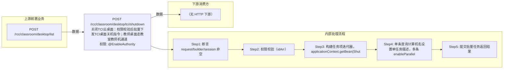

# POST /rcc/classroom/desktop/tci/shutdown

> 关闭TCI云桌面：权限校验后批量下发TCI桌面关机指令；教师桌面走教室教师机通道，学生桌面走座位通道。 ｜ @EnableAuthority ｜ batch

## 依赖关系全景图

## 接口基本信息

| 项目 | 内容 |
|---|---|
| URL | /rcc/classroom/desktop/tci/shutdown |
| Controller | TCIDesktopOperateController |
| 方法名 | shutdownTCIDesktop |
| 权限注解 | @EnableAuthority |
| 执行方式 | batch |
| 业务含义 | 关闭TCI云桌面：权限校验后批量下发TCI桌面关机指令；教师桌面走教室教师机通道，学生桌面走座位通道。 |

## 入参详情

### IdArrWebRequest

| 参数名 | 类型 | 必填 | 约束 | 说明 |
|---|---|---|---|---|
| idArr | UUID[] | 是 | @NotEmpty 非空 | TCI云桌面ID数组 |

## 出参详情

| 返回类型 | DefaultWebResponse |
|---|---|

| 字段 | 类型 | 说明 |
|---|---|---|
| content | BatchTaskSubmitResult | 批量任务提交结果 |

## 上游前置业务

### 前置1：POST /rcc/classroom/desktop/list

桌面ID数组来自桌面列表查询出参（ViewDesktopResultDTO.desktopId）（由 field_map 契约映射）
## 内部处理流程

### 批量处理器：ShutdownTCIDesktopBatchTaskHandler

| 步骤 | 说明 |
|---|---|
| 1 | desktopMgmtAPI.getDeskIDV(desktopId) 取桌面名 |
| 2 | shutdownDesktop：classroomDesktopRelationService.getRelationByDeskId（null则抛IllegalArgumentException） |
| 3 | enableTeacher=true：classroomTeacherAPI.shutdownTeacherTCIDesktop(classroomId) |
| 4 | 否则：seatAPI.shutdownTCIDesktop(desktopId) |
| 5 | 成功记 RCDC_RCC_TCI_DESKTOP_SHUTDOWN_SUC_LOG，失败记 FAIL_LOG 并返回 FAILURE 项 |

### 处理流程

1. 断言 request/builder/session 非空
2. 权限校验（idArr）
3. 构建任务项迭代器，applicationContext.getBean(ShutdownTCIDesktopBatchTaskHandler)
4. 单条查询计算机名设置单任务描述，多条 enableParallel
5. 提交批量任务返回结果

## 下游消费方

（本接口数据主要被自身/关联接口消费，或经 SPI 通知）
## 接口参数约束分析

| 层级 | 参数 | 规则 | 失败结果 |
|---|---|---|---|
| PARAM | idArr | 非空 | 参数校验失败（@NotEmpty） |
| PERM | session | 当前用户需有对应终端分组权限 | 权限校验抛异常 |
| BIZ | desktop | 桌面必须存在教室桌面关联 | getRelationByDeskId 返回 null 时抛 IllegalArgumentException |

## 参数取值策略

| 参数 | 策略 | 说明 |
|---|---|---|
| idArr | user_input/from_query | 按业务构造 |

## 成功/失败断言基准

> 断言以 HTTP 响应为准（status + content.taskId + taskName），任务结果通过轮询 content.taskId 获取。依据源码：TCIDesktopOperateController.shutdownTCIDesktop(#135) → executeShutdownBatchTask(#151)；ShutdownTCIDesktopBatchTaskHandler.processItem(#72)。

### 成功场景（HTTP 响应级）

| 场景 | 触发条件 | 断言点 |
|---|---|---|
| 单台关机 | idArr 长度=1 | status==SUCCESS；content.taskId 非空；content.taskName==RCDC_RCC_TCI_DESKTOP_SHUTDOWN_SINGLE_TASK_NAME（先 getDeskIDV 查计算机名设任务描述）；轮询终态 batchTaskItemStatus==SUCCESS |
| 批量关机 | idArr 长度>1 | status==SUCCESS；content.taskId 非空；content.taskName==RCDC_RCC_TCI_DESKTOP_SHUTDOWN_BATCH_TASK_NAME；任务 enableParallel；逐台 batchTaskItemStatus==SUCCESS |

### 失败场景（HTTP 响应级）

| 场景 | 触发条件 | 断言点 |
|---|---|---|
| 无终端组权限 | 非管理员且无对应教室终端组权限 | 请求阶段拒绝：status==ERROR（checkTerminalGroupPermissionByDeskId 抛出权限类异常） |
| 单台桌面不存在 | idArr 长度=1 且 getDeskIDV(id) 查无此 IDV 桌面 | 提交前失败：status==ERROR（BusinessException，任务未提交，无 taskId） |
| 单台关机指令失败 | 终端离线/平台异常（shutdownDesktop 抛 BusinessException） | 任务已提交：status==SUCCESS；content.taskId 非空；轮询 taskId 终态 batchTaskItemStatus==FAILURE；对应项 msgKey==rcdc_rcc_tci_desktop_shutdown_item_fail_desc（单条任务时 finish msgKey==rcdc_rcc_tci_desktop_shutdown_single_fail）；审计记录 RCDC_RCC_TCI_DESKTOP_SHUTDOWN_FAIL_LOG |
| 参数校验 | idArr 为空 | status==ERROR（参数校验 @NotEmpty） |

## 环境清理机制

| 接口 | 说明 |
|---|---|
| 本接口创建的资源 | 通过对应 delete 接口清理 |

## 前置状态和幂等性标注

| 维度 | 结论 |
|---|---|
| 幂等性 | low |
| 说明 | 关机为有状态操作，任务级不幂等 |
