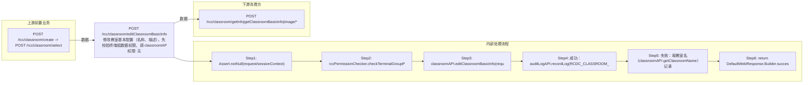

# POST /rcc/classroom/editClassroomBasicInfo

> 修改教室基本配置（名称、描述）。先校验终端组数据权限，调 classroomAPI.editClassroomBasicInfo 更新；成功记录更新成功审计日志并返回 ResponseClassroomIdDTO，失败记录失败审计日志后重新抛出异常。 ｜ 无特殊权限 ｜ 同步

## 依赖关系全景图

## 接口基本信息

| 项目 | 内容 |
|---|---|
| URL | /rcc/classroom/editClassroomBasicInfo |
| Controller | RccClassroomConfigController |
| 方法名 | editClassroomBasicInfo |
| 权限注解 | 无 |
| 执行方式 | 同步 |
| 业务含义 | 修改教室基本配置（名称、描述）。先校验终端组数据权限，调 classroomAPI.editClassroomBasicInfo 更新；成功记录更新成功审计日志并返回 ResponseClassroomIdDTO，失败记录失败审计日志后重新抛出异常。 |

## 入参详情

### ClassroomBasicConfigWebRequest

| 参数名 | 类型 | 必填 | 约束 | 说明 |
|---|---|---|---|---|
| classroomId | UUID | 是 | @NotNull | 教室ID |
| classroomName | String | 是 | @NotNull @Size(min=3, max=20) | 新教室名称 |
| classroomDesc | String | 否 | @Nullable @Size(max=200) | 新教室描述 |

## 出参详情

| 返回类型 | DefaultWebResponse（data=ResponseClassroomIdDTO，msg=CLASSROOM_OPERATE_TIP_SUCCESS） |
|---|---|

| 字段 | 类型 | 说明 |
|---|---|---|
| classroomId | UUID | 教室ID |
| classroomName | String | 修改后的教室名称 |
| status | Integer | 1=教室创建成功但座位创建失败（默认0） |
| errorMessage | String | 错误消息（可选） |

## 上游前置业务

### 前置1：POST /rcc/classroom/create -> POST /rcc/classroom/select

create 为异步批任务，响应为 BatchTaskSubmitResult 不直接返回 ID；实际经 select 按名称查询 content[0].classroomId（由 field_map 契约映射）
## 内部处理流程

### 处理流程

1. Assert.notNull(request/sessionContext)
2. rccPermissionChecker.checkTerminalGroupPermissionByClassroomId([classroomId], sessionContext)
3. classroomAPI.editClassroomBasicInfo(request) 更新基本配置
4. 成功：auditLogAPI.recordLog(RCDC_CLASSROOM_RECORD_LOG_UPDATE_SUCCESS, 教室名, CLASSROOM_RECORD_LOG_I18MESSAGE_BASIC)
5. 失败：取教室名（classroomAPI.getClassroomName）记录 RCDC_CLASSROOM_RECORD_LOG_UPDATE_FAILED 审计后 throw e
6. return DefaultWebResponse.Builder.success(CLASSROOM_OPERATE_TIP_SUCCESS, classroomIdDTO)

## 下游消费方

### 消费1：POST /rcc/classroom/getInfo|getClassroomBasicInfo|image/*

出参 ResponseClassroomIdDTO.classroomId 回显教室ID（由 field_map 契约映射）
## 接口参数约束分析

| 层级 | 参数 | 规则 | 失败结果 |
|---|---|---|---|
| PARAM | classroomId | @NotNull | 缺失校验失败 |
| PARAM | classroomName | @NotNull @Size(3-20) | 非空/长度校验失败 |
| BUSINESS | classroomId | 教室存在且有数据权限 | 不存在抛 RCDC_CLASSROOM_NOT_FIND；权限不足抛权限异常 |
| BUSINESS | classroomName | 新名称不与其它教室重复 | 抛 RCDC_RCC_CLASSROOM_NAME_DUPLICATION |

## 参数取值策略

| 参数 | 策略 | 说明 |
|---|---|---|
| classroomId | user_input/from_query | 按业务构造 |
| classroomName | user_input/from_query | 按业务构造 |
| classroomDesc | user_input/from_query | 按业务构造 |

## 成功/失败断言基准

### 成功场景

| 场景 | 断言点 |
|---|---|
| 合法的新名称/描述 | $.status=="SUCCESS"；$.content.classroomId 非空 |

### 失败场景

| 场景 | 触发条件 | 断言点 |
|---|---|---|
| 教室ID不存在 | classroomId 无效 | status==ERROR（BusinessException 重新抛出，如 RCDC_CLASSROOM_NOT_FIND） |
| 新名称与其他教室重复 | classroomName 被占用 | status==ERROR；msgKey==RCDC_RCC_CLASSROOM_NAME_DUPLICATION |

## 环境清理机制

| 接口 | 说明 |
|---|---|
| 本接口创建的资源 | 通过对应 delete 接口清理 |

## 前置状态和幂等性标注

| 维度 | 结论 |
|---|---|
| 幂等性 | MEDIUM |
| 说明 | 按 classroomId 整体更新基本配置，重复提交收敛于最终值；名称冲突时失败 |
