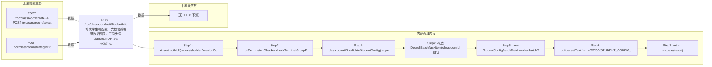

# POST /rcc/classroom/editStudentInfo

> 修改学生机配置：先校验终端组数据权限，再同步调 classroomAPI.validateStudentConfig 做学生机配置校验（IP段、工作模式、VDI/TCI本地磁盘、策略、存储池等），通过后构造 StudentConfigBatchTaskHandler 提交异步批任务；任务内 processItem 调 classroomAPI.editStudentTerminalInfo 应用配置，接口立即返回 BatchTaskSubmitResult。 ｜ 无特殊权限 ｜ 异步批处理任务（BatchTask，StudentConfigBatchTaskHandler）

## 依赖关系全景图

## 接口基本信息

| 项目 | 内容 |
|---|---|
| URL | /rcc/classroom/editStudentInfo |
| Controller | RccClassroomConfigController |
| 方法名 | editStudentInfo |
| 权限注解 | 无 |
| 执行方式 | 异步批处理任务（BatchTask，StudentConfigBatchTaskHandler） |
| 业务含义 | 修改学生机配置：先校验终端组数据权限，再同步调 classroomAPI.validateStudentConfig 做学生机配置校验（IP段、工作模式、VDI/TCI本地磁盘、策略、存储池等），通过后构造 StudentConfigBatchTaskHandler 提交异步批任务；任务内 processItem 调 classroomAPI.editStudentTerminalInfo 应用配置，接口立即返回 BatchTaskSubmitResult。 |

## 入参详情

### ClassroomStudentConfigWebRequest

| 参数名 | 类型 | 必填 | 约束 | 说明 |
|---|---|---|---|---|
| classroomId | UUID | 是 | @NotNull | 教室ID |
| studentModeArr | TerminalTypeEnum[] | 是 | @NotNull | 学生机类型数组 |
| studentStartIp | String | 否 | @Nullable | 可接入终端起始IP |
| studentEndIp | String | 否 | @Nullable | 可接入终端终止IP |
| studentVlanId | Integer | 否 | @Nullable @Range(min=2, max=4094) | 学生机VLAN ID |
| studentVdiLocalDiskConfig | VdiLocalDiskConfig | 否 | @Nullable | 学生VDI本地磁盘配置 |
| studentClassroomStrategy | ClassroomStrategyDTO | 否 | @Nullable（逻辑上学生机策略必填） | 学生机教室策略 |
| studentTciLocalDiskConfig | TciLocalDiskConfig | 否 | @Nullable | 学生TCI本地磁盘配置 |
| vdiLocalDiskStoragePoolList | List<VdiLocalDiskStorageDTO> | 否 | @Nullable | VDI本地磁盘存储池列表 |
| diskRequiredSize | Integer | 否 | @Nullable | 学生机终端磁盘容量要求（GB） |
| shouldOnlyDeleteDataFromDb | Boolean | 否 | @Nullable | 是否仅从数据库删除数据 |

## 出参详情

| 返回类型 | DefaultWebResponse（data=BatchTaskSubmitResult） |
|---|---|

| 字段 | 类型 | 说明 |
|---|---|---|
| taskId | UUID | 批任务ID（使用 classroomId 作 uniqueId） |
| taskName | String | 学生机配置任务名称 |
| taskDesc | String | 学生机配置任务描述 |

## 上游前置业务

### 前置1：POST /rcc/classroom/create -> POST /rcc/classroom/select

create 为异步批任务，响应为 BatchTaskSubmitResult 不直接返回 ID；实际经 select 按名称查询 content[0].classroomId（由 field_map 契约映射）

### 前置2：POST /rcc/classroom/strategy/list

学生机教室策略ID（ClassroomStrategyDTO.classroomStrategyId）（由 field_map 契约映射）
## 内部处理流程

### 批量处理器：StudentConfigBatchTaskHandler（extends AbstractSingleTaskHandler）

| 步骤 | 说明 |
|---|---|
| 1 | processItem：Assert batchTaskItem 非空 |
| 2 | 调用 classroomAPI.editStudentTerminalInfo(request) 应用学生机配置 |
| 3 | 成功：返回 SUCCESS，msgKey=RCDC_RCC_CLASSROOM_STUDENT_CONFIG_SUCCESS_LOG |
| 4 | 失败：捕获 BusinessException 返回 FAILURE，msgKey=RCDC_RCC_CLASSROOM_STUDENT_CONFIG_FAIL_LOG，args=e.getI18nMessage() |
| 5 | onFinish：failCount==0 → SUCCESS(STUDENT_CONFIG_TASK_SUCCESS)；否则 FAILURE(STUDENT_CONFIG_TASK_FAIL) |

### 处理流程

1. Assert.notNull(request/builder/sessionContext)
2. rccPermissionChecker.checkTerminalGroupPermissionByClassroomId([classroomId], sessionContext)
3. classroomAPI.validateStudentConfig(request) 同步校验
4. 构造 DefaultBatchTaskItem(classroomId, STUDENT_CONFIG_TASK_NAME)
5. new StudentConfigBatchTaskHandler(batchTaskItem, classroomAPI, request)
6. builder.setTaskName/DESC(STUDENT_CONFIG_TASK_NAME/DESC).setUniqueId(classroomId).registerHandler(handler).start()
7. return success(result)

## 下游消费方

（本接口数据主要被自身/关联接口消费，或经 SPI 通知）
## 接口参数约束分析

| 层级 | 参数 | 规则 | 失败结果 |
|---|---|---|---|
| PARAM | classroomId | @NotNull | 缺失校验失败 |
| PARAM | studentModeArr | @NotNull | 缺失校验失败 |
| BUSINESS | studentModeArr | 学生机工作模式合法 | 抛 RCDC_RCC_CLASSROOM_STUDENT_WORK_MODE_ILLEGAL |
| BUSINESS | studentStartIp/studentEndIp | IP段合法且不与现有教室/网络策略冲突 | 抛 CLASSROOM_IP_CHECK_* 系列 |
| BUSINESS | studentClassroomStrategy | 学生机策略不能为空 | 抛 RCDC_RCC_CLASSROOM_STUDENT_CONFIG_STRATEGY_IS_NULL |
| BUSINESS | 学生机状态 | 学生机桌面未在运行/创建/删除中 | 抛 CLASSROOM_TIP_STUDENT_DESKTOP_RUNNING / RCDC_RCC_CLASSROOM_DESKTOP_CREATING 等 |
| BUSINESS | vdiLocalDiskStoragePoolList | 开启VDI本地磁盘时必须配置存储池 | 抛 RCDC_RCC_CLASSROOM_NOT_CONFIG_VDI_DISK_STORAGE_POOL / _VDI_DISK_STORAGE_POOL_NOT_CHANGE |

## 参数取值策略

| 参数 | 策略 | 说明 |
|---|---|---|
| classroomId | user_input/from_query | 按业务构造 |
| studentModeArr | user_input/from_query | 按业务构造 |
| studentStartIp | user_input/from_query | 按业务构造 |
| studentEndIp | user_input/from_query | 按业务构造 |
| studentVlanId | user_input/from_query | 按业务构造 |
| studentVdiLocalDiskConfig | user_input/from_query | 按业务构造 |
| studentClassroomStrategy | user_input/from_query | 按业务构造 |
| studentTciLocalDiskConfig | user_input/from_query | 按业务构造 |
| vdiLocalDiskStoragePoolList | user_input/from_query | 按业务构造 |
| diskRequiredSize | user_input/from_query | 按业务构造 |
| shouldOnlyDeleteDataFromDb | user_input/from_query | 按业务构造 |

## 成功/失败断言基准

### 成功场景

| 场景 | 断言点 |
|---|---|
| 学生机配置合法 | 返回 HTTP 200 + BatchTaskSubmitResult，异步应用学生机配置并成功 |

### 失败场景

| 场景 | 触发条件 | 断言点 |
|---|---|---|
| 学生机桌面运行中 | 教室有学生桌面在线 | status==ERROR；msgKey==CLASSROOM_TIP_STUDENT_DESKTOP_RUNNING |
| 学生机策略为空 | studentClassroomStrategy 未传 | status==ERROR；msgKey==RCDC_RCC_CLASSROOM_STUDENT_CONFIG_STRATEGY_IS_NULL |

## 环境清理机制

| 接口 | 说明 |
|---|---|
| 本接口创建的资源 | 通过对应 delete 接口清理 |

## 前置状态和幂等性标注

| 维度 | 结论 |
|---|---|
| 幂等性 | MEDIUM |
| 说明 | 每次提交生成新批任务，但配置应用为最终态收敛；重复提交会重复触发任务执行 |
