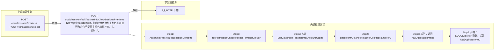

# POST /rcc/classroom/editTeacherInfoCheckDesktopPreName

> 教室设置中编辑教师机信息时校验教师机主机名前缀是否与座位云桌面主机名前缀冲突。先校验终端组数据权限，构造 EditClassroomTeacherInfoCheckDTO 调 classroomAPI.checkTeacherDesktopNameForEdit 校验；冲突时返回 hasDuplication=true 与错误消息。 ｜ 无特殊权限 ｜ 同步

## 依赖关系全景图

## 接口基本信息

| 项目 | 内容 |
|---|---|
| URL | /rcc/classroom/editTeacherInfoCheckDesktopPreName |
| Controller | RccClassroomConfigController |
| 方法名 | editTeacherInfoCheckDesktopPreName |
| 权限注解 | 无 |
| 执行方式 | 同步 |
| 业务含义 | 教室设置中编辑教师机信息时校验教师机主机名前缀是否与座位云桌面主机名前缀冲突。先校验终端组数据权限，构造 EditClassroomTeacherInfoCheckDTO 调 classroomAPI.checkTeacherDesktopNameForEdit 校验；冲突时返回 hasDuplication=true 与错误消息。 |

## 入参详情

### EditClassroomTeacherInfoCheckRequest

| 参数名 | 类型 | 必填 | 约束 | 说明 |
|---|---|---|---|---|
| classroomId | UUID | 是 | @NotNull | 教室ID |
| teacherPreName | String | 是 | @NotNull | 待校验的教师机主机名前缀 |
| teacherMode | TerminalTypeEnum | 是 | @NotNull | 教师机工作模式 |

## 出参详情

| 返回类型 | DefaultWebResponse（data=CheckDuplicationResultDTO） |
|---|---|

| 字段 | 类型 | 说明 |
|---|---|---|
| hasDuplication | Boolean | 前缀是否冲突（默认 false） |
| errorMsg | String | 冲突的 i18n 错误消息 |

## 上游前置业务

### 前置1：POST /rcc/classroom/create -> POST /rcc/classroom/select

create 为异步批任务，响应为 BatchTaskSubmitResult 不直接返回 ID；实际经 select 按名称查询 content[0].classroomId（由 field_map 契约映射）
## 内部处理流程

### 处理流程

1. Assert.notNull(request/sessionContext)
2. rccPermissionChecker.checkTerminalGroupPermissionByClassroomId([classroomId], sessionContext)
3. 构造 EditClassroomTeacherInfoCheckDTO(classroomId, teacherPreName, teacherMode)
4. classroomAPI.checkTeacherDesktopNameForEdit(dto) 校验前缀冲突
5. 成功：返回 hasDuplication=false
6. 异常：LOGGER.error 记录，设置 hasDuplication=true、errorMsg=e.getI18nMessage()，仍返回成功响应

## 下游消费方

（本接口数据主要被自身/关联接口消费，或经 SPI 通知）
## 接口参数约束分析

| 层级 | 参数 | 规则 | 失败结果 |
|---|---|---|---|
| PARAM | classroomId | @NotNull | 缺失校验失败 |
| PARAM | teacherPreName | @NotNull | 缺失校验失败 |
| PARAM | teacherMode | @NotNull | 缺失校验失败 |
| BUSINESS | teacherPreName | 前缀不与座位桌面前缀冲突 | 抛 RCDC_RCC_CLASSROOM_TEACHER_PRE_NAME_CONFLICT_SEAT / _TEACHER_PRE_NAME_EXIST，接口以 hasDuplication=true 返回 |

## 参数取值策略

| 参数 | 策略 | 说明 |
|---|---|---|
| classroomId | user_input/from_query | 按业务构造 |
| teacherPreName | user_input/from_query | 按业务构造 |
| teacherMode | user_input/from_query | 按业务构造 |

## 成功/失败断言基准

### 成功场景

| 场景 | 断言点 |
|---|---|
| 前缀无冲突 | $.status=="SUCCESS"；$.content.hasDuplication==false |

### 失败场景

| 场景 | 触发条件 | 断言点 |
|---|---|---|
| 前缀与座位名前缀重复 | teacherPreName 与某座位桌面前缀重叠 | $.status=="SUCCESS"；$.content.hasDuplication==true；$.content.errorMsg 非空 |

## 环境清理机制

| 接口 | 说明 |
|---|---|
| 本接口创建的资源 | 通过对应 delete 接口清理 |

## 前置状态和幂等性标注

| 维度 | 结论 |
|---|---|
| 幂等性 | HIGH |
| 说明 | 只读校验，无副作用 |
