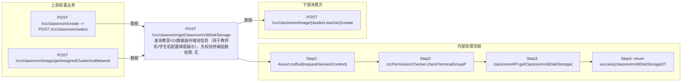

# POST /rcc/classroom/getClassroomVdiDiskStorage

> 查询教室VDI数据盘存储池信息（用于教师机/学生机配置弹窗展示）。先校验终端组数据权限，调 classroomAPI.getClassroomVdiDiskStorage(classroomId, clusterId, enableTeacher, platformId) 返回教室VDI磁盘存储池及其集群/平台信息。 ｜ 无特殊权限 ｜ 同步

## 依赖关系全景图

## 接口基本信息

| 项目 | 内容 |
|---|---|
| URL | /rcc/classroom/getClassroomVdiDiskStorage |
| Controller | RccClassroomConfigController |
| 方法名 | getClassroomTeacherVdiDiskStorage |
| 权限注解 | 无 |
| 执行方式 | 同步 |
| 业务含义 | 查询教室VDI数据盘存储池信息（用于教师机/学生机配置弹窗展示）。先校验终端组数据权限，调 classroomAPI.getClassroomVdiDiskStorage(classroomId, clusterId, enableTeacher, platformId) 返回教室VDI磁盘存储池及其集群/平台信息。 |

## 入参详情

### GetClassroomVdiDiskStorageRequest

| 参数名 | 类型 | 必填 | 约束 | 说明 |
|---|---|---|---|---|
| classroomId | UUID | 是 | @NotNull | 教室ID |
| clusterId | UUID | 否 | @Nullable | 集群ID（用于确认存储池与集群绑定关系） |
| platformId | UUID | 否 | @Nullable | 云平台ID |
| enableTeacher | Boolean | 是 | @NotNull | 是否查询教师机VDI磁盘配置（true=教师机，false=学生机） |

## 出参详情

| 返回类型 | DefaultWebResponse（data=ClassroomVdiDiskStorageDTO） |
|---|---|

| 字段 | 类型 | 说明 |
|---|---|---|
| hasOpenVdiDisk | Boolean | 是否已开启VDI数据盘 |
| vdiDiskStorageId | UUID | VDI磁盘存储池ID |
| vdiDiskStorageName | String | VDI磁盘存储池名称 |
| hasVdiDiskStorageBindCluster | Boolean | 存储池是否绑定集群 |
| clusterId | UUID | 集群ID |
| platformId | UUID | 云平台ID |
| clusterName | String | 集群名称 |
| platformName | String | 云平台名称 |

## 上游前置业务

### 前置1：POST /rcc/classroom/create -> POST /rcc/classroom/select

create 为异步批任务，响应为 BatchTaskSubmitResult 不直接返回 ID；实际经 select 按名称查询 content[0].classroomId（由 field_map 契约映射）

### 前置2：POST /rcc/classroom/image/getAssignedClusterAndNetwork

计算集群ID（推断）（由 field_map 契约映射）
## 内部处理流程

### 处理流程

1. Assert.notNull(request/sessionContext)
2. rccPermissionChecker.checkTerminalGroupPermissionByClassroomId([classroomId], sessionContext)
3. classroomAPI.getClassroomVdiDiskStorage(classroomId, clusterId, enableTeacher, platformId) 查询
4. return success(classroomVdiDiskStorageDTO)

## 下游消费方

### 消费1：POST /rcc/classroom/image/{student,teacher}/create

出参 ClassroomVdiDiskStorageDTO.vdiDiskStorageId，分配镜像时作为 VDI 数据盘存储池（由 field_map 契约映射）
## 接口参数约束分析

| 层级 | 参数 | 规则 | 失败结果 |
|---|---|---|---|
| PARAM | classroomId | @NotNull | 缺失校验失败 |
| PARAM | enableTeacher | @NotNull | 缺失校验失败 |
| BUSINESS | classroomId | 教室存在且有数据权限 | 不存在抛 RCDC_CLASSROOM_NOT_FIND；权限不足抛权限异常 |

## 参数取值策略

| 参数 | 策略 | 说明 |
|---|---|---|
| classroomId | user_input/from_query | 按业务构造 |
| clusterId | user_input/from_query | 按业务构造 |
| platformId | user_input/from_query | 按业务构造 |
| enableTeacher | user_input/from_query | 按业务构造 |

## 成功/失败断言基准

### 成功场景

| 场景 | 断言点 |
|---|---|
| 传入有效教室ID | 返回 HTTP 200，data 含 hasOpenVdiDisk/vdiDiskStorageId 等存储池信息 |

### 失败场景

| 场景 | 触发条件 | 断言点 |
|---|---|---|
| 教室不存在 | classroomId 无效 | 抛 RCDC_CLASSROOM_NOT_FIND |

## 环境清理机制

| 接口 | 说明 |
|---|---|
| 本接口创建的资源 | 通过对应 delete 接口清理 |

## 前置状态和幂等性标注

| 维度 | 结论 |
|---|---|
| 幂等性 | HIGH |
| 说明 | 纯查询接口，无副作用 |
