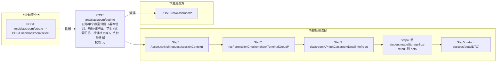

# POST /rcc/classroom/getInfo

> 获取单个教室详情（基本信息、教师机详情、学生机配置汇总、授课状态等）。先校验终端组数据权限，调 classroomAPI.getClassroomDetailInfo 组装详情返回 ClassroomInfoDetailDTO；studentImageStorageSize 非空时对其自赋值（无实际变更）。 ｜ 无特殊权限 ｜ 同步

## 依赖关系全景图

## 接口基本信息

| 项目 | 内容 |
|---|---|
| URL | /rcc/classroom/getInfo |
| Controller | RccClassroomConfigController |
| 方法名 | getClassroomDetailInfo |
| 权限注解 | 无 |
| 执行方式 | 同步 |
| 业务含义 | 获取单个教室详情（基本信息、教师机详情、学生机配置汇总、授课状态等）。先校验终端组数据权限，调 classroomAPI.getClassroomDetailInfo 组装详情返回 ClassroomInfoDetailDTO；studentImageStorageSize 非空时对其自赋值（无实际变更）。 |

## 入参详情

### ClassroomQueryWebRequest

| 参数名 | 类型 | 必填 | 约束 | 说明 |
|---|---|---|---|---|
| classroomId | UUID | 是 | @NotNull | 教室ID |

## 出参详情

| 返回类型 | DefaultWebResponse（data=ClassroomInfoDetailDTO） |
|---|---|

| 字段 | 类型 | 说明 |
|---|---|---|
| classroomName | String | 教室名称 |
| classroomState | ClassroomLessonStatusEnum | 教室授课状态 |
| terminalTotalNum | Integer | 终端总数 |
| terminalOnlineNum | Integer | 终端在线数 |
| desktopTotalNum | Integer | 桌面总数 |
| desktopOnlineNum | Integer | 桌面在线数 |
| disableNetwork | Boolean | 是否禁网 |
| networkIds | String | 关联网络策略ID集合 |
| studentModeArr | TerminalTypeEnum[] | 学生机模式数组 |
| studentTerminalModel | String | 学生机终端型号 |
| studentTerminalIpSegment | String | 学生机终端IP段 |
| studentImageNum | Integer | 学生机镜像数量 |
| studentImageStorageSize | Integer | 学生机镜像存储大小 |
| currentLessonId | UUID | 当前上课ID |
| studentVlanId | Integer | 学生机VLAN ID |
| terminalGroupId | UUID | 关联终端组ID |
| cmrClassConfig | String | 课堂同步录制配置 |
| diskRequiredSize | Integer | 学生机终端磁盘容量要求（GB） |
| startPolicy | DesktopStartPolicyEnum | 上课云桌面启动策略 |
| teacherBootManageMode | CbbTerminalBootManageModeEnums | 教师机引导管理模式 |
| studentClassroomStrategyName | String | 学生机教室策略名称 |
| teacherPlatformStatus | CloudPlatformStatus | 教师机镜像云平台状态 |
| classroomId | UUID | 教室ID（继承 ClassroomTeacherBasicDetailDTO） |
| teacherId | UUID | 教师ID |
| teacherName | String | 教师名称 |
| teacherDesktopState | CbbCloudDeskState | 教师桌面状态 |
| teacherDesktopIp | String | 教师桌面IP |
| teacherRainOsVersion | String | 教师终端 RainOS 版本 |
| teacherHardwareVersion | String | 教师终端硬件版本 |
| teacherUpgradeVersion | String | 教师终端升级版本 |
| teacherSerialNumber | String | 教师终端序列号 |
| teacherTerminalModel | String | 教师终端型号 |
| teacherCpuType | String | 教师机CPU型号 |
| teacherMemory | Long | 教师机内存大小 |
| teacherMac | String | 教师机MAC地址 |
| teacherIp | String | 教师机终端IP |
| teacherTerminalId | String | 教师终端ID |
| teacherOsType | String | 教师机操作系统类型 |
| teacherLockStatus | Boolean | 教师终端是否锁定 |
| teacherDesktopId | UUID | 教师桌面ID |
| teacherTerminalName | String | 教师终端名称 |
| teacherMode | TerminalTypeEnum | 教师机模式 |
| teacherTerminalState | CbbTerminalStateEnums | 教师终端状态 |
| teacherDiskSize | Long | 教师机磁盘大小 |
| teacherSystemSize | Long | 教师机系统盘大小 |
| teacherImageNum | Integer | 教师机镜像数量 |
| teacherTerminalDiskSize | Long | 教师终端磁盘大小 |
| teacherState | ClassroomLessonStatusEnum | 教师状态 |
| teacherClassroomStrategyName | String | 教师机教室策略名称 |
| terminalNeedUpgrade | Boolean | 终端是否需要升级 |
| canTerminalInit | Boolean | 是否支持终端初始化 |
| deployMode | String | 部署模式 |

## 上游前置业务

### 前置1：POST /rcc/classroom/create -> POST /rcc/classroom/select

create 为异步批任务，响应为 BatchTaskSubmitResult 不直接返回 ID；实际经 select 按名称查询 content[0].classroomId（由 field_map 契约映射）
## 内部处理流程

### 处理流程

1. Assert.notNull(request/sessionContext)
2. rccPermissionChecker.checkTerminalGroupPermissionByClassroomId([classroomId], sessionContext)
3. classroomAPI.getClassroomDetailInfo(request) 查询详情
4. 若 studentImageStorageSize != null 则 setStudentImageStorageSize(getStudentImageStorageSize())（无实际变化）
5. return success(detailDTO)

## 下游消费方

### 消费1：POST /rcc/classroom/*

出参 ClassroomInfoDetailDTO 继承 ClassroomTeacherBasicDetailDTO 含 classroomId（由 field_map 契约映射）
## 接口参数约束分析

| 层级 | 参数 | 规则 | 失败结果 |
|---|---|---|---|
| PARAM | classroomId | @NotNull | 缺失校验失败 |
| BUSINESS | classroomId | 教室存在且有数据权限 | 不存在抛 RCDC_CLASSROOM_NOT_FIND；权限不足抛权限异常 |

## 参数取值策略

| 参数 | 策略 | 说明 |
|---|---|---|
| classroomId | user_input/from_query | 按业务构造 |

## 成功/失败断言基准

### 成功场景

| 场景 | 断言点 |
|---|---|
| 传入有效教室ID | $.status=="SUCCESS"；$.content.classroomId 非空；$.content.classroomName 非空 |

### 失败场景

| 场景 | 触发条件 | 断言点 |
|---|---|---|
| 教室不存在 | classroomId 无效 | status==ERROR；msgKey==RCDC_CLASSROOM_NOT_FIND |

## 环境清理机制

| 接口 | 说明 |
|---|---|
| 本接口创建的资源 | 通过对应 delete 接口清理 |

## 前置状态和幂等性标注

| 维度 | 结论 |
|---|---|
| 幂等性 | HIGH |
| 说明 | 纯查询接口，无副作用 |
