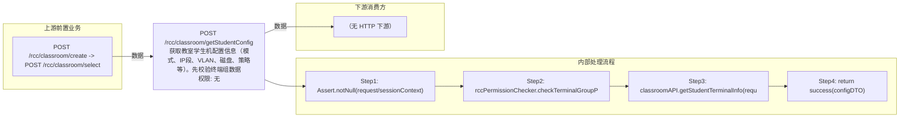

# POST /rcc/classroom/getStudentConfig

> 获取教室学生机配置信息（模式、IP段、VLAN、磁盘、策略等）。先校验终端组数据权限，调 classroomAPI.getStudentTerminalInfo 返回 ClassroomStudentTerminalConfigDTO。 ｜ 无特殊权限 ｜ 同步

## 依赖关系全景图

## 接口基本信息

| 项目 | 内容 |
|---|---|
| URL | /rcc/classroom/getStudentConfig |
| Controller | RccClassroomConfigController |
| 方法名 | getStudentConfig |
| 权限注解 | 无 |
| 执行方式 | 同步 |
| 业务含义 | 获取教室学生机配置信息（模式、IP段、VLAN、磁盘、策略等）。先校验终端组数据权限，调 classroomAPI.getStudentTerminalInfo 返回 ClassroomStudentTerminalConfigDTO。 |

## 入参详情

### ClassroomQueryWebRequest

| 参数名 | 类型 | 必填 | 约束 | 说明 |
|---|---|---|---|---|
| classroomId | UUID | 是 | @NotNull | 教室ID |

## 出参详情

| 返回类型 | DefaultWebResponse（data=ClassroomStudentTerminalConfigDTO） |
|---|---|

| 字段 | 类型 | 说明 |
|---|---|---|
| classroomId | UUID | 教室ID（父类 ClassroomConfigDTO 字段） |
| teacherMode | TerminalTypeEnum | 教师机模式（父类字段） |
| studentModeArr | TerminalTypeEnum[] | 学生机模式数组 |
| studentStartIp | String | 可接入终端起始IP |
| studentEndIp | String | 可接入终端终止IP |
| studentVlanId | Integer | 学生机VLAN ID |
| diskRequiredSize | Integer | 学生机终端磁盘容量要求（GB） |
| studentTciLocalDiskConfig | TciLocalDiskConfig | 学生TCI本地磁盘配置 |
| studentVdiLocalDiskConfig | VdiLocalDiskConfig | 学生VDI本地磁盘配置 |
| studentClassroomStrategy | ClassroomStrategyDTO | 学生机教室策略 |
| seatNum | Integer | 座位数 |
| taskIdList | List<UUID> | 关联任务ID列表 |
| vdiLocalDiskStoragePoolList | List<VdiLocalDiskStorageDTO> | VDI本地磁盘存储池列表 |
| shouldOnlyDeleteDataFromDb | Boolean | 是否仅从数据库删除数据 |

## 上游前置业务

### 前置1：POST /rcc/classroom/create -> POST /rcc/classroom/select

create 为异步批任务，响应为 BatchTaskSubmitResult 不直接返回 ID；实际经 select 按名称查询 content[0].classroomId（由 field_map 契约映射）
## 内部处理流程

### 处理流程

1. Assert.notNull(request/sessionContext)
2. rccPermissionChecker.checkTerminalGroupPermissionByClassroomId([classroomId], sessionContext)
3. classroomAPI.getStudentTerminalInfo(request) 查询
4. return success(configDTO)

## 下游消费方

（本接口数据主要被自身/关联接口消费，或经 SPI 通知）
## 接口参数约束分析

| 层级 | 参数 | 规则 | 失败结果 |
|---|---|---|---|
| PARAM | classroomId | @NotNull | 缺失校验失败 |
| BUSINESS | classroomId | 教室存在且有数据权限 | 不存在抛 RCDC_CLASSROOM_NOT_FIND；权限不足抛权限异常 |

## 参数取值策略

| 参数 | 策略 | 说明 |
|---|---|---|
| classroomId | user_input/from_query | 按业务构造 |

## 成功/失败断言基准

### 成功场景

| 场景 | 断言点 |
|---|---|
| 传入有效教室ID | $.status=="SUCCESS"；$.content.classroomId 非空；$.content.teacherMode 非空 |

### 失败场景

| 场景 | 触发条件 | 断言点 |
|---|---|---|
| 教室不存在 | classroomId 无效 | status==ERROR；msgKey==RCDC_CLASSROOM_NOT_FIND |

## 环境清理机制

| 接口 | 说明 |
|---|---|
| 本接口创建的资源 | 通过对应 delete 接口清理 |

## 前置状态和幂等性标注

| 维度 | 结论 |
|---|---|
| 幂等性 | HIGH |
| 说明 | 纯查询接口，无副作用 |
