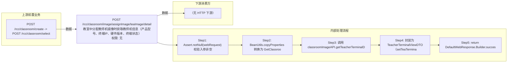

# POST /rcc/classroom/image/assignImage/teaImage/detail

> 教室中分配教师机镜像时获取教师机信息（产品型号、终端IP、硬件版本、终端状态） ｜ 无特殊权限 ｜ sync

## 依赖关系全景图

## 接口基本信息

| 项目 | 内容 |
|---|---|
| URL | /rcc/classroom/image/assignImage/teaImage/detail |
| Controller | RccClassroomImageController |
| 方法名 | getTeacherDetail |
| 权限注解 | 无 |
| 执行方式 | sync |
| 业务含义 | 教室中分配教师机镜像时获取教师机信息（产品型号、终端IP、硬件版本、终端状态） |

## 入参详情

### GetImageDetailRequest

| 参数名 | 类型 | 必填 | 约束 | 说明 |
|---|---|---|---|---|
| crId | UUID | 是 | @NotNull 非空 | 操作的教室ID |

## 出参详情

| 返回类型 | DefaultWebResponse（data=TeacherTerminalViewDTO） |
|---|---|

| 字段 | 类型 | 说明 |
|---|---|---|
| teaTerminalConfig | TeacherTerminalDTO | 教师终端配置信息 |
| teaTerminalConfig.productModel | String | 产品型号 |
| teaTerminalConfig.terminalIp | String | 终端IP |
| teaTerminalConfig.hardwareVersion | String | 硬件版本 |
| teaTerminalConfig.terminalStatus | ClassroomTerminalStateEnum | 终端状态 |

## 上游前置业务

### 前置1：POST /rcc/classroom/create -> POST /rcc/classroom/select

create 为异步批任务，响应为 BatchTaskSubmitResult 不直接返回 ID；实际经 select 按名称查询 content[0].classroomId（由 field_map 契约映射）
## 内部处理流程

### 处理流程

1. Assert.notNull(webRequest) 校验入参非空
2. BeanUtils.copyProperties 转换为 GetClassroomAssignInfoDefaultlRequest
3. 调用 classroomImageAPI.getTeacherTerminalDetail(request) 获取 TeacherTerminalDTO
4. 封装为 TeacherTerminalViewDTO（setTeaTerminalConfig）
5. return DefaultWebResponse.Builder.success(teacherTerminalViewDTO)

## 下游消费方

（本接口数据主要被自身/关联接口消费，或经 SPI 通知）
## 接口参数约束分析

| 层级 | 参数 | 规则 | 失败结果 |
|---|---|---|---|
| PARAM | crId | @NotNull | 入参为空时 Assert 抛 IllegalArgumentException |

## 参数取值策略

| 参数 | 策略 | 说明 |
|---|---|---|
| crId | user_input/from_query | 按业务构造 |

## 成功/失败断言基准

### 成功场景

| 场景 | 断言点 |
|---|---|
| 教室存在且教师终端已注册 | $.status==SUCCESS && $.content.teaTerminalConfig 非空（Builder.success(TeacherTerminalViewDTO)） |

### 失败场景

| 场景 | 触发条件 | 断言点 |
|---|---|---|
| crId 为空 | 请求体缺少 crId | $.status==ERROR（参数校验，无固定 msgKey） |

## 环境清理机制

| 接口 | 说明 |
|---|---|
| 本接口创建的资源 | 通过对应 delete 接口清理 |

## 前置状态和幂等性标注

| 维度 | 结论 |
|---|---|
| 幂等性 | HIGH |
| 说明 | 纯查询接口 |
