# POST /rcc/classroom/image/assignImage/yetAssign/list

> 分页获取待分配给教室的课程镜像列表，管理员无全量权限时按数据权限过滤可见镜像 ｜ 无特殊权限 ｜ sync

## 依赖关系全景图

```mermaid
graph LR
    subgraph 上游前置业务
        A1["POST /rcc/classroom/create -> POST /rcc/classroom/select"]
    end
    B["POST /rcc/classroom/image/assignImage/yetAssign/list<br>分页获取待分配给教室的课程镜像列表，管理员无全量权限时按数据权限过滤可见镜像<br>权限: 无"]
    A1 -->|数据| B
    subgraph 内部处理流程
        C1["Step1: Assert.notNull 校验 webRequest 与 sessionCo"]
        C2["Step2: BeanUtils.copyProperties 转换为 GetYetAssig"]
        C3["Step3: 若 !adminDataPermissionAPI.isAdminHasAllD"]
        C4["Step4:   调用 listImageIdByAdminId 获取有权限镜像ID列表"]
        C5["Step5:   若列表为空直接返回空 PageQueryResponse"]
        C6["Step6:   否则将权限镜像ID数组设置到 request.permissionImage"]
        C1 --> C2
        C7["Step7: 调用 classroomImageAPI.getImageState(reque"]
        C8["Step8: return success(imageDetailDTOPageQueryRe"]
        C6 --> C7
        C7 --> C8
        C2 --> C3
        C3 --> C4
        C4 --> C5
        C5 --> C6
    end
    B --> C1
    subgraph 下游消费方
        D1["POST /rcc/classroom/image/{student,teacher}/create"]
    end
    B -->|数据| D1
```

## 接口基本信息

| 项目 | 内容 |
|---|---|
| URL | /rcc/classroom/image/assignImage/yetAssign/list |
| Controller | RccClassroomImageController |
| 方法名 | getYetAssignImageList |
| 权限注解 | 无 |
| 执行方式 | sync |
| 业务含义 | 分页获取待分配给教室的课程镜像列表，管理员无全量权限时按数据权限过滤可见镜像 |

## 入参详情

### GetClassroomAssignInfoDefaultlWebRequest

| 参数名 | 类型 | 必填 | 约束 | 说明 |
|---|---|---|---|---|
| crId | UUID | 是 | @NotNull 非空 | 操作的教室ID |
| teaTerminal | Boolean | 否 | 默认 false | 教师机或学生机 |
| page | Integer | 是 | @Range(0-2147483647) 默认0 | 分页页码 |
| limit | Integer | 是 | @Range(1-2147483647) 默认1 | 每页条数 |
| searchKeyword | String | 否 | 可空 | 搜索关键字 |
| exactMatchArr | ExactMatch[] | 否 | 可空 | 精确匹配条件（可含 storagePoolId） |
| matchArr | Match[] | 否 | 可空 | 模糊匹配条件 |
| sortArr | Sort[] | 否 | 可空 | 排序条件 |
| customData | String | 否 | 可空 | 自定义扩展数据 |
| platformId | UUID | 否 | 可空 | 云平台ID过滤 |

## 出参详情

| 返回类型 | DefaultWebResponse（data=PageQueryResponse<ImageDetailDTO>） |
|---|---|

| 字段 | 类型 | 说明 |
|---|---|---|
| itemArr | ImageDetailDTO[] | 待分配镜像分页记录，元素为 ImageDetailDTO（字段见下） |
| total | Integer | 总条数 |
| itemArr[].rccImageTemplateDetailDTO | RccImageTemplateDetailDTO | 镜像模板详情（RCC 侧） |
| itemArr[].rccImageTemplateDetailDTO.workModeMacth | boolean | 工作模式是否匹配 |
| itemArr[].rccImageTemplateDetailDTO.teacherTerminal | boolean | 是否教师终端 |
| itemArr[].cbbImageTemplateDetailDTO | CbbImageTemplateDetailDTO | 镜像模板详情（CBB 侧，字段基于源码调用推断） |
| itemArr[].cbbImageTemplateDetailDTO.id | UUID | 镜像模板ID |
| itemArr[].cbbImageTemplateDetailDTO.name | String | 镜像模板名称 |
| itemArr[].cbbImageTemplateDetailDTO.imageRoleType | ImageRoleType | 镜像角色类型（VERSION/CLONE 等） |
| itemArr[].cbbImageTemplateDetailDTO.osType | CbbOsType | 操作系统类型 |
| itemArr[].cbbImageTemplateDetailDTO.imageType | CbbImageType | 镜像类型 |
| itemArr[].cbbImageTemplateDetailDTO.cbbImageType | CbbImageType | 镜像类型（CBB 侧） |
| itemArr[].cbbImageTemplateDetailDTO.imageFileName | String | 镜像文件名称 |
| itemArr[].cbbImageTemplateDetailDTO.state | CbbImageTemplateState | 镜像模板状态 |
| itemArr[].cbbImageTemplateDetailDTO.imageState | CbbImageState | 镜像状态 |
| itemArr[].cbbImageTemplateDetailDTO.note | String | 备注 |
| itemArr[].cbbImageTemplateDetailDTO.guestToolVersion | String | 客户机工具版本 |
| itemArr[].cbbImageTemplateDetailDTO.rootImageId | UUID | 根镜像ID（镜像版本场景） |
| itemArr[].cbbImageTemplateDetailDTO.rootImageName | String | 根镜像名称 |
| itemArr[].cbbImageTemplateDetailDTO.enableMultipleVersion | Boolean | 是否支持多版本 |
| itemArr[].cbbImageTemplateDetailDTO.imageDiskList | List<CbbImageDiskInfoDTO> | 镜像磁盘信息列表 |
| itemArr[].cbbImageTemplateDetailDTO.vgpuInfoDTOHistoryList | List<VgpuInfoDTO> | vGPU 历史信息列表 |

## 上游前置业务

### 前置1：POST /rcc/classroom/create -> POST /rcc/classroom/select

create 为异步批任务，响应为 BatchTaskSubmitResult 不直接返回 ID；实际经 select 按名称查询 content[0].classroomId（由 field_map 契约映射）
## 内部处理流程

### 处理流程

1. Assert.notNull 校验 webRequest 与 sessionContext
2. BeanUtils.copyProperties 转换为 GetYetAssignImageRequest
3. 若 !adminDataPermissionAPI.isAdminHasAllDataPermissions(userId)：
4.   调用 listImageIdByAdminId 获取有权限镜像ID列表
5.   若列表为空直接返回空 PageQueryResponse
6.   否则将权限镜像ID数组设置到 request.permissionImageIdArr
7. 调用 classroomImageAPI.getImageState(request) 分页查询
8. return success(imageDetailDTOPageQueryResponse)

## 下游消费方

### 消费1：POST /rcc/classroom/image/{student,teacher}/create

待分配镜像模板ID；ImageDetailDTO 包装 rcc/cbbImageTemplateDetailDTO，cbbImageTemplateDetailDTO.id 为推断字段路径（由 field_map 契约映射）
## 接口参数约束分析

| 层级 | 参数 | 规则 | 失败结果 |
|---|---|---|---|
| PARAM | crId/page/limit | @NotNull 且 page/limit 有 @Range | 参数缺失或越界时校验失败 |
| PERM | sessionContext.userId | 无全量权限时按 listImageIdByAdminId 结果过滤 | 无权限且无可见镜像时返回空列表（不报错） |

## 参数取值策略

| 参数 | 策略 | 说明 |
|---|---|---|
| crId | user_input/from_query | 按业务构造 |
| teaTerminal | user_input/from_query | 按业务构造 |
| page | user_input/from_query | 按业务构造 |
| limit | user_input/from_query | 按业务构造 |
| searchKeyword | user_input/from_query | 按业务构造 |
| exactMatchArr | user_input/from_query | 按业务构造 |
| matchArr | user_input/from_query | 按业务构造 |
| sortArr | user_input/from_query | 按业务构造 |
| customData | user_input/from_query | 按业务构造 |
| platformId | user_input/from_query | 按业务构造 |

## 成功/失败断言基准

### 成功场景

| 场景 | 断言点 |
|---|---|
| 管理员有全量权限 | $.status==SUCCESS && $.content.itemArr 非空（分页框架字段为 itemArr/total） |
| 管理员无权限但有关联镜像 | $.status==SUCCESS && $.content.itemArr 非空（均为权限范围内镜像） |
| 管理员无任何可见镜像 | $.status==SUCCESS && $.content.itemArr 为空（Builder.success(new PageQueryResponse())） |

### 失败场景

| 场景 | 触发条件 | 断言点 |
|---|---|---|
| 参数不合法 | crId 缺失或 limit 超出范围 | $.status==ERROR（参数校验，无固定 msgKey） |

## 环境清理机制

| 接口 | 说明 |
|---|---|
| 本接口创建的资源 | 通过对应 delete 接口清理 |

## 前置状态和幂等性标注

| 维度 | 结论 |
|---|---|
| 幂等性 | HIGH |
| 说明 | 纯查询接口 |
