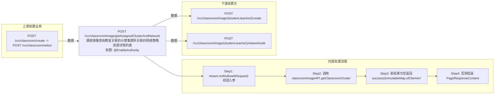

# POST /rcc/classroom/image/getAssignedClusterAndNetwork

> 课程镜像查询教室关联的计算集群所关联的网络策略资源详情列表 ｜ @EnableAuthority ｜ sync

## 依赖关系全景图

## 接口基本信息

| 项目 | 内容 |
|---|---|
| URL | /rcc/classroom/image/getAssignedClusterAndNetwork |
| Controller | RccClassroomImageController |
| 方法名 | getNetworkStrategy |
| 权限注解 | @EnableAuthority |
| 执行方式 | sync |
| 业务含义 | 课程镜像查询教室关联的计算集群所关联的网络策略资源详情列表 |

## 入参详情

### ClassroomImageNetworkQueryWebRequest

| 参数名 | 类型 | 必填 | 约束 | 说明 |
|---|---|---|---|---|
| classroomId | UUID | 是 | @NotNull 非空 | 教室ID |
| enableTeacher | Boolean | 是 | @NotNull 非空 | 是否教师机（true教师/false学生） |

## 出参详情

| 返回类型 | DefaultWebResponse（data=PageResponseContent<ClassroomClusterResourcesDetailDTO>，空数据时为 {itemArr: []}） |
|---|---|

| 字段 | 类型 | 说明 |
|---|---|---|
| itemArr | ClassroomClusterResourcesDetailDTO[] | 资源列表，元素为 ClassroomClusterResourcesDetailDTO（含自身字段与继承 ClassroomClusterResourcesDTO/BaseDTO 字段，见下） |
| total | Integer | 资源总数 |
| itemArr[].id | UUID | 资源记录ID（继承 ClassroomClusterResourcesDTO） |
| itemArr[].enableTeacher | Boolean | 是否教师机资源（继承 ClassroomClusterResourcesBaseDTO） |
| itemArr[].classroomId | UUID | 教室ID |
| itemArr[].clusterId | UUID | 计算集群ID |
| itemArr[].platformId | UUID | 云平台ID |
| itemArr[].resourceId | UUID | 资源ID（网络策略ID等） |
| itemArr[].resourceType | CrClusterResourcesEnum | 资源类型（CLUSTER/NETWORK_STRATEGY/PERSONAL_DISK_STORAGE_POOL/DESK_POOL 等） |
| itemArr[].platformName | String | 云平台名称（自身字段） |
| itemArr[].platformStatus | CloudPlatformStatus | 云平台状态 |
| itemArr[].clusterName | String | 计算集群名称 |
| itemArr[].networkName | String | 网络策略名称 |
| itemArr[].networkId | UUID | 网络策略ID |
| itemArr[].ipPoolArr | CbbDeskNetworkIpPoolDTO[] | IP 地址池数组 |
| itemArr[].teacherDesktopIp | String | 教师机桌面IP |
| itemArr[].imageReplicationStoragePoolId | UUID | 同步镜像副本的存储池ID |
| itemArr[].imageReplicationStoragePoolName | String | 同步镜像副本的存储池名称 |

## 上游前置业务

### 前置1：POST /rcc/classroom/create -> POST /rcc/classroom/select

create 为异步批任务，响应为 BatchTaskSubmitResult 不直接返回 ID；实际经 select 按名称查询 content[0].classroomId（由 field_map 契约映射）
## 内部处理流程

### 处理流程

1. Assert.notNull(webRequest) 校验入参
2. 调用 classroomImageAPI.getClassroomClusterNetwork(classroomId, enableTeacher)
3. 若结果为空返回 success(ImmutableMap.of("itemArr", emptyList()))
4. 否则组装 PageResponseContent<ClassroomClusterResourcesDetailDTO> 返回

## 下游消费方

### 消费1：POST /rcc/classroom/image/{student,teacher}/create

教室关联计算集群ID，供分配镜像/改网络使用（推断）（由 field_map 契约映射）

### 消费2：POST /rcc/classroom/image/{student,teacher}/network/edit

教室关联网络策略ID，供改网络使用（推断）（由 field_map 契约映射）
## 接口参数约束分析

| 层级 | 参数 | 规则 | 失败结果 |
|---|---|---|---|
| PARAM | classroomId/enableTeacher | @NotNull | 参数缺失时校验失败 |
| AUTH | - | @EnableAuthority 需登录且有权限 | 未认证或权限不足返回 401/403 |

## 参数取值策略

| 参数 | 策略 | 说明 |
|---|---|---|
| classroomId | user_input/from_query | 按业务构造 |
| enableTeacher | user_input/from_query | 按业务构造 |

## 成功/失败断言基准

### 成功场景

| 场景 | 断言点 |
|---|---|
| 教室已配置集群与网络 | $.status==SUCCESS && $.content.itemArr 非空（PageResponseContent） |
| 教室无资源配置 | $.status==SUCCESS && $.content.itemArr 为空数组 |

### 失败场景

| 场景 | 触发条件 | 断言点 |
|---|---|---|
| 参数缺失 | classroomId 为空 | $.status==ERROR（参数校验，无固定 msgKey） |
| 未登录 | 无有效会话调用 | $.status==ERROR（@EnableAuthority 权限拦截，无固定 msgKey） |

## 环境清理机制

| 接口 | 说明 |
|---|---|
| 本接口创建的资源 | 通过对应 delete 接口清理 |

## 前置状态和幂等性标注

| 维度 | 结论 |
|---|---|
| 幂等性 | HIGH |
| 说明 | 纯查询接口 |
