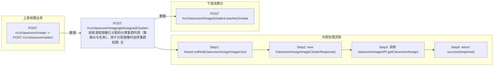

# POST /rcc/classroom/image/getAssignedClusters

> 获取课程镜像已分配的计算集群列表（集群ID与名称），用于分配镜像时选择集群 ｜ 无特殊权限 ｜ sync

## 依赖关系全景图

## 接口基本信息

| 项目 | 内容 |
|---|---|
| URL | /rcc/classroom/image/getAssignedClusters |
| Controller | RccClassroomImageController |
| 方法名 | getAssignedClusters |
| 权限注解 | 无 |
| 执行方式 | sync |
| 业务含义 | 获取课程镜像已分配的计算集群列表（集群ID与名称），用于分配镜像时选择集群 |

## 入参详情

### ClassroomAssignImageClusterRequest

| 参数名 | 类型 | 必填 | 约束 | 说明 |
|---|---|---|---|---|
| classroomId | UUID | 是 | @NotNull 非空 | 教室ID |
| hasTeacher | Boolean | 是 | @NotNull 非空 | 是否包含教师机角色 |

## 出参详情

| 返回类型 | DefaultWebResponse（data=ClassroomAssignImageClusterResponse） |
|---|---|

| 字段 | 类型 | 说明 |
|---|---|---|
| classroomAssignImageClusterDTOList | List<ClassroomAssignImageClusterDTO> | 集群列表，元素字段见下 |
| classroomAssignImageClusterDTOList[].clusterId | UUID | 计算集群ID |
| classroomAssignImageClusterDTOList[].clusterName | String | 计算集群名称 |

## 上游前置业务

### 前置1：POST /rcc/classroom/create -> POST /rcc/classroom/select

create 为异步批任务，响应为 BatchTaskSubmitResult 不直接返回 ID；实际经 select 按名称查询 content[0].classroomId（由 field_map 契约映射）
## 内部处理流程

### 处理流程

1. Assert.notNull(classroomAssignImageClusterRequest) 校验入参
2. new ClassroomAssignImageClusterResponse()
3. 调用 classroomImageAPI.getClassroomAssignImageClusterInfo(classroomId, hasTeacher) 并 set 到响应
4. return success(response)

## 下游消费方

### 消费1：POST /rcc/classroom/image/{student,teacher}/create

可分配的课程镜像计算集群ID，供分配镜像使用（由 field_map 契约映射）
## 接口参数约束分析

| 层级 | 参数 | 规则 | 失败结果 |
|---|---|---|---|
| PARAM | classroomId/hasTeacher | @NotNull | 参数缺失时校验失败 |

## 参数取值策略

| 参数 | 策略 | 说明 |
|---|---|---|
| classroomId | user_input/from_query | 按业务构造 |
| hasTeacher | user_input/from_query | 按业务构造 |

## 成功/失败断言基准

### 成功场景

| 场景 | 断言点 |
|---|---|
| 教室有关联集群 | $.status==SUCCESS && $.content.classroomAssignImageClusterDTOList 非空（Builder.success(ClassroomAssignImageClusterResponse)） |

### 失败场景

| 场景 | 触发条件 | 断言点 |
|---|---|---|
| 参数缺失 | classroomId 为空 | $.status==ERROR（参数校验，无固定 msgKey） |

## 环境清理机制

| 接口 | 说明 |
|---|---|
| 本接口创建的资源 | 通过对应 delete 接口清理 |

## 前置状态和幂等性标注

| 维度 | 结论 |
|---|---|
| 幂等性 | HIGH |
| 说明 | 纯查询接口 |
