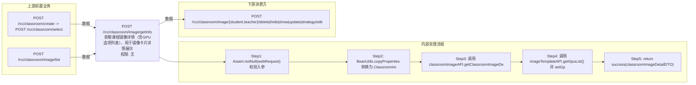

# POST /rcc/classroom/image/getInfo

> 获取课程镜像详情（含GPU选项列表），用于镜像卡片详情展示 ｜ 无特殊权限 ｜ sync

## 依赖关系全景图

## 接口基本信息

| 项目 | 内容 |
|---|---|
| URL | /rcc/classroom/image/getInfo |
| Controller | RccClassroomImageController |
| 方法名 | getImageDetail |
| 权限注解 | 无 |
| 执行方式 | sync |
| 业务含义 | 获取课程镜像详情（含GPU选项列表），用于镜像卡片详情展示 |

## 入参详情

### GetClassroomImageDetailRequest

| 参数名 | 类型 | 必填 | 约束 | 说明 |
|---|---|---|---|---|
| crId | UUID | 是 | @NotNull 非空 | 操作的教室ID |
| imageId | UUID | 是 | @NotNull 非空 | 镜像ID |
| teaTerminal | Boolean | 否 | 默认 false | 教师机或学生机 |

## 出参详情

| 返回类型 | DefaultWebResponse（data=ClassroomImageDetailDTO） |
|---|---|

| 字段 | 类型 | 说明 |
|---|---|---|
| imageId | UUID | 镜像ID |
| imageName | String | 镜像名称 |
| rootImageId | UUID | 根镜像ID（镜像版本场景） |
| rootImageName | String | 根镜像名称（镜像版本场景） |
| imageRoleType | ImageRoleType | 镜像角色类型 |
| enableMultipleVersion | Boolean | 是否支持多版本 |
| cbbImageType | CbbImageType | 镜像类型 |
| imageFileName | String | 镜像文件名称 |
| cpu | int | 镜像CPU核数 |
| memory | double | 内存大小（GB） |
| systemDisk | int | 系统盘大小（GB） |
| osType | CbbOsType | 操作系统类型 |
| guestToolVersion | String | 客户机工具版本 |
| createTime | Date | 创建时间 |
| lastModifyTime | Date | 最后修改时间 |
| note | String | 备注 |
| imageDiskList | List<CbbImageDiskInfoDTO> | 镜像磁盘信息列表 |
| dataDiskSize | Integer | 数据盘大小 |
| enableGpu | Boolean | 是否启用GPU |
| vgpuType | VgpuType | vGPU类型 |
| graphicsMemorySize | String | 显存大小 |
| vgpuItem | String | vGPU规格项 |
| vgpuModel | String | vGPU型号 |
| hide | Boolean | 是否隐藏 |
| vgpuInfoDTOHistoryList | List<VgpuInfoDTO> | vGPU历史信息列表 |
| gpuOptionList | List<VgpuDTO> | 可选GPU规格列表（本接口额外填充） |
| clusterId | UUID | 关联计算集群ID |
| platformId | UUID | 关联云平台ID |
| clusterInfo | ComputerClusterDTO | 计算集群信息 |
| strategyId | UUID | 关联云桌面策略ID |
| networkId | UUID | 网络策略ID |
| network | CbbDeskNetworkDetailDTO | 网络策略详情 |
| storagePoolIds | String | 存储池ID集合（逗号分隔） |
| storagePoolIdList | List<UUID> | 存储池ID列表 |
| imageReplicationStoragePoolId | UUID | 跨存储同步副本存储池ID |
| imageReplicationStoragePoolName | String | 跨存储同步副本存储池名称 |
| cbbCloudDeskPattern | CbbCloudDeskPattern | 桌面模式 |
| deskStrategyVDI | SpaceDeskStrategyGroupVDI | VDI云桌面策略 |
| platformType | CloudPlatformType | 云平台类型（继承 RccPlatformBaseInfoDTO） |
| platformName | String | 云平台名称（继承 RccPlatformBaseInfoDTO） |
| platformStatus | CloudPlatformStatus | 云平台状态（继承 RccPlatformBaseInfoDTO） |

## 上游前置业务

### 前置1：POST /rcc/classroom/create -> POST /rcc/classroom/select

create 为异步批任务，响应为 BatchTaskSubmitResult 不直接返回 ID；实际经 select 按名称查询 content[0].classroomId（由 field_map 契约映射）

### 前置2：POST /rcc/classroom/image/list

课程镜像ID（镜像模板ID）；image/list 出参 ClassroomImageCardInfoDTO.id（由 field_map 契约映射）
## 内部处理流程

### 处理流程

1. Assert.notNull(webRequest) 校验入参
2. BeanUtils.copyProperties 转换为 ClassroomImageDetailRequest
3. 调用 classroomImageAPI.getClassroomImageDetail(request) 获取详情 DTO
4. 调用 imageTemplateAPI.getGpuList() 并 setGpuOptionList
5. return success(classroomImageDetailDTO)

## 下游消费方

### 消费1：POST /rcc/classroom/image/{student,teacher}/delete|hide|show|update|strategy/edit

getInfo 出参 ClassroomImageDetailDTO.imageId 即课程镜像ID，被操作类接口消费（由 field_map 契约映射）
## 接口参数约束分析

| 层级 | 参数 | 规则 | 失败结果 |
|---|---|---|---|
| PARAM | crId/imageId | @NotNull | 参数缺失校验失败 |
| BIZ | imageId | 镜像需存在且属于该教室 | 不存在时抛 RCDC_RCC_CLASSROOM_IMAGE_NOT_FOUND |

## 参数取值策略

| 参数 | 策略 | 说明 |
|---|---|---|
| crId | user_input/from_query | 按业务构造 |
| imageId | user_input/from_query | 按业务构造 |
| teaTerminal | user_input/from_query | 按业务构造 |

## 成功/失败断言基准

### 成功场景

| 场景 | 断言点 |
|---|---|
| 镜像存在于教室 | $.status==SUCCESS && $.content.imageId 非空 && $.content.imageName 非空（Builder.success(ClassroomImageDetailDTO)） |

### 失败场景

| 场景 | 触发条件 | 断言点 |
|---|---|---|
| 镜像不存在 | imageId 未分配到该教室 | $.status==ERROR && $.msgKey==rcdc_rcc_classroom_image_not_found |

## 环境清理机制

| 接口 | 说明 |
|---|---|
| 本接口创建的资源 | 通过对应 delete 接口清理 |

## 前置状态和幂等性标注

| 维度 | 结论 |
|---|---|
| 幂等性 | HIGH |
| 说明 | 纯查询接口 |
