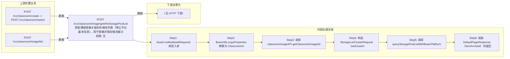

# POST /rcc/classroom/image/getInfoStoragePoolList

> 获取课程镜像关联的存储池列表（带云平台基本信息），用于镜像详情存储池展示 ｜ 无特殊权限 ｜ sync

## 依赖关系全景图

## 接口基本信息

| 项目 | 内容 |
|---|---|
| URL | /rcc/classroom/image/getInfoStoragePoolList |
| Controller | RccClassroomImageController |
| 方法名 | getInfoStoragePoolList |
| 权限注解 | 无 |
| 执行方式 | sync |
| 业务含义 | 获取课程镜像关联的存储池列表（带云平台基本信息），用于镜像详情存储池展示 |

## 入参详情

### GetClassroomImageDetailRequest

| 参数名 | 类型 | 必填 | 约束 | 说明 |
|---|---|---|---|---|
| crId | UUID | 是 | @NotNull 非空 | 操作的教室ID |
| imageId | UUID | 是 | @NotNull 非空 | 镜像ID |
| teaTerminal | Boolean | 否 | 默认 false | 教师机或学生机 |

## 出参详情

| 返回类型 | DefaultWebResponse（data=DefaultPageResponse） |
|---|---|

| 字段 | 类型 | 说明 |
|---|---|---|
| itemArr | PlatformStoragePoolInfoDTO[] | 存储池列表，元素为 PlatformStoragePoolInfoDTO（继承 hciadapter StoragePoolListInfoDTO 存储池基础字段，字段见下） |
| total | Integer | 存储池数量 |
| itemArr[].id | UUID | 存储池ID |
| itemArr[].name | String | 存储池名称 |
| itemArr[].storagePoolId | String | 存储池唯一标识 |
| itemArr[].storagePoolType | StoragePoolType | 存储池类型（POS/SAN/SAMBA 等） |
| itemArr[].redundancyStrategy | RedundancyStrategy | 冗余策略（RAID0/RAID1 等） |
| itemArr[].totalCapacity | Long | 总容量 |
| itemArr[].usedCapacity | Long | 已用容量 |
| itemArr[].storagePoolMgmtState | StoragePoolMgmtState | 存储池管理状态 |
| itemArr[].storagePoolHealthState | StoragePoolHealthState | 存储池健康状态 |
| itemArr[].description | String | 存储池描述 |
| itemArr[].createTime | Date | 创建时间 |
| itemArr[].updateTime | Date | 更新时间 |
| itemArr[].platformId | UUID | 云平台ID（继承 PlatformStoragePoolInfoDTO） |
| itemArr[].platformName | String | 云平台名称 |
| itemArr[].platformType | CloudPlatformType | 云平台类型 |
| itemArr[].platformStatus | CloudPlatformStatus | 云平台状态 |

## 上游前置业务

### 前置1：POST /rcc/classroom/create -> POST /rcc/classroom/select

create 为异步批任务，响应为 BatchTaskSubmitResult 不直接返回 ID；实际经 select 按名称查询 content[0].classroomId（由 field_map 契约映射）

### 前置2：POST /rcc/classroom/image/list

课程镜像ID（由 field_map 契约映射）
## 内部处理流程

### 处理流程

1. Assert.notNull(webRequest) 校验入参
2. BeanUtils.copyProperties 转换为 ClassroomImageDetailRequest
3. 调用 classroomImageAPI.getClassroomImageDetail(request) 获取镜像详情
4. 构造 StorageListClusterRequest（setClusterId/setPlatformId/setStorageClusterIdList=镜像存储池列表）
5. 调用 queryStoragePoolListWithBasicPlatformInfo：queryStoragePoolListByRequest + 用 platformServerMgmtAPI.getInfoById 填充云平台信息
6. 组装 DefaultPageResponse（itemArr/total）并返回 success

## 下游消费方

（本接口数据主要被自身/关联接口消费，或经 SPI 通知）
## 接口参数约束分析

| 层级 | 参数 | 规则 | 失败结果 |
|---|---|---|---|
| PARAM | crId/imageId | @NotNull | 参数缺失校验失败 |
| BIZ | imageId | 镜像需存在 | 抛 RCDC_RCC_CLASSROOM_IMAGE_NOT_FOUND |

## 参数取值策略

| 参数 | 策略 | 说明 |
|---|---|---|
| crId | user_input/from_query | 按业务构造 |
| imageId | user_input/from_query | 按业务构造 |
| teaTerminal | user_input/from_query | 按业务构造 |

## 成功/失败断言基准

### 成功场景

| 场景 | 断言点 |
|---|---|
| 镜像存在且绑定存储池 | $.status==SUCCESS && $.content.itemArr 非空 && $.content.total 非空（DefaultPageResponse 分页框架字段为 itemArr/total） |

### 失败场景

| 场景 | 触发条件 | 断言点 |
|---|---|---|
| 镜像不存在 | 无效 imageId | $.status==ERROR && $.msgKey==rcdc_rcc_classroom_image_not_found |

## 环境清理机制

| 接口 | 说明 |
|---|---|
| 本接口创建的资源 | 通过对应 delete 接口清理 |

## 前置状态和幂等性标注

| 维度 | 结论 |
|---|---|
| 幂等性 | HIGH |
| 说明 | 纯查询接口 |
