# POST /rcc/classroom/image/getStrategy

> 课程镜像查询教室关联计算集群、存储池及关联的课程云桌面策略详情（含镜像版本与跨存储信息） ｜ @EnableAuthority ｜ sync

## 依赖关系全景图

```mermaid
graph LR
    subgraph 上游前置业务
        A1["POST /rcc/classroom/create -> POST /rcc/classroom/select"]
        A2["POST /rcc/classroom/image/list"]
    end
    B["POST /rcc/classroom/image/getStrategy<br>课程镜像查询教室关联计算集群、存储池及关联的课程云桌面策略详情（含镜像版本与跨存<br>权限: @EnableAuthority"]
    A1 -->|数据| B
    A2 -->|数据| B
    subgraph 内部处理流程
        C1["Step1: Assert.notNull(request) 校验入参"]
        C2["Step2: 调用 classroomImageAPI.getByImageIdAndClas"]
        C3["Step3: 调用 classroomImageAPI.getImageName 获取镜像名"]
        C4["Step4: 调用 clusterAPI.queryAvailableClusterById("]
        C5["Step5: 遍历 classroomImageDTO.convertStoragePoolI"]
        C6["Step6: 调用 classroomImageStrategyAPI.fetchDeskSt"]
        C1 --> C2
        C7["Step7: new ClassroomImageStrategyResponse(image"]
        C8["Step8: 若 rootImageId 非空：imageTemplateAPI.findBy"]
        C9["Step9: 若 imageReplicationStoragePoolId 非空：getPl"]
        C10["Step10: return success(response)"]
        C6 --> C7
        C7 --> C8
        C8 --> C9
        C9 --> C10
        C2 --> C3
        C3 --> C4
        C4 --> C5
        C5 --> C6
    end
    B --> C1
    subgraph 下游消费方
        D1["POST /rcc/classroom/image/{student,teacher}/strategy/edit"]
        D2["POST /rcc/classroom/image/{student,teacher}/create"]
    end
    B -->|数据| D1
    B -->|数据| D2
```

## 接口基本信息

| 项目 | 内容 |
|---|---|
| URL | /rcc/classroom/image/getStrategy |
| Controller | RccClassroomImageController |
| 方法名 | getStrategy |
| 权限注解 | @EnableAuthority |
| 执行方式 | sync |
| 业务含义 | 课程镜像查询教室关联计算集群、存储池及关联的课程云桌面策略详情（含镜像版本与跨存储信息） |

## 入参详情

### GetClassroomImageStrategyWebRequest

| 参数名 | 类型 | 必填 | 约束 | 说明 |
|---|---|---|---|---|
| classroomId | UUID | 是 | @NotNull 非空 | 操作的教室ID |
| enableTeacher | Boolean | 是 | @NotNull 非空 | 是否教师机 |
| imageId | UUID | 是 | @NotNull 非空 | 镜像ID |

## 出参详情

| 返回类型 | DefaultWebResponse（data=ClassroomImageStrategyResponse） |
|---|---|

| 字段 | 类型 | 说明 |
|---|---|---|
| imageId | UUID | 镜像ID |
| imageName | String | 镜像名称 |
| cluster | ClusterInfoDTO | 计算集群信息 |
| storagePoolList | List<StoragePoolDetailDTO> | 存储池详情列表 |
| lessonDeskStrategy | SpaceDeskStrategyGroupVDI | 课程云桌面策略 |
| rootImageId | UUID | 根镜像ID（当前为镜像版本时填充） |
| rootImageName | String | 根镜像名称（当前为镜像版本时填充） |
| imageRoleType | ImageRoleType | 镜像角色类型 |
| imageReplicationStoragePoolId | UUID | 跨存储同步副本存储池ID |
| imageReplicationStoragePoolName | String | 跨存储同步副本存储池名称 |

## 上游前置业务

### 前置1：POST /rcc/classroom/create -> POST /rcc/classroom/select

create 为异步批任务，响应为 BatchTaskSubmitResult 不直接返回 ID；实际经 select 按名称查询 content[0].classroomId（由 field_map 契约映射）

### 前置2：POST /rcc/classroom/image/list

课程镜像ID（由 field_map 契约映射）
## 内部处理流程

### 处理流程

1. Assert.notNull(request) 校验入参
2. 调用 classroomImageAPI.getByImageIdAndClassroomIdAndRole 获取 ClassroomImageDTO
3. 调用 classroomImageAPI.getImageName 获取镜像名
4. 调用 clusterAPI.queryAvailableClusterById(clusterId) 查询集群
5. 遍历 classroomImageDTO.convertStoragePoolIdList() 调用 storagePoolMgmtAPI.getStoragePoolDetail 收集存储池列表
6. 调用 classroomImageStrategyAPI.fetchDeskStrategyDetailByImageId 查询课程策略
7. new ClassroomImageStrategyResponse(imageId, imageName, cluster, storagePoolList, vdiDeskStrategyDTO)
8. 若 rootImageId 非空：imageTemplateAPI.findById 填充 rootImageName/imageRoleType
9. 若 imageReplicationStoragePoolId 非空：getPlatformStoragePool 填充副本存储池名称
10. return success(response)

## 下游消费方

### 消费1：POST /rcc/classroom/image/{student,teacher}/strategy/edit

getStrategy 出参 ClassroomImageStrategyResponse.imageId（由 field_map 契约映射）

### 消费2：POST /rcc/classroom/image/{student,teacher}/create

镜像所在集群ID（推断，ClusterInfoDTO 字段）（由 field_map 契约映射）
## 接口参数约束分析

| 层级 | 参数 | 规则 | 失败结果 |
|---|---|---|---|
| PARAM | classroomId/enableTeacher/imageId | @NotNull | 参数缺失校验失败 |
| BIZ | imageId+classroomId | 教室需绑定该镜像 | 未绑定抛 RCDC_RCC_CLASSROOM_IMAGE_NOT_FOUND |

## 参数取值策略

| 参数 | 策略 | 说明 |
|---|---|---|
| classroomId | user_input/from_query | 按业务构造 |
| enableTeacher | user_input/from_query | 按业务构造 |
| imageId | user_input/from_query | 按业务构造 |

## 成功/失败断言基准

### 成功场景

| 场景 | 断言点 |
|---|---|
| 镜像已分配教室 | $.status==SUCCESS && $.content.imageId 非空 && $.content.imageName 非空（Builder.success(ClassroomImageStrategyResponse)） |
| 当前为镜像版本 | $.status==SUCCESS && $.content.rootImageId 非空 && $.content.imageRoleType 非空 |

### 失败场景

| 场景 | 触发条件 | 断言点 |
|---|---|---|
| 镜像未分配到教室 | imageId 与 classroomId 无关联 | $.status==ERROR && $.msgKey==rcdc_rcc_classroom_image_not_found |

## 环境清理机制

| 接口 | 说明 |
|---|---|
| 本接口创建的资源 | 通过对应 delete 接口清理 |

## 前置状态和幂等性标注

| 维度 | 结论 |
|---|---|
| 幂等性 | HIGH |
| 说明 | 纯查询接口 |
