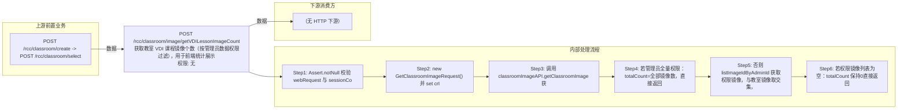

# POST /rcc/classroom/image/getVDILessonImageCount

> 获取教室 VDI 课程镜像个数（按管理员数据权限过滤），用于前端统计展示 ｜ 无特殊权限 ｜ sync

## 依赖关系全景图

## 接口基本信息

| 项目 | 内容 |
|---|---|
| URL | /rcc/classroom/image/getVDILessonImageCount |
| Controller | RccClassroomImageController |
| 方法名 | getVDILessonImageCount |
| 权限注解 | 无 |
| 执行方式 | sync |
| 业务含义 | 获取教室 VDI 课程镜像个数（按管理员数据权限过滤），用于前端统计展示 |

## 入参详情

### GetVDILessonImageCountsRequest

| 参数名 | 类型 | 必填 | 约束 | 说明 |
|---|---|---|---|---|
| classroomId | UUID | 是 | @NotNull 非空 | 教室ID |
| enableTeacher | Boolean | 是 | @NotNull 非空 | 是否教师机 |

## 出参详情

| 返回类型 | DefaultWebResponse（data=GetVDILessonImageCountsResponse） |
|---|---|

| 字段 | 类型 | 说明 |
|---|---|---|
| totalCount | Integer | VDI 课程镜像个数（默认0） |

## 上游前置业务

### 前置1：POST /rcc/classroom/create -> POST /rcc/classroom/select

create 为异步批任务，响应为 BatchTaskSubmitResult 不直接返回 ID；实际经 select 按名称查询 content[0].classroomId（由 field_map 契约映射）
## 内部处理流程

### 处理流程

1. Assert.notNull 校验 webRequest 与 sessionContext
2. new GetClassroomImageRequest() 并 set crId/teaTerminal
3. 调用 classroomImageAPI.getClassroomImage 获取教室全部镜像ID
4. 若管理员全量权限：totalCount=全部镜像数，直接返回
5. 否则 listImageIdByAdminId 获取权限镜像，与教室镜像取交集，totalCount=交集大小
6. 若权限镜像列表为空：totalCount 保持0直接返回

## 下游消费方

（本接口数据主要被自身/关联接口消费，或经 SPI 通知）
## 接口参数约束分析

| 层级 | 参数 | 规则 | 失败结果 |
|---|---|---|---|
| PARAM | classroomId/enableTeacher | @NotNull | 参数缺失校验失败 |
| PERM | sessionContext.userId | 非全量权限按数据权限过滤计数 | 无权限时返回0 |

## 参数取值策略

| 参数 | 策略 | 说明 |
|---|---|---|
| classroomId | user_input/from_query | 按业务构造 |
| enableTeacher | user_input/from_query | 按业务构造 |

## 成功/失败断言基准

### 成功场景

| 场景 | 断言点 |
|---|---|
| 全量权限管理员 | $.status==SUCCESS && $.content.totalCount 非空（教室全部镜像数） |
| 受限权限管理员 | $.status==SUCCESS && $.content.totalCount 非空（权限内镜像与教室镜像交集数） |
| 无可见镜像 | $.status==SUCCESS && $.content.totalCount==0 |

### 失败场景

| 场景 | 触发条件 | 断言点 |
|---|---|---|
| 参数缺失 | enableTeacher 为空 | $.status==ERROR（参数校验，无固定 msgKey） |

## 环境清理机制

| 接口 | 说明 |
|---|---|
| 本接口创建的资源 | 通过对应 delete 接口清理 |

## 前置状态和幂等性标注

| 维度 | 结论 |
|---|---|
| 幂等性 | HIGH |
| 说明 | 纯查询接口 |
