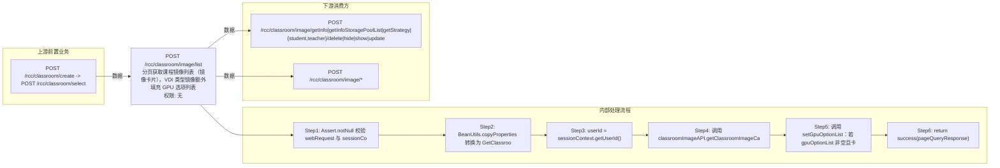

# POST /rcc/classroom/image/list

> 分页获取课程镜像列表（镜像卡片），VDI 类型镜像额外填充 GPU 选项列表 ｜ 无特殊权限 ｜ sync

## 依赖关系全景图

## 接口基本信息

| 项目 | 内容 |
|---|---|
| URL | /rcc/classroom/image/list |
| Controller | RccClassroomImageController |
| 方法名 | getClassroomImage |
| 权限注解 | 无 |
| 执行方式 | sync |
| 业务含义 | 分页获取课程镜像列表（镜像卡片），VDI 类型镜像额外填充 GPU 选项列表 |

## 入参详情

### GetClassroomImagePageWebRequest

| 参数名 | 类型 | 必填 | 约束 | 说明 |
|---|---|---|---|---|
| crId | UUID | 是 | @NotNull 非空 | 操作的教室ID |
| teaTerminal | Boolean | 否 | 默认 false | 学生机或教师机 |
| imageTypeList | List<CbbImageType> | 否 | 可空 | 镜像类型过滤（VDI/TCI等） |
| limit | Integer | 否 |  | 分页、排序与筛选参数（limit） |
| matchArr | Object | 否 |  | 分页、排序与筛选参数（matchArr） |
| searchKeyword | String | 否 |  | 分页、排序与筛选参数（searchKeyword） |
| sortArr | Object | 否 |  | 分页、排序与筛选参数（sortArr） |
| page | Integer | 否 |  | 分页、排序与筛选参数（page） |
## 出参详情

| 返回类型 | DefaultWebResponse（data=PageQueryResponse<ClassroomImageCardInfoDTO>） |
|---|---|

| 字段 | 类型 | 说明 |
|---|---|---|
| itemArr | ClassroomImageCardInfoDTO[] | 镜像卡片列表（元素字段见下） |
| total | Integer | 总条数 |
| id | UUID | 镜像ID |
| imageName | String | 镜像名称 |
| teaImage | Boolean | 是否教师机镜像 |
| hide | Boolean | 是否隐藏 |
| canUpdate | Boolean | 是否能更新 |
| usage | String | 用途 |
| classroomState | ClassroomLessonStatusEnum | 当前教室状态 |
| beingUsedInLesson | Boolean | 当前教室正使用该镜像且处于上课准备/上课中/下课准备中 |
| cbbImageType | CbbImageType | 镜像类型（VDI/IDV/VOI） |
| rootImageId | UUID | 根镜像ID |
| rootImageName | String | 根镜像名称 |
| imageRoleType | ImageRoleType | 镜像角色类型 |
| enableMultipleVersion | Boolean | 是否开启多版本 |
| cpu | Integer | CPU核数 |
| editErrorMessageArr | String[] | 驱动未更新等错误提示 |
| imageSystemSize | Integer | 系统盘大小（GB） |
| memory | Double | 内存大小（GB） |
| osType | CbbOsType | 操作系统类型 |
| supportGoldenImage | Boolean | 是否黄金镜像 |
| downloadInfo | String | 镜像下载总览 |
| bindDefaultEnter | Boolean | 是否默认进入的镜像 |
| cbbCloudDeskPattern | CbbCloudDeskPattern | 桌面模式 |
| imageTemplateState | ImageTemplateState | 镜像模板状态 |
| classroomId | UUID | 教室ID |
| createTime | Date | 创建时间 |
| imageDiskList | List<CbbImageDiskInfoDTO> | 镜像磁盘信息列表 |
| dataDiskSize | Integer | 数据盘大小 |
| enableGpu | Boolean | 是否启用GPU |
| vgpuType | VgpuType | vGPU类型 |
| graphicsMemorySize | String | 显存大小 |
| vgpuItem | String | vGPU规格项 |
| vgpuModel | String | vGPU型号 |
| classroomImageId | UUID | 教室镜像ID |
| gpuOptionList | List<VgpuDTO> | GPU规格列表（仅VDI填充） |
| clusterId | UUID | 计算集群ID |
| platformId | UUID | 平台ID |
| clusterName | String | 计算集群名称 |
| strategyId | UUID | 云桌面策略ID |
| strategyName | String | 云桌面策略名称 |
| networkId | UUID | 网络策略ID |
| networkName | String | 网络策略名称 |
| storagePoolIds | String | 存储池ID集合 |
| spaceImage | Boolean | 是否在教学实训桌面池发布 |
| teacherDesktopState | CbbCloudDeskState | 教师机桌面状态 |
| platformType | CloudPlatformType | 云平台类型（继承 RccPlatformBaseInfoDTO） |
| platformName | String | 云平台名称（继承 RccPlatformBaseInfoDTO） |
| platformStatus | CloudPlatformStatus | 云平台状态（继承 RccPlatformBaseInfoDTO） |

## 上游前置业务

### 前置1：POST /rcc/classroom/create -> POST /rcc/classroom/select

create 为异步批任务，响应为 BatchTaskSubmitResult 不直接返回 ID；实际经 select 按名称查询 content[0].classroomId（由 field_map 契约映射）
## 内部处理流程

### 处理流程

1. Assert.notNull 校验 webRequest 与 sessionContext
2. BeanUtils.copyProperties 转换为 GetClassroomImageRequest
3. userId = sessionContext.getUserId()
4. 调用 classroomImageAPI.getClassroomImageCardPageByCrIdAndTeaTerminal(request, userId) 分页查询
5. 调用 setGpuOptionList：若 gpuOptionList 非空且卡片为 CbbImageType.VDI 则 setGpuOptionDeepCopyList
6. return success(pageQueryResponse)

## 下游消费方

### 消费1：POST /rcc/classroom/image/getInfo|getInfoStoragePoolList|getStrategy|{student,teacher}/delete|hide|show|update

出参 ClassroomImageCardInfoDTO.id=课程镜像ID（镜像模板ID），是大量下游消费的主键（由 field_map 契约映射）

### 消费2：POST /rcc/classroom/image/*

卡片自带 classroomId 回显（由 field_map 契约映射）
## 接口参数约束分析

| 层级 | 参数 | 规则 | 失败结果 |
|---|---|---|---|
| PARAM | crId | @NotNull | 参数缺失校验失败 |

## 参数取值策略

| 参数 | 策略 | 说明 |
|---|---|---|
| crId | user_input/from_query | 按业务构造 |
| teaTerminal | user_input/from_query | 按业务构造 |
| imageTypeList | user_input/from_query | 按业务构造 |
| page/limit/sortArr/matchArr/searchKeyword | user_input/from_query | 按业务构造 |

## 成功/失败断言基准

### 成功场景

| 场景 | 断言点 |
|---|---|
| 教室存在 | $.status==SUCCESS && $.content.itemArr 非空（PageQueryResponse 分页框架字段为 itemArr/total） |
| 包含VDI镜像 | $.status==SUCCESS && $.content.itemArr 中 VDI 卡片含 gpuOptionList 非空 |

### 失败场景

| 场景 | 触发条件 | 断言点 |
|---|---|---|
| crId 缺失 | 请求体无 crId | $.status==ERROR（参数校验，无固定 msgKey） |

## 环境清理机制

| 接口 | 说明 |
|---|---|
| 本接口创建的资源 | 通过对应 delete 接口清理 |

## 前置状态和幂等性标注

| 维度 | 结论 |
|---|---|
| 幂等性 | HIGH |
| 说明 | 纯查询接口 |
