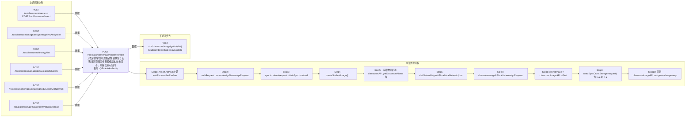

# POST /rcc/classroom/image/student/create

> 分配新的学生机课程镜像到教室；若选择跨存储同步且镜像副本尚未同步，则提交跨存储同步批任务 ｜ @EnableAuthority ｜ sync（需跨存储同步镜像副本时提交 AssignCrossStorageImageSingleTaskHandler 批任务）

## 依赖关系全景图

## 接口基本信息

| 项目 | 内容 |
|---|---|
| URL | /rcc/classroom/image/student/create |
| Controller | RccClassroomImageController |
| 方法名 | assignNewStudentImage |
| 权限注解 | @EnableAuthority |
| 执行方式 | sync（需跨存储同步镜像副本时提交 AssignCrossStorageImageSingleTaskHandler 批任务） |
| 业务含义 | 分配新的学生机课程镜像到教室；若选择跨存储同步且镜像副本尚未同步，则提交跨存储同步批任务 |

## 入参详情

### AssignNewStudentImageRequest

| 参数名 | 类型 | 必填 | 约束 | 说明 |
|---|---|---|---|---|
| crId | UUID | 是 | @NotNull | 分配的教室ID |
| plusImageId | UUID | 是 | @NotNull | 分配的镜像模板ID |
| enableHide | Boolean | 是 | @NotNull | 是否隐藏镜像 |
| storagePoolIdList | List<UUID> | 是 | @NotEmpty 非空 | 存储池ID集合 |
| clusterId | UUID | 是 | @NotNull | 计算集群ID |
| platformId | UUID | 是 | @NotNull | 平台ID |
| strategyId | UUID | 是 | @NotNull | 云桌面策略ID |
| networkId | UUID | 是 | @NotNull | 网络策略ID |
| desktopStartIp | String | 否 | @Nullable（首次新增时必填） | 网络策略开始IP |
| vdiDiskStorageId | UUID | 否 | @Nullable | vdi数据盘存储池 |
| imageReplicationStoragePoolId | UUID | 否 | @Nullable | 同步镜像副本的存储池 |

## 出参详情

| 返回类型 | DefaultWebResponse（普通成功或 BatchTaskSubmitResult） |
|---|---|

| 字段 | 类型 | 说明 |
|---|---|---|
| content | BatchTaskSubmitResult|空 | 跨存储同步时返回批任务提交结果；否则返回 RCDC_RCC_MODULE_OPERATE_SUCCESS |

## 上游前置业务

### 前置1：POST /rcc/classroom/create -> POST /rcc/classroom/select

create 为异步批任务，响应为 BatchTaskSubmitResult 不直接返回 ID；实际经 select 按名称查询 content[0].classroomId（由 field_map 契约映射）

### 前置2：POST /rcc/classroom/image/assignImage/yetAssign/list

待分配镜像模板ID（推断字段路径：ImageDetailDTO.cbbImageTemplateDetailDTO.id）（由 field_map 契约映射）

### 前置3：POST /rcc/classroom/strategy/list

教室策略ID；strategy/create 响应不含ID，需经 strategy/list 查询 ViewClassroomStrategyDTO.classroomStrategyId（由 field_map 契约映射）

### 前置4：POST /rcc/classroom/image/getAssignedClusters

计算集群ID；创建计算集群接口不在本清单，实际从 getAssignedClusters 选取（推断）（由 field_map 契约映射）

### 前置5：POST /rcc/classroom/image/getAssignedClusterAndNetwork

网络策略ID；网络策略创建接口不在本清单，从教室已关联网络选取（推断）（由 field_map 契约映射）

### 前置6：POST /rcc/classroom/getClassroomVdiDiskStorage

VDI数据盘存储池ID；需先开启VDI数据盘后才有值（由 field_map 契约映射）
## 内部处理流程

### 批量处理器：AssignCrossStorageImageSingleTaskHandler

| 步骤 | 说明 |
|---|---|
| 1 | 校验 batchTaskItem/classroomImageAPI 非空 |
| 2 | 调用 classroomImageAPI.assignNewImageWithCrossStorage(request, identityId)：写镜像库表+创建跨存储副本+完成分配流程 |
| 3 | 成功：记录 RCDC_RCC_ASSIGN_CLASSROOM_CROSS_STORAGE_SUCCESS_LOG 审计，返回 BatchTaskItemStatus.SUCCESS |
| 4 | 失败：记录 RCDC_RCC_ASSIGN_CLASSROOM_CROSS_STORAGE_FAIL_LOG 审计，返回 BatchTaskItemStatus.FAILURE |
| 5 | onFinish：failCount==0 返回 SUCCESS，否则返回 FAILURE |

### 处理流程

1. Assert.notNull 校验 webRequest/builder/sessionContext
2. webRequest.convertAssignNewImageRequest()（enableTeacher=false, enableFirstImageCreation=false）
3. synchronized(request.obtainSynchronizedlock().intern()) 加教室+镜像锁
4. createStudentImage()：
5.   获取教室名称 classroomAPI.getClassroomName 与镜像名 classroomImageAPI.getImageName
6.   cbbNetworkMgmtAPI.validateNetwork(clusterId, networkId) 校验网络
7.   classroomImageAPI.validateAssignRequest(request) 校验分配
8.   isFirstImage = classroomImageAPI.isFirstImage(request)；request.setEnableFirstImageCreation
9.   needSyncCrossStorage(request) 为 true 时：assignCrosseStorageImage 提交跨存储同步批任务（注册 CrossStorageInitWaitHelper，等待最多5秒）
10.   否则 classroomImageAPI.assignNewImage(request, userId)
11.   BusinessException 时记录 RCDC_ASSIGN_CLASSROOM_STUDENT_IMAGE_FAIL_LOG 并返回 fail

## 下游消费方

### 消费1：POST /rcc/classroom/image/getInfo|list|{student}/delete|hide|show|update

分配成功后课程镜像ID，经 image/list 查询获取（create 响应不含ID）（由 field_map 契约映射）

> 📖 错误码/状态码对照表见 **code_map_all.md**（工程级全量）与 **error_code_map_tci_strategy.md**（TCI 接口级，含触发条件）。

## 接口参数约束分析

| 层级 | 参数 | 规则 | 失败结果 |
|---|---|---|---|
| PARAM | crId/plusImageId/enableHide/storagePoolIdList/clusterId/platformId/strategyId/networkId | @NotNull/@NotEmpty | 参数缺失或列表为空时校验失败 |
| BIZ | networkId+clusterId | 网络策略必须与集群匹配 | 不匹配抛 RCDC_RCC_ASSIGN_IMAGE_DIFF_NET_STRATEGY(62100235) |
| BIZ | platformId/clusterId | 镜像所属平台/集群与目标一致 | 不一致抛 RCDC_RCC_ASSIGN_IMAGE_DIFF_PLATFORM(62100233)/RCDC_RCC_ASSIGN_IMAGE_DIFF_CLUSTER(62100234) |
| BIZ | plusImageId | 镜像模板需存在且可用 | 抛 RCDC_RCC_IMAGE_NOT_AVAILABLE_UN_SUPPORT / RCDC_RCC_CLASSROOM_IMAGE_NOT_FOUND / RCDC_RCC_IMAGE_HAS_BE_DELETE |
| BIZ | strategyId | 策略需为课程策略且与镜像类型匹配 | 抛 RCDC_RCC_CLASSROOM_IMAGE_DESK_STRATEGY_NOT_RCC / RCDC_RCC_IMAGE_STRATEGY_NOT_SAME_TYPE |
| BIZ | role | 镜像模板工作模式需匹配学生机 | 抛 RCDC_RCC_IMAGE_STUDENT_WORK_MODE_NOT_MATCH |
| CONCURRENCY | crId+plusImageId | synchronized 锁串行化同一教室镜像分配 | 并发下重复分配由校验拦截 |

## 参数取值策略

| 参数 | 策略 | 说明 |
|---|---|---|
| crId | user_input/from_query | 按业务构造 |
| plusImageId | user_input/from_query | 按业务构造 |
| enableHide | user_input/from_query | 按业务构造 |
| storagePoolIdList | user_input/from_query | 按业务构造 |
| clusterId | user_input/from_query | 按业务构造 |
| platformId | user_input/from_query | 按业务构造 |
| strategyId | user_input/from_query | 按业务构造 |
| networkId | user_input/from_query | 按业务构造 |
| desktopStartIp | user_input/from_query | 按业务构造 |
| vdiDiskStorageId | user_input/from_query | 按业务构造 |
| imageReplicationStoragePoolId | user_input/from_query | 按业务构造 |

## 成功/失败断言基准

### 成功场景

| 场景 | 断言点 |
|---|---|
| 镜像副本已同步无需跨存储 | $.status==SUCCESS（content 为空，msgKey==rcdc_rcc_module_operate_success） |
| 需要跨存储同步 | $.status==SUCCESS && $.content.taskId 非空（Builder.success(BatchTaskSubmitResult)）；轮询 content.taskId（2000ms 间隔）至终态 batchTaskItemStatus∈["SUCCESS"] |

### 失败场景

| 场景 | 触发条件 | 断言点 |
|---|---|---|
| 网络策略与集群不匹配 | networkId 不属于 clusterId | $.status==ERROR && $.msgKey==rcdc_assign_classroom_student_image_fail_log（底层抛 62100235） |
| 镜像模板已被删除 | plusImageId 对应镜像模板已删除 | $.status==ERROR && $.msgKey==rcdc_assign_classroom_student_image_fail_log（底层抛 rcdc_rcc_image_has_be_delete） |
| 参数校验失败 | storagePoolIdList 为空 | $.status==ERROR（@NotEmpty 参数校验拦截） |

## 环境清理机制

| 接口 | 说明 |
|---|---|
| POST /rcc/classroom/image/student/delete | 清理本接口分配的课程镜像（学生镜像删除接口） |

## 前置状态和幂等性标注

| 维度 | 结论 |
|---|---|
| 幂等性 | LOW |
| 说明 | 创建类操作；有 synchronized 锁与分配校验防重复，但 HTTP 层无幂等键，重复提交会按校验结果拒绝 |
