# POST /rcc/classroom/image/student/delete

> 删除学生机课程镜像（action=DELETE）：按是否最后一个镜像、是否有座位分发到不同批任务或直接删除 ｜ @EnableAuthority ｜ sync（提交删除批任务：DeleteLastStudentImageBatchTaskHandler / DeleteSeatDesktopDiskBatchTaskHandler，或无座位时同步删除）

## 依赖关系全景图

```mermaid
graph LR
    subgraph 上游前置业务
        A1["POST /rcc/classroom/create -> POST /rcc/classroom/select"]
        A2["POST /rcc/classroom/image/list"]
    end
    B["POST /rcc/classroom/image/student/delete<br>删除学生机课程镜像（action=DELETE）：按是否最后一个镜像、是否有座位<br>权限: @EnableAuthority"]
    A1 -->|数据| B
    A2 -->|数据| B
    subgraph 内部处理流程
        C1["Step1: Assert.notNull 校验 webRequest/builder"]
        C2["Step2: classroomImageHandler.doAction(webReques"]
        C3["Step3: action==DELETE 时加 synchronized(request.o"]
        C4["Step4: doImageAction()："]
        C5["Step5:   获取教室名/镜像名，构建 DoCardActionRequest"]
        C6["Step6:   DELETE 前调用 classroomImageAPI.validCanD"]
        C1 --> C2
        C7["Step7: isLast = classroomImageAPI.isLastDeleteI"]
        C8["Step8: getClassroomImage 获取 ClassroomImageDTO"]
        C9["Step9: 学生机且存在座位："]
        C10["Step10: isLast：handleBeforeDeleteStudentLastImag"]
        C6 --> C7
        C7 --> C8
        C8 --> C9
        C9 --> C10
        C2 --> C3
        C3 --> C4
        C4 --> C5
        C5 --> C6
    end
    B --> C1
    subgraph 下游消费方
        D1["（无 HTTP 下游）"]
    end
    B -->|数据| D1
```

## 接口基本信息

| 项目 | 内容 |
|---|---|
| URL | /rcc/classroom/image/student/delete |
| Controller | RccClassroomImageController |
| 方法名 | studentDoDelete |
| 权限注解 | @EnableAuthority |
| 执行方式 | sync（提交删除批任务：DeleteLastStudentImageBatchTaskHandler / DeleteSeatDesktopDiskBatchTaskHandler，或无座位时同步删除） |
| 业务含义 | 删除学生机课程镜像（action=DELETE）：按是否最后一个镜像、是否有座位分发到不同批任务或直接删除 |

## 入参详情

### DoActionRequest

| 参数名 | 类型 | 必填 | 约束 | 说明 |
|---|---|---|---|---|
| crId | UUID | 是 | @NotNull | 操作的教室id |
| teaTerminal | Boolean | 否 | 默认 false | 教师机或学生机（学生场景 false） |
| imageId | UUID | 是 | @NotNull | 操作的镜像ID |
| action | Integer | 是 | @NotNull，取值1更新/2隐藏/3显示/4删除 | 动作 |
| shouldOnlyDeleteDataFromDb | Boolean | 否 | 可空 | 是否仅从数据库删除数据（VDI桌面场景） |

## 出参详情

| 返回类型 | DefaultWebResponse（成功或 BatchTaskSubmitResult） |
|---|---|

| 字段 | 类型 | 说明 |
|---|---|---|
| content | BatchTaskSubmitResult|空 | 批任务提交结果或操作成功 |

## 上游前置业务

### 前置1：POST /rcc/classroom/create -> POST /rcc/classroom/select

create 为异步批任务，响应为 BatchTaskSubmitResult 不直接返回 ID；实际经 select 按名称查询 content[0].classroomId（由 field_map 契约映射）

### 前置2：POST /rcc/classroom/image/list

课程镜像ID（DoActionRequest.imageId）（由 field_map 契约映射）
## 内部处理流程

### 批量处理器：DeleteLastStudentImageBatchTaskHandler / DeleteSeatDesktopDiskBatchTaskHandler / PushImageListBatchTaskHandler

| 步骤 | 说明 |
|---|---|
| 1 | DeleteLastStudentImageBatchTaskHandler.processItem：按座位 getSeatInfo → shouldOnlyDeleteDataFromDb 且 VDI 时 seatAPI.deleteDesktopFromDb，否则 seatAPI.deleteDesktop(seatId, imageType, imageId)；成功记录 SUCCESS 日志 |
| 2 | DeleteSeatDesktopDiskBatchTaskHandler.processItem：getSeatInfo → shouldOnlyDeleteDataFromDb 时 platformServerMgmtAPI.validForForceDelete 校验平台后 seatAPI.deleteDesktopDiskFromDb，否则 seatAPI.deleteDesktopDisk(seatId, imageId) |
| 3 | PushImageListBatchTaskHandler.processItem：getSeatInfo → seatAPI.pushClassroomImageList2Seat(seatId)；onFinish 调 seatAPI.refreshDeskInfo(classroomId) |

### 处理流程

1. Assert.notNull 校验 webRequest/builder
2. classroomImageHandler.doAction(webRequest, builder)
3. action==DELETE 时加 synchronized(request.obtainSynchronizedlock().intern()) 锁
4. doImageAction()：
5.   获取教室名/镜像名，构建 DoCardActionRequest
6.   DELETE 前调用 classroomImageAPI.validCanDeleteClassroomImage(request)
7.   isLast = classroomImageAPI.isLastDeleteImage(imageId, crId, teaTerminal)
8.   getClassroomImage 获取 ClassroomImageDTO
9.   学生机且存在座位：
10.     isLast：handleBeforeDeleteStudentLastImage（shouldOnlyDeleteDataFromDb 时仅删亲和性规则；否则 seatAPI.checkCanOperatorByclassroomId 校验可操作）→ DeleteLastStudentImageBatchTaskHandler
11.     非 isLast 且 VDI：DeleteSeatDesktopDiskBatchTaskHandler
12.   学生机且无座位：deleteOtherPlatformVmGroupByDeleteImage + classroomImageAPI.doAction；若 isLast 再 ipDeliverAPI.delClassroom + seatAPI.deleteClassroomClusterResources
13.   notifyImageInfo：学生机有座位时提交 PushImageListBatchTaskHandler 推送镜像列表到学生端
14.   失败：记录 RCDC_RCC_DO_IMAGE_CARD_ACTION_FAIL 审计并返回 fail

## 下游消费方

（本接口数据主要被自身/关联接口消费，或经 SPI 通知）
## 接口参数约束分析

| 层级 | 参数 | 规则 | 失败结果 |
|---|---|---|---|
| PARAM | crId/imageId/action | @NotNull | 参数缺失校验失败 |
| BIZ | imageId | 删除前镜像需存在可删 | 抛 RCDC_RCC_IMAGE_HAS_BE_DELETE / RCDC_RCC_NOT_FIND_IMAGE_FILE |
| BIZ | classroom | 删除最后一个学生镜像前需教室可操作（无运行中桌面） | seatAPI.checkCanOperatorByclassroomId 抛异常 |
| CONCURRENCY | crId+teaTerminal | DELETE 与创建互斥加锁 | 并发时按锁串行 |

## 参数取值策略

| 参数 | 策略 | 说明 |
|---|---|---|
| crId | user_input/from_query | 按业务构造 |
| teaTerminal | user_input/from_query | 按业务构造 |
| imageId | user_input/from_query | 按业务构造 |
| action | user_input/from_query | 按业务构造 |
| shouldOnlyDeleteDataFromDb | user_input/from_query | 按业务构造 |

## 成功/失败断言基准

### 成功场景

| 场景 | 断言点 |
|---|---|
| 删除非最后一个学生镜像且有座位(VDI) | $.status==SUCCESS && $.content.taskId 非空（DeleteSeatDesktopDiskBatchTaskHandler 批任务）；轮询 content.taskId 至终态 batchTaskItemStatus∈["SUCCESS"] |
| 删除最后一个学生镜像 | $.status==SUCCESS && $.content.taskId 非空（DeleteLastStudentImageBatchTaskHandler 批任务）；轮询 content.taskId 至终态 batchTaskItemStatus∈["SUCCESS"] |
| 教室无座位 | $.status==SUCCESS（同步删除镜像数据，content 为空） |

### 失败场景

| 场景 | 触发条件 | 断言点 |
|---|---|---|
| 镜像已被删除 | 再次删除同一镜像 | $.status==ERROR && $.msgKey==rcdc_rcc_image_has_be_delete |
| 有运行中桌面 | 删除最后一个学生镜像时桌面运行中 | $.status==ERROR && $.msgKey==rcdc_rcc_do_image_card_action_fail |

## 环境清理机制

| 接口 | 说明 |
|---|---|
| 无对应 HTTP 清理接口 | 删除类接口无反向清理；删除时的释放IP/清理教室集群资源为服务端内部动作 |

## 前置状态和幂等性标注

| 维度 | 结论 |
|---|---|
| 幂等性 | LOW |
| 说明 | 删除类操作；重复删除被 validCanDelete 校验拦截，delete 与 create 有互斥锁 |
