# POST /rcc/classroom/image/student/network/edit

> 学生机课程镜像修改网络策略：更新座位网络配置，若需变更桌面IP则按座位批处理变更IP并重建禁网白名单 ｜ @EnableAuthority ｜ sync（需变更桌面IP且有座位时提交 ChangeSeatDesktopIpBatchTaskHandler 批任务）

## 依赖关系全景图

```mermaid
graph LR
    subgraph 上游前置业务
        A1["POST /rcc/classroom/create -> POST /rcc/classroom/select"]
        A2["POST /rcc/classroom/image/getAssignedClusterAndNetwork"]
    end
    B["POST /rcc/classroom/image/student/network/edit<br>学生机课程镜像修改网络策略：更新座位网络配置，若需变更桌面IP则按座位批处理变更<br>权限: @EnableAuthority"]
    A1 -->|数据| B
    A2 -->|数据| B
    subgraph 内部处理流程
        C1["Step1: Assert.notNull 校验 webRequest/builder"]
        C2["Step2: webRequest.buildStudentClusterUpdateNetw"]
        C3["Step3: classroomName=classroomAPI.getClassroomN"]
        C4["Step4: cbbNetworkMgmtAPI.validateNetwork(cluste"]
        C5["Step5: isChangeDesktopIp = classroomImageAPI.ch"]
        C6["Step6: seatAPI.changeClassroomSeatNetworkConfig"]
        C1 --> C2
        C7["Step7: 记录 RCDC_RCC_CLASSROOM_STU_NETWORK_STRATE"]
        C8["Step8: 若 !isChangeDesktopIp：直接返回成功"]
        C9["Step9: 若需变更IP：seatIdList=seatAPI.getSeatIdArr(["]
        C10["Step10: 无座位：networkWhiteListAPI.recreateNetworkW"]
        C6 --> C7
        C7 --> C8
        C8 --> C9
        C9 --> C10
        C2 --> C3
        C3 --> C4
        C4 --> C5
        C5 --> C6
    end
    B --> C1
    subgraph 下游消费方
        D1["（无 HTTP 下游）"]
    end
    B -->|数据| D1
```

## 接口基本信息

| 项目 | 内容 |
|---|---|
| URL | /rcc/classroom/image/student/network/edit |
| Controller | RccClassroomImageController |
| 方法名 | editStudentNetwork |
| 权限注解 | @EnableAuthority |
| 执行方式 | sync（需变更桌面IP且有座位时提交 ChangeSeatDesktopIpBatchTaskHandler 批任务） |
| 业务含义 | 学生机课程镜像修改网络策略：更新座位网络配置，若需变更桌面IP则按座位批处理变更IP并重建禁网白名单 |

## 入参详情

### UpdateClusterNetworkWebRequest

| 参数名 | 类型 | 必填 | 约束 | 说明 |
|---|---|---|---|---|
| classroomId | UUID | 是 | @NotNull | 教室ID |
| clusterId | UUID | 是 | @NotNull | 计算节点ID |
| platformId | UUID | 是 | @NotNull | 云平台ID |
| networkId | UUID | 是 | @NotNull | 网络策略ID |
| desktopStartIp | String | 否 | 可空 | 云桌面起始IP |

## 出参详情

| 返回类型 | DefaultWebResponse（成功或 BatchTaskSubmitResult） |
|---|---|

| 字段 | 类型 | 说明 |
|---|---|---|
| content | BatchTaskSubmitResult|空 | 变更IP批任务提交结果或操作成功 |

## 上游前置业务

### 前置1：POST /rcc/classroom/create -> POST /rcc/classroom/select

create 为异步批任务，响应为 BatchTaskSubmitResult 不直接返回 ID；实际经 select 按名称查询 content[0].classroomId（由 field_map 契约映射）

### 前置2：POST /rcc/classroom/image/getAssignedClusterAndNetwork

计算集群ID（推断）（由 field_map 契约映射）
## 内部处理流程

### 批量处理器：ChangeSeatDesktopIpBatchTaskHandler

| 步骤 | 说明 |
|---|---|
| 1 | processItem：getSeatInfo → seatAPI.changeSeatDesktopIp(seatId, networkId) 变更桌面IP |
| 2 | 成功：记录 RCDC_RCC_SEAT_OPERATE_SEAT_CHANGE_SINGLE_SUC_LOG 返回 SUCCESS |
| 3 | 失败：记录 RCDC_RCC_SEAT_OPERATE_SEAT_CHANGE_SINGLE_FAIL_LOG 返回 FAILURE |
| 4 | onFinish：networkWhiteListAPI.recreateNetworkWhiteList(classroomId) 重建禁网白名单 + seatAPI.refreshDeskInfo(classroomId) |

### 处理流程

1. Assert.notNull 校验 webRequest/builder
2. webRequest.buildStudentClusterUpdateNetworkRequest()（enableTeacher=false, resourceType=NETWORK_STRATEGY）
3. classroomName=classroomAPI.getClassroomName；deskNetworkName=cbbNetworkMgmtAPI.getDeskNetwork(networkId).getDeskNetworkName()
4. cbbNetworkMgmtAPI.validateNetwork(clusterId, networkId) 校验网络策略有效性
5. isChangeDesktopIp = classroomImageAPI.checkDeskNetworkNeedChange(request)
6. seatAPI.changeClassroomSeatNetworkConfig(request) 更新座位网络配置
7. 记录 RCDC_RCC_CLASSROOM_STU_NETWORK_STRATEGY_EDIT_SUCCESS_LOG 审计
8. 若 !isChangeDesktopIp：直接返回成功
9. 若需变更IP：seatIdList=seatAPI.getSeatIdArr([classroomId])
10.   无座位：networkWhiteListAPI.recreateNetworkWhiteList(classroomId) 后直接返回成功
11.   有座位：getBatchChangeDesktopIpDefaultWebResponse 提交 ChangeSeatDesktopIpBatchTaskHandler 批任务
12. BusinessException：记录 RCDC_RCC_CLASSROOM_STU_NETWORK_STRATEGY_EDIT_FAIL_LOG 并返回 fail

## 下游消费方

（本接口数据主要被自身/关联接口消费，或经 SPI 通知）
## 接口参数约束分析

| 层级 | 参数 | 规则 | 失败结果 |
|---|---|---|---|
| PARAM | classroomId/clusterId/platformId/networkId | @NotNull | 参数缺失校验失败 |
| BIZ | networkId+clusterId | 网络策略需与集群匹配且有效 | validateNetwork 抛异常（如 RCDC_RCC_CLASSROOM_HAS_NO_NETWORK/RCDC_RCC_CLASSROOM_NO_FIND_NETWORK） |
| BIZ | networkId | 目标网络策略IP需充足（变更时） | isFreeIpEnough 校验失败 |

## 参数取值策略

| 参数 | 策略 | 说明 |
|---|---|---|
| classroomId | user_input/from_query | 按业务构造 |
| clusterId | user_input/from_query | 按业务构造 |
| platformId | user_input/from_query | 按业务构造 |
| networkId | user_input/from_query | 按业务构造 |
| desktopStartIp | user_input/from_query | 按业务构造 |

## 成功/失败断言基准

### 成功场景

| 场景 | 断言点 |
|---|---|
| 网络无实质变更 | $.status==SUCCESS（仅更新座位配置，content 为空，msgKey==rcdc_classroom_operate_tip_success） |
| 需变更IP且教室无座位 | $.status==SUCCESS（重建禁网白名单后返回，content 为空，msgKey==rcdc_classroom_operate_tip_success） |
| 需变更IP且有座位 | $.status==SUCCESS && $.content.taskId 非空（ChangeSeatDesktopIpBatchTaskHandler 批任务）；轮询 content.taskId 至终态 batchTaskItemStatus∈["SUCCESS"] |

### 失败场景

| 场景 | 触发条件 | 断言点 |
|---|---|---|
| 网络策略与集群不匹配 | networkId 不属于 clusterId | $.status==ERROR && $.msgKey==rcdc_classroom_operate_tip_failed |
| 参数缺失 | platformId 为空 | $.status==ERROR（参数校验，无固定 msgKey） |

## 环境清理机制

| 接口 | 说明 |
|---|---|
| 无对应 HTTP 清理接口 | 网络编辑类接口无反向清理；重建禁网白名单为服务端内部动作 |

## 前置状态和幂等性标注

| 维度 | 结论 |
|---|---|
| 幂等性 | MEDIUM |
| 说明 | 重复提交同参数会重复执行座位配置更新与IP变更命令，但结果收敛；无幂等键 |
