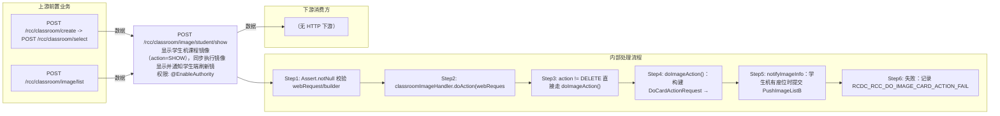

# POST /rcc/classroom/image/student/show

> 显示学生机课程镜像（action=SHOW），同步执行镜像显示并通知学生端刷新镜像列表 ｜ @EnableAuthority ｜ sync

## 依赖关系全景图

## 接口基本信息

| 项目 | 内容 |
|---|---|
| URL | /rcc/classroom/image/student/show |
| Controller | RccClassroomImageController |
| 方法名 | studentDoShow |
| 权限注解 | @EnableAuthority |
| 执行方式 | sync |
| 业务含义 | 显示学生机课程镜像（action=SHOW），同步执行镜像显示并通知学生端刷新镜像列表 |

## 入参详情

### DoActionRequest

| 参数名 | 类型 | 必填 | 约束 | 说明 |
|---|---|---|---|---|
| crId | UUID | 是 | @NotNull | 操作的教室id |
| teaTerminal | Boolean | 否 | 默认 false | 教师机或学生机 |
| imageId | UUID | 是 | @NotNull | 操作的镜像ID |
| action | Integer | 是 | @NotNull，值3=SHOW | 动作 |
| shouldOnlyDeleteDataFromDb | Boolean | 否 | 可空 | 仅删除场景使用，SHOW 下忽略 |

## 出参详情

| 返回类型 | DefaultWebResponse（纯操作接口，content 为空） |
|---|---|

> 纯操作接口：成功时 content 为空，结果经 status/msgKey 返回（msgKey==rcdc_rcc_module_operate_success）。

| 字段 | 类型 | 说明 |
|---|---|---|
| content | 空 | 成功时为空（msgKey 为 rcdc_rcc_module_operate_success） |

## 上游前置业务

### 前置1：POST /rcc/classroom/create -> POST /rcc/classroom/select

create 为异步批任务，响应为 BatchTaskSubmitResult 不直接返回 ID；实际经 select 按名称查询 content[0].classroomId（由 field_map 契约映射）

### 前置2：POST /rcc/classroom/image/list

课程镜像ID（DoActionRequest.imageId）（由 field_map 契约映射）
## 内部处理流程

### 批量处理器：PushImageListBatchTaskHandler（有座位时通知学生端）

| 步骤 | 说明 |
|---|---|
| 1 | processItem：getSeatInfo → seatAPI.pushClassroomImageList2Seat(seatId) |
| 2 | onFinish：seatAPI.refreshDeskInfo(classroomId) |

### 处理流程

1. Assert.notNull 校验 webRequest/builder
2. classroomImageHandler.doAction(webRequest, builder)
3. action != DELETE 直接走 doImageAction()
4. doImageAction()：构建 DoCardActionRequest → classroomImageAPI.doAction(request) 执行显示
5. notifyImageInfo：学生机有座位时提交 PushImageListBatchTaskHandler 批任务推送镜像列表
6. 失败：记录 RCDC_RCC_DO_IMAGE_CARD_ACTION_FAIL 审计并返回 fail

## 下游消费方

（本接口数据主要被自身/关联接口消费，或经 SPI 通知）
## 接口参数约束分析

| 层级 | 参数 | 规则 | 失败结果 |
|---|---|---|---|
| PARAM | crId/imageId/action | @NotNull | 参数缺失校验失败 |

## 参数取值策略

| 参数 | 策略 | 说明 |
|---|---|---|
| crId | user_input/from_query | 按业务构造 |
| teaTerminal | user_input/from_query | 按业务构造 |
| imageId | user_input/from_query | 按业务构造 |
| action | user_input/from_query | 按业务构造 |
| shouldOnlyDeleteDataFromDb | user_input/from_query | 按业务构造 |

## 成功/失败断言基准

### 成功场景

| 场景 | 断言点 |
|---|---|
| 镜像存在 | $.status==SUCCESS（同步显示成功，content 为空，msgKey==rcdc_rcc_module_operate_success） |

### 失败场景

| 场景 | 触发条件 | 断言点 |
|---|---|---|
| 镜像不存在 | imageId 无效 | $.status==ERROR && $.msgKey==rcdc_rcc_do_image_card_action_fail |

## 环境清理机制

| 接口 | 说明 |
|---|---|
| 本接口创建的资源 | 通过对应 delete 接口清理 |

## 前置状态和幂等性标注

| 维度 | 结论 |
|---|---|
| 幂等性 | MEDIUM |
| 说明 | 显示操作可重复执行 |
