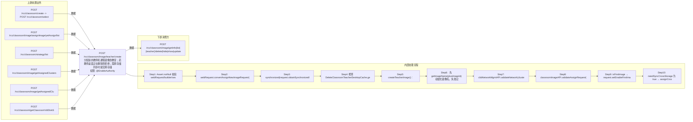

# POST /rcc/classroom/image/teacher/create

> 分配新的教师机课程镜像到教室；若教师桌面正在删除则拒绝；需跨存储同步时提交跨存储同步批任务 ｜ @EnableAuthority ｜ sync（需跨存储同步镜像副本时提交 AssignCrossStorageImageSingleTaskHandler 批任务）

## 依赖关系全景图

## 接口基本信息

| 项目 | 内容 |
|---|---|
| URL | /rcc/classroom/image/teacher/create |
| Controller | RccClassroomImageController |
| 方法名 | assignNewTeacherImage |
| 权限注解 | @EnableAuthority |
| 执行方式 | sync（需跨存储同步镜像副本时提交 AssignCrossStorageImageSingleTaskHandler 批任务） |
| 业务含义 | 分配新的教师机课程镜像到教室；若教师桌面正在删除则拒绝；需跨存储同步时提交跨存储同步批任务 |

## 入参详情

### AssignNewTeacherImageRequest

| 参数名 | 类型 | 必填 | 约束 | 说明 |
|---|---|---|---|---|
| crId | UUID | 是 | @NotNull | 分配的教室ID |
| plusImageId | UUID | 是 | @NotNull | 分配的镜像ID |
| enableHide | Boolean | 是 | @NotNull | 是否隐藏镜像 |
| storagePoolIdList | List<UUID> | 是 | @NotEmpty 非空 | 存储池ID集合 |
| clusterId | UUID | 是 | @NotNull | 计算集群ID |
| platformId | UUID | 是 | @NotNull | 平台ID |
| strategyId | UUID | 是 | @NotNull | 云桌面策略ID |
| networkId | UUID | 是 | @NotNull | 网络策略ID |
| desktopStartIp | String | 否 | @Nullable（首次新增时必填） | 云桌面起始IP |
| vdiDiskStorageId | UUID | 否 | @Nullable | vdi数据盘存储池 |
| imageReplicationStoragePoolId | UUID | 否 | @Nullable | 同步镜像副本的存储池 |

## 出参详情

| 返回类型 | DefaultWebResponse |
|---|---|

### 外层响应（SK 框架统一包装）

| 字段 | 类型 | 说明 |
|---|---|---|
| status | String | SUCCESS / ERROR |
| message | String | 提示消息 |
| msgKey | String | 错误/成功消息key（成功=RCDC_RCC_MODULE_OPERATE_SUCCESS） |
| msgArgArr | String[] | 消息参数数组 |
| content | Object | 业务体（普通分配为空；跨存储同步时为 BatchTaskSubmitResult） |

### content 业务体（跨存储同步时）

| 字段 | 类型 | 说明 |
|---|---|---|
| taskId | UUID | 批处理任务ID（轮询任务状态） |
| taskName | String | 任务名称 |
| taskStatus | Enum | SUCCESS/FAILURE/PROCESSING |

> 源码依据：RccClassroomImageController.assignNewTeacherImage(#288) → createTeacherImage：普通分配 `Builder.success(RCDC_RCC_MODULE_OPERATE_SUCCESS)`（content 空）；跨存储 `assignCrosseStorageImage`（返回 BatchTaskSubmitResult）；失败 `Builder.fail(RCDC_ASSIGN_CLASSROOM_TEACHER_IMAGE_FAIL_LOG)`。

## 上游前置业务

### 前置1：POST /rcc/classroom/create -> POST /rcc/classroom/select

create 为异步批任务，响应为 BatchTaskSubmitResult 不直接返回 ID；实际经 select 按名称查询 content[0].classroomId（由 field_map 契约映射）

### 前置2：POST /rcc/classroom/image/assignImage/yetAssign/list

待分配镜像模板ID（推断字段路径）（由 field_map 契约映射）

### 前置3：POST /rcc/classroom/strategy/list

教室策略ID（由 field_map 契约映射）

### 前置4：POST /rcc/classroom/image/getAssignedClusters

计算集群ID（推断）（由 field_map 契约映射）

### 前置5：POST /rcc/classroom/image/getAssignedClusterAndNetwork

网络策略ID（推断）（由 field_map 契约映射）

### 前置6：POST /rcc/classroom/getClassroomVdiDiskStorage

VDI数据盘存储池ID（由 field_map 契约映射）
## 内部处理流程

### 批量处理器：AssignCrossStorageImageSingleTaskHandler

| 步骤 | 说明 |
|---|---|
| 1 | 校验 batchTaskItem/classroomImageAPI 非空 |
| 2 | 调用 classroomImageAPI.assignNewImageWithCrossStorage(request, identityId) 完成跨存储分配 |
| 3 | 成功：记录 RCDC_RCC_ASSIGN_CLASSROOM_CROSS_STORAGE_SUCCESS_LOG，返回 SUCCESS |
| 4 | 失败：记录 RCDC_RCC_ASSIGN_CLASSROOM_CROSS_STORAGE_FAIL_LOG，返回 FAILURE |
| 5 | onFinish：failCount==0 SUCCESS 否则 FAILURE |

### 处理流程

1. Assert.notNull 校验 webRequest/builder/sessionContext
2. webRequest.convertAssignNewImageRequest()（enableTeacher=true, enableFirstImageCreation=false）
3. synchronized(request.obtainSynchronizedlock().intern()) 加锁
4. 检查 DeleteClassroomTeacherDesktopCache.getDeleteClassroomTeacherDesktopCache(crId) 非空则抛 RCDC_RCC_CLASSROOM_DELETING_TEACHER_DESKTOP
5. createTeacherImage()：
6.   先 getImageName(plusImageId) 初始化镜像名，失败记录 RCDC_ASSIGN_CLASSROOM_TEACHER_IMAGE_FAIL_NOT_FIND_IMAGE_LOG 并返回 fail
7.   cbbNetworkMgmtAPI.validateNetwork(clusterId, networkId)
8.   classroomImageAPI.validateAssignRequest(request)
9.   isFirstImage → request.setEnableFirstImageCreation
10.   needSyncCrossStorage 为 true → assignCrosseStorageImage 提交跨存储批任务（waitToken 等待最多5秒）
11.   否则 classroomImageAPI.assignNewImage(request, userId)
12.   BusinessException：记录 RCDC_ASSIGN_CLASSROOM_TEACHER_IMAGE_FAIL_LOG 并返回 fail

## 下游消费方

### 消费1：POST /rcc/classroom/image/getInfo|list|{teacher}/delete|hide|show|update

分配成功后课程镜像ID，经 image/list 查询获取（由 field_map 契约映射）

> 📖 错误码/状态码对照表见 **code_map_all.md**（工程级全量）与 **error_code_map_tci_strategy.md**（TCI 接口级，含触发条件）。

## 接口参数约束分析

| 层级 | 参数 | 规则 | 失败结果 |
|---|---|---|---|
| PARAM | crId/plusImageId/enableHide/storagePoolIdList/clusterId/platformId/strategyId/networkId | @NotNull/@NotEmpty | 参数缺失或列表为空校验失败 |
| BIZ | crId | 教师桌面删除中不可分配新镜像 | 抛 RCDC_RCC_CLASSROOM_DELETING_TEACHER_DESKTOP |
| BIZ | plusImageId | 镜像模板需存在 | getImageName 失败返回 RCDC_ASSIGN_CLASSROOM_TEACHER_IMAGE_FAIL_NOT_FIND_IMAGE_LOG |
| BIZ | networkId+clusterId/platformId | 网络策略、集群、平台匹配 | 抛 62100233/62100234/62100235 |
| BIZ | role | 镜像工作模式需匹配教师机 | 抛 RCDC_RCC_IMAGE_TEACHER_WORK_MODE_NOT_MATCH |

## 参数取值策略

| 参数 | 策略 | 说明 |
|---|---|---|
| crId | user_input/from_query | 按业务构造 |
| plusImageId | user_input/from_query | 按业务构造 |
| enableHide | user_input/from_query | 按业务构造 |
| storagePoolIdList | user_input/from_query | 按业务构造 |
| clusterId | user_input/from_query | 按业务构造 |
| platformId | user_input/from_query | 按业务构造 |
| strategyId | user_input/from_query | 按业务构造 |
| networkId | user_input/from_query | 按业务构造 |
| desktopStartIp | user_input/from_query | 按业务构造 |
| vdiDiskStorageId | user_input/from_query | 按业务构造 |
| imageReplicationStoragePoolId | user_input/from_query | 按业务构造 |

## 成功/失败断言基准

### 成功场景

| 场景 | 断言点 |
|---|---|
| 无需跨存储同步 | $.status==SUCCESS（content 为空，msgKey==rcdc_rcc_module_operate_success） |
| 需要跨存储同步 | $.status==SUCCESS && $.content.taskId 非空（Builder.success(BatchTaskSubmitResult)）；轮询 content.taskId 至终态 batchTaskItemStatus∈["SUCCESS"] |

### 失败场景

| 场景 | 触发条件 | 断言点 |
|---|---|---|
| 教师桌面删除中 | DeleteClassroomTeacherDesktopCache 存在缓存 | $.status==ERROR && $.msgKey==rcdc_rcc_classroom_deleting_teacher_desktop |
| 镜像模板不存在 | plusImageId 无效 | $.status==ERROR && $.msgKey==rcdc_assign_classroom_teacher_image_fail_not_find_image_log |

## 环境清理机制

| 接口 | 说明 |
|---|---|
| POST /rcc/classroom/image/teacher/delete | 清理本接口分配的课程镜像（教师镜像删除接口） |

## 前置状态和幂等性标注

| 维度 | 结论 |
|---|---|
| 幂等性 | LOW |
| 说明 | 创建类操作；synchronized 锁+分配校验防并发重复，HTTP 层无幂等键 |
