# POST /rcc/classroom/image/teacher/network/edit

> 教师机镜像修改网络策略：校验网络与IP充足性，需变更桌面网络时提交教师桌面网络变更批任务 ｜ @EnableAuthority ｜ sync（需变更桌面网络时提交 ChangeTeacherDeskNetworkBatchTaskHandler 批任务）

## 依赖关系全景图

```mermaid
graph LR
    subgraph 上游前置业务
        A1["POST /rcc/classroom/create -> POST /rcc/classroom/select"]
        A2["POST /rcc/classroom/image/getAssignedClusterAndNetwork"]
    end
    B["POST /rcc/classroom/image/teacher/network/edit<br>教师机镜像修改网络策略：校验网络与IP充足性，需变更桌面网络时提交教师桌面网络变<br>权限: @EnableAuthority"]
    A1 -->|数据| B
    A2 -->|数据| B
    subgraph 内部处理流程
        C1["Step1: Assert.notNull 校验 webRequest/builder"]
        C2["Step2: webRequest.buildTeacherClusterUpdateNetw"]
        C3["Step3: classroomName=classroomAPI.getClassroomN"]
        C4["Step4: cbbNetworkMgmtAPI.validateNetwork(cluste"]
        C5["Step5: isNeedChangeDeskNetwork = classroomImage"]
        C6["Step6: 若需变更：vdiIpDeliverAPI.isFreeIpEnough(netw"]
        C1 --> C2
        C7["Step7: 充足 → getBatchChangeTeacherDeskNetworkDef"]
        C8["Step8: 若无需变更：记录 RCDC_RCC_CLASSROOM_TEACHER_NETW"]
        C9["Step9: BusinessException：记录 RCDC_RCC_CLASSROOM_"]
        C6 --> C7
        C7 --> C8
        C8 --> C9
        C2 --> C3
        C3 --> C4
        C4 --> C5
        C5 --> C6
    end
    B --> C1
    subgraph 下游消费方
        D1["（无 HTTP 下游）"]
    end
    B -->|数据| D1
```

## 接口基本信息

| 项目 | 内容 |
|---|---|
| URL | /rcc/classroom/image/teacher/network/edit |
| Controller | RccClassroomImageController |
| 方法名 | editTeacherNetwork |
| 权限注解 | @EnableAuthority |
| 执行方式 | sync（需变更桌面网络时提交 ChangeTeacherDeskNetworkBatchTaskHandler 批任务） |
| 业务含义 | 教师机镜像修改网络策略：校验网络与IP充足性，需变更桌面网络时提交教师桌面网络变更批任务 |

## 入参详情

### UpdateClusterNetworkWebRequest

| 参数名 | 类型 | 必填 | 约束 | 说明 |
|---|---|---|---|---|
| classroomId | UUID | 是 | @NotNull | 教室ID |
| clusterId | UUID | 是 | @NotNull | 计算节点ID |
| platformId | UUID | 是 | @NotNull | 云平台ID |
| networkId | UUID | 是 | @NotNull | 网络策略ID |
| desktopStartIp | String | 否 | 可空 | 云桌面起始IP |

## 出参详情

| 返回类型 | DefaultWebResponse（成功或 BatchTaskSubmitResult） |
|---|---|

| 字段 | 类型 | 说明 |
|---|---|---|
| content | BatchTaskSubmitResult|空 | 教师桌面网络变更批任务提交结果或操作成功 |

## 上游前置业务

### 前置1：POST /rcc/classroom/create -> POST /rcc/classroom/select

create 为异步批任务，响应为 BatchTaskSubmitResult 不直接返回 ID；实际经 select 按名称查询 content[0].classroomId（由 field_map 契约映射）

### 前置2：POST /rcc/classroom/image/getAssignedClusterAndNetwork

计算集群ID（推断）（由 field_map 契约映射）
## 内部处理流程

### 批量处理器：ChangeTeacherDeskNetworkBatchTaskHandler

| 步骤 | 说明 |
|---|---|
| 1 | processItem：classroomTeacherAPI.changeVdiDesktopNetwork(request) 变更教师VDI桌面网络 |
| 2 | 成功：记录 RCDC_RCC_CLASSROOM_TEACHER_NETWORK_STRATEGY_EDIT_SUCCESS_LOG，返回 SUCCESS |
| 3 | 失败：记录 RCDC_RCC_CLASSROOM_TEACHER_NETWORK_STRATEGY_EDIT_FAIL_LOG，返回 FAILURE |
| 4 | onFinish：failCount==0 SUCCESS 否则 FAILURE |

### 处理流程

1. Assert.notNull 校验 webRequest/builder
2. webRequest.buildTeacherClusterUpdateNetworkRequest()（enableTeacher=true, resourceType=NETWORK_STRATEGY）
3. classroomName=classroomAPI.getClassroomName；deskNetworkName=cbbNetworkMgmtAPI.getDeskNetwork(networkId).getDeskNetworkName()
4. cbbNetworkMgmtAPI.validateNetwork(clusterId, networkId) 校验网络策略有效性
5. isNeedChangeDeskNetwork = classroomImageAPI.checkDeskNetworkNeedChange(request)
6. 若需变更：vdiIpDeliverAPI.isFreeIpEnough(networkId, 1) 校验IP充足
7.   充足 → getBatchChangeTeacherDeskNetworkDefaultWebResponse 提交 ChangeTeacherDeskNetworkBatchTaskHandler 批任务（enableParallel）
8. 若无需变更：记录 RCDC_RCC_CLASSROOM_TEACHER_NETWORK_STRATEGY_EDIT_SUCCESS_LOG 审计，直接返回成功
9. BusinessException：记录 RCDC_RCC_CLASSROOM_TEACHER_NETWORK_STRATEGY_EDIT_FAIL_LOG 审计并返回 fail

## 下游消费方

（本接口数据主要被自身/关联接口消费，或经 SPI 通知）
## 接口参数约束分析

| 层级 | 参数 | 规则 | 失败结果 |
|---|---|---|---|
| PARAM | classroomId/clusterId/platformId/networkId | @NotNull | 参数缺失校验失败 |
| BIZ | networkId+clusterId | 网络策略需与集群匹配且有效 | validateNetwork 抛异常 |
| BIZ | networkId | 目标网络IP需充足 | vdiIpDeliverAPI.isFreeIpEnough 抛 IP 不足异常 |

## 参数取值策略

| 参数 | 策略 | 说明 |
|---|---|---|
| classroomId | user_input/from_query | 按业务构造 |
| clusterId | user_input/from_query | 按业务构造 |
| platformId | user_input/from_query | 按业务构造 |
| networkId | user_input/from_query | 按业务构造 |
| desktopStartIp | user_input/from_query | 按业务构造 |

## 成功/失败断言基准

> ⚠️ 断言以 HTTP 响应为准（status + msgKey / BatchTaskSubmitResult），非服务端审计日志。

### 成功场景

| 场景 | 断言点 |
|---|---|
| 网络无需变更 | $.status==SUCCESS（content 为空，msgKey==rcdc_classroom_operate_tip_success） |
| 网络需变更且IP充足 | $.status==SUCCESS && $.content.taskId 非空（ChangeTeacherDeskNetworkBatchTaskHandler 批任务）；轮询 content.taskId 至终态 batchTaskItemStatus∈["SUCCESS"] |

### 失败场景

| 场景 | 触发条件 | 断言点 |
|---|---|---|
| 目标网络IP不足 | networkId 对应IP池空闲IP少于需求 | $.status==ERROR && $.msgKey==rcdc_classroom_operate_tip_failed |
| 网络策略不匹配 | networkId 与 clusterId 不匹配 | $.status==ERROR && $.msgKey==rcdc_classroom_operate_tip_failed |
## 环境清理机制

| 接口 | 说明 |
|---|---|
| 本接口创建的资源 | 通过对应 delete 接口清理 |

## 前置状态和幂等性标注

| 维度 | 结论 |
|---|---|
| 幂等性 | MEDIUM |
| 说明 | 重复提交同参数会重复下发网络变更命令但结果收敛；无幂等键 |
