# POST /rcc/classroom/image/teacher/strategy/edit

> 教师机课程镜像编辑课程云桌面策略；可选同步变更镜像版本（提交镜像版本变更批任务） ｜ @EnableAuthority ｜ sync（指定 targetImageId 变更镜像版本时提交 ChangeImageVersionBatchTaskHandler 批任务）

## 依赖关系全景图

```mermaid
graph LR
    subgraph 上游前置业务
        A1["POST /rcc/classroom/create -> POST /rcc/classroom/select"]
        A2["POST /rcc/classroom/image/list"]
        A3["POST /rcc/classroom/strategy/list"]
    end
    B["POST /rcc/classroom/image/teacher/strategy/edit<br>教师机课程镜像编辑课程云桌面策略；可选同步变更镜像版本（提交镜像版本变更批任务）<br>权限: @EnableAuthority"]
    A1 -->|数据| B
    A2 -->|数据| B
    A3 -->|数据| B
    subgraph 内部处理流程
        C1["Step1: Assert.notNull 校验 webRequest/builder"]
        C2["Step2: request = webRequest.buildTeacherRequest"]
        C3["Step3: 获取教室名/镜像名/策略名"]
        C4["Step4: classroomImageAPI.updateTeacherImageStra"]
        C5["Step5: 记录 RCDC_RCC_CLASSROOM_TEACHER_IMAGE_STRA"]
        C6["Step6: handleImageVersionChange(webRequest, tru"]
        C1 --> C2
        C7["Step7: targetImageId 为 null 返回 null"]
        C8["Step8: getClassroomImageDetail(旧镜像) → buildChan"]
        C9["Step9: 失败：记录 RCDC_RCC_CHANGE_CLASSROOM_TEACHER_"]
        C10["Step10: BusinessException：记录 RCDC_RCC_CLASSROOM_"]
        C6 --> C7
        C7 --> C8
        C8 --> C9
        C9 --> C10
        C2 --> C3
        C3 --> C4
        C4 --> C5
        C5 --> C6
    end
    B --> C1
    subgraph 下游消费方
        D1["（无 HTTP 下游）"]
    end
    B -->|数据| D1
```

## 接口基本信息

| 项目 | 内容 |
|---|---|
| URL | /rcc/classroom/image/teacher/strategy/edit |
| Controller | RccClassroomImageController |
| 方法名 | editTeacherStrategy |
| 权限注解 | @EnableAuthority |
| 执行方式 | sync（指定 targetImageId 变更镜像版本时提交 ChangeImageVersionBatchTaskHandler 批任务） |
| 业务含义 | 教师机课程镜像编辑课程云桌面策略；可选同步变更镜像版本（提交镜像版本变更批任务） |

## 入参详情

### UpdateImageStrategyWebRequest

| 参数名 | 类型 | 必填 | 约束 | 说明 |
|---|---|---|---|---|
| classroomId | UUID | 是 | @NotNull | 教室ID |
| imageId | UUID | 是 | @NotNull | 课程镜像ID |
| oldImageId | UUID | 否 | 可空（变更版本时必填） | 变更前的镜像版本id |
| targetImageId | UUID | 否 | 可空（有值则触发版本变更批任务） | 变更后的镜像版本id |
| deskStrategyId | UUID | 是 | @NotNull | 课程云桌面策略Id |
| clusterId | UUID | 是 | @NotNull | 计算节点ID |
| platformId | UUID | 是 | @NotNull | 云平台ID |

## 出参详情

| 返回类型 | DefaultWebResponse（成功或 BatchTaskSubmitResult） |
|---|---|

| 字段 | 类型 | 说明 |
|---|---|---|
| content | BatchTaskSubmitResult|空 | 版本变更批任务提交结果或 CLASSROOM_OPERATE_TIP_SUCCESS |

## 上游前置业务

### 前置1：POST /rcc/classroom/create -> POST /rcc/classroom/select

create 为异步批任务，响应为 BatchTaskSubmitResult 不直接返回 ID；实际经 select 按名称查询 content[0].classroomId（由 field_map 契约映射）

### 前置2：POST /rcc/classroom/image/list

课程镜像ID（由 field_map 契约映射）

### 前置3：POST /rcc/classroom/strategy/list

策略ID（推断）（由 field_map 契约映射）
## 内部处理流程

### 批量处理器：ChangeImageVersionBatchTaskHandler

| 步骤 | 说明 |
|---|---|
| 1 | processItem：classroomImageAPI.changeImageVersion(request) 执行版本变更 |
| 2 | 成功：记录 RCDC_CHANGE_CLASSROOM_TEACHER_IMAGE_VERSION_LOG 审计，返回 SUCCESS（RCDC_RCC_CLASSROOM_CHANGE_TEACHER_IMAGE_VERSION_SUCCESS_LOG） |
| 3 | 失败：记录 RCDC_RCC_CHANGE_CLASSROOM_TEACHER_IMAGE_VERSION_FAIL_LOG 审计，返回 FAILURE |
| 4 | onFinish：failCount==0 SUCCESS 否则 FAILURE |

### 处理流程

1. Assert.notNull 校验 webRequest/builder
2. request = webRequest.buildTeacherRequest()（enableTeacher=true）
3. 获取教室名/镜像名/策略名
4. classroomImageAPI.updateTeacherImageStrategy(request) 更新策略
5. 记录 RCDC_RCC_CLASSROOM_TEACHER_IMAGE_STRATEGY_EDIT_SUCCESS_LOG 审计
6. handleImageVersionChange(webRequest, true, builder)：
7.   targetImageId 为 null 返回 null
8.   getClassroomImageDetail(旧镜像) → buildChangeVersionRequest → validCanChangeClassroomImageVersion → startImageVersionChangeBatchTask（ChangeImageVersionBatchTaskHandler，唯一锁）
9.   失败：记录 RCDC_RCC_CHANGE_CLASSROOM_TEACHER_IMAGE_VERSION_FAIL_LOG 审计并重抛
10. BusinessException：记录 RCDC_RCC_CLASSROOM_TEACHER_IMAGE_STRATEGY_EDIT_FAIL_LOG 审计并返回 fail

## 下游消费方

（本接口数据主要被自身/关联接口消费，或经 SPI 通知）

> 📖 错误码/状态码对照表见 **code_map_all.md**（工程级全量）与 **error_code_map_tci_strategy.md**（TCI 接口级，含触发条件）。

## 接口参数约束分析

| 层级 | 参数 | 规则 | 失败结果 |
|---|---|---|---|
| PARAM | classroomId/imageId/deskStrategyId/clusterId/platformId | @NotNull | 参数缺失校验失败 |
| BIZ | deskStrategyId | 策略需为课程策略且与镜像匹配 | 抛 RCDC_RCC_IMAGE_DESK_STRATEGY_NOT_RCC / RCDC_RCC_IMAGE_STRATEGY_NOT_SAME_TYPE / RCDC_RCC_IMAGE_BIND_CLASSROOM_PERSONAL_DESK_STRATEGY |
| BIZ | targetImageId | 版本变更需 oldImageId 且镜像支持变更 | 抛 62100223/62100224/62100225/62100226/62100231/62100238/62100239 |
| CONCURRENCY | 版本变更任务 | 批任务唯一锁防并发变更 | 并发版本变更被拦截 |

## 参数取值策略

| 参数 | 策略 | 说明 |
|---|---|---|
| classroomId | user_input/from_query | 按业务构造 |
| imageId | user_input/from_query | 按业务构造 |
| oldImageId | user_input/from_query | 按业务构造 |
| targetImageId | user_input/from_query | 按业务构造 |
| deskStrategyId | user_input/from_query | 按业务构造 |
| clusterId | user_input/from_query | 按业务构造 |
| platformId | user_input/from_query | 按业务构造 |

## 成功/失败断言基准

### 成功场景

| 场景 | 断言点 |
|---|---|
| 仅修改策略 | $.status==SUCCESS（content 为空，msgKey==rcdc_classroom_operate_tip_success） |
| 修改策略并变更版本 | $.status==SUCCESS && $.content.taskId 非空（ChangeImageVersionBatchTaskHandler 批任务）；轮询 content.taskId 至终态 batchTaskItemStatus∈["SUCCESS"] |

### 失败场景

| 场景 | 触发条件 | 断言点 |
|---|---|---|
| 镜像绑定个性桌面策略 | deskStrategyId 为个人桌面策略 | $.status==ERROR && $.msgKey==rcdc_classroom_operate_tip_failed（底层抛 rcdc_rcc_image_bind_classroom_personal_desk_strategy） |
| 版本变更校验失败 | targetImageId 传单镜像或跨平台 | $.status==ERROR && $.msgKey==rcdc_classroom_operate_tip_failed（底层抛 62100223/62100224） |

## 环境清理机制

| 接口 | 说明 |
|---|---|
| 本接口创建的资源 | 通过对应 delete 接口清理 |

## 前置状态和幂等性标注

| 维度 | 结论 |
|---|---|
| 幂等性 | MEDIUM |
| 说明 | @OneTimeTokenRequired 防重复提交；版本变更批任务带唯一锁 |
