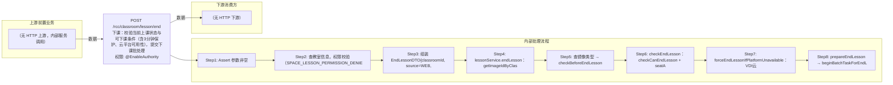

# POST /rcc/classroom/lesson/end

> 下课：校验当前上课状态与可下课条件（含3分钟保护、云平台可用性），提交下课批处理任务 ｜ @EnableAuthority ｜ async_batch

## 依赖关系全景图

## 接口基本信息

| 项目 | 内容 |
|---|---|
| URL | /rcc/classroom/lesson/end |
| Controller | RccClassroomLessonController |
| 方法名 | endLesson |
| 权限注解 | @EnableAuthority |
| 执行方式 | async_batch |
| 业务含义 | 下课：校验当前上课状态与可下课条件（含3分钟保护、云平台可用性），提交下课批处理任务 |

## 入参详情

### EndLessonWebRequest

| 参数名 | 类型 | 必填 | 约束 | 说明 |
|---|---|---|---|---|
| classroomId | UUID | 是 | @NotNull 非空 | 教室ID |

## 出参详情

| 返回类型 | DefaultWebResponse<BatchTaskSubmitResult> |
|---|---|

| 字段 | 类型 | 说明 |
|---|---|---|
| taskId | UUID | 下课批处理任务ID |

## 上游前置业务

> 本接口上游为服务端内部调用（非 HTTP 端点）：
> - 
## 内部处理流程

### 批量处理器：LessonFactory按镜像类型创建的下课批处理Handler

| 步骤 | 说明 |
|---|---|
| 1 | 逐座位关闭桌面/终端，汇总成功与失败 |

### 处理流程

1. Assert 参数非空
2. 查教室信息，权限校验（SPACE_LESSON_PERMISSION_DENIED）
3. 组装 EndLessonDTO{classroomId, source=WEB, closeTerminal=false}
4. lessonService.endLesson：getImageIdByClassroomId 无当前镜像抛 RCDC_RCC_CLASSROOM_ENDING_CLASS_FAIL_DESC_FOR_CLASSROOM_IMAGE_NOT_IN_CLASS
5. 查镜像类型 → checkBeforeEndLesson
6. checkEndLesson：checkCanEndLesson + seatAPI.checkCanEndLesson + 无座位强制下课 + 3分钟保护校验
7. forceEndLessonIfPlatformUnavailable：VDI云平台不可用时校验 validForForceDelete 后本地强制下课并抛 RCDC_RCC_CLASSROOM_FORCE_ENDING_CLASS_DESC_FOR_PLATFORM_UNAVAILABLE
8. prepareEndLesson → beginBatchTaskForEndLesson 提交下课批处理；updateEndLessonStatisticsLessonTaskId

## 下游消费方

（本接口数据主要被自身/关联接口消费，或经 SPI 通知）
## 接口参数约束分析

| 层级 | 参数 | 规则 | 失败结果 |
|---|---|---|---|
| request | classroomId | @NotNull 非空 | webmvc 参数校验异常 |
| business | classroomId | 教室必须处于上课状态且有当前镜像 | rcdc_rcc_classroom_ending_class_fail_desc_for_classroom_image_not_in_class |
| business | classroomId | 上课时长不足3分钟不允许下课 | checkIsTimeToEndLesson 抛出异常 |
| business | classroomId | 教室无座位时强制下课 | rcdc_rcc_classroom_ending_class_force_desc_for_classroom_no_seat |
| business | platformId | VDI云平台不可用时需允许强制删除 | rcdc_rcc_classroom_validate_force_ending_class_desc_for_platform_unavailable_* |

## 参数取值策略

| 参数 | 策略 | 说明 |
|---|---|---|
| classroomId | user_input/from_query | 按业务构造 |

## 成功/失败断言基准

### 成功场景

| 场景 | 断言点 |
|---|---|
| 正常在课且座位存在 | $.status==SUCCESS && $.content.taskId 非空（Builder.success(BatchTaskSubmitResult)） |

### 失败场景

| 场景 | 触发条件 | 断言点 |
|---|---|---|
| 未在上课 | 教室无当前上课镜像 | $.status==ERROR && $.msgKey==rcdc_rcc_classroom_ending_class_fail_desc_for_classroom_image_not_in_class |
| 无座位教室 | getSeatInfoList 为空 | $.status==ERROR && $.msgKey==rcdc_rcc_classroom_ending_class_force_desc_for_classroom_no_seat（本地直接下课 endLessonWithoutSeat） |
| 云平台不可用且禁止强制删除 | validForForceDelete 失败 | $.status==ERROR && $.msgKey==rcdc_rcc_classroom_validate_force_ending_class_desc_for_platform_unavailable_server |
| 上课时间过短 | IN_CLASS 且 source 为 WEB 且不足3分钟 | $.status==ERROR && $.msgKey==rcdc_classroom_end_lessoon_limit_time |

## 环境清理机制

| 接口 | 说明 |
|---|---|
| 本接口创建的资源 | 通过对应 delete 接口清理 |

## 前置状态和幂等性标注

| 维度 | 结论 |
|---|---|
| 幂等性 | medium |
| 说明 | 重复下课因当前镜像不存在或不在上课状态被拒绝；正常路径为一次性操作 |
