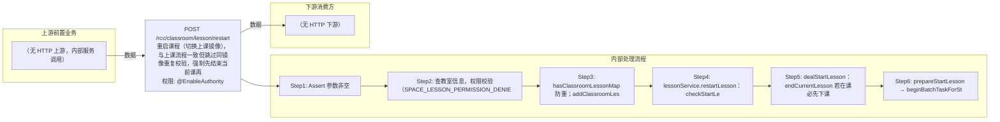

# POST /rcc/classroom/lesson/restart

> 重启课程（切换上课镜像），与上课流程一致但跳过同镜像重复校验，强制先结束当前课再上课 ｜ @EnableAuthority ｜ async_batch

## 依赖关系全景图

## 接口基本信息

| 项目 | 内容 |
|---|---|
| URL | /rcc/classroom/lesson/restart |
| Controller | RccClassroomLessonController |
| 方法名 | restartLesson |
| 权限注解 | @EnableAuthority |
| 执行方式 | async_batch |
| 业务含义 | 重启课程（切换上课镜像），与上课流程一致但跳过同镜像重复校验，强制先结束当前课再上课 |

## 入参详情

### StartLessonWebRequest

| 参数名 | 类型 | 必填 | 约束 | 说明 |
|---|---|---|---|---|
| classroomId | UUID | 是 | @NotNull 非空 | 教室ID |
| imageId | UUID | 是 | @NotNull 非空 | 新镜像模板ID |

## 出参详情

| 返回类型 | DefaultWebResponse<BatchTaskSubmitResult> |
|---|---|

| 字段 | 类型 | 说明 |
|---|---|---|
| taskId | UUID | 重启课程批处理任务ID |

## 上游前置业务

> 本接口上游为服务端内部调用（非 HTTP 端点）：
> - 
## 内部处理流程

### 批量处理器：LessonFactory按镜像类型创建的上课批处理Handler

| 步骤 | 说明 |
|---|---|
| 1 | 逐座位启动桌面并汇总结果 |

### 处理流程

1. Assert 参数非空
2. 查教室信息，权限校验（SPACE_LESSON_PERMISSION_DENIED）
3. hasClassroomLessonMap 防重；addClassroomLessonMap 加锁
4. lessonService.restartLesson：checkStartLessonStatus(needCheckInLesson=false)（不校验同镜像重复）
5. dealStartLesson：endCurrentLesson 若在课必先下课并 waitEndLesson 等待下课任务完成
6. prepareStartLesson → beginBatchTaskForStartLesson 提交上课任务；finally 释放锁

## 下游消费方

（本接口数据主要被自身/关联接口消费，或经 SPI 通知）
## 接口参数约束分析

| 层级 | 参数 | 规则 | 失败结果 |
|---|---|---|---|
| request | classroomId/imageId | @NotNull 非空 | webmvc 参数校验异常 |
| business | classroomId | 教室必须存在且未在准备中 | rcdc_rcc_classroom_starting_class_fail_desc_for_no_classroom / _for_repeat_starting |
| business | terminalGroupId | 管理员需具备教室终端组数据权限 | space_lesson_permission_denied |

## 参数取值策略

| 参数 | 策略 | 说明 |
|---|---|---|
| classroomId | user_input/from_query | 按业务构造 |
| imageId | user_input/from_query | 按业务构造 |

## 成功/失败断言基准

### 成功场景

| 场景 | 断言点 |
|---|---|
| 教室在课或空闲 | $.status==SUCCESS && $.content.taskId 非空（Builder.success(BatchTaskSubmitResult)） |

### 失败场景

| 场景 | 触发条件 | 断言点 |
|---|---|---|
| 正在准备上课中重启 | classroomState==STARTING_CLASS | $.status==ERROR && $.msgKey==rcdc_rcc_classroom_starting_class_fail_desc_for_repeat_starting |
| 无权限 | 终端组权限不匹配 | $.status==ERROR && $.msgKey==space_lesson_permission_denied |

## 环境清理机制

| 接口 | 说明 |
|---|---|
| 无对应 HTTP 清理接口 | finally 释放上课执行锁为服务端内部动作，无 HTTP 清理接口 |

## 前置状态和幂等性标注

| 维度 | 结论 |
|---|---|
| 幂等性 | low |
| 说明 | 语义为切课：强制先下课再上课，重复提交会重复执行下课-上课全流程 |
