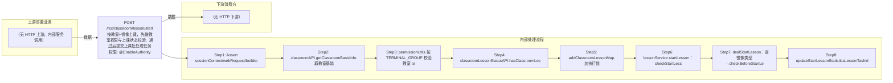

# POST /rcc/classroom/lesson/start

> 按教室+镜像上课，先做教室权限与上课状态校验，通过后提交上课批处理任务 ｜ @EnableAuthority ｜ async_batch

## 依赖关系全景图

## 接口基本信息

| 项目 | 内容 |
|---|---|
| URL | /rcc/classroom/lesson/start |
| Controller | RccClassroomLessonController |
| 方法名 | startLesson |
| 权限注解 | @EnableAuthority |
| 执行方式 | async_batch |
| 业务含义 | 按教室+镜像上课，先做教室权限与上课状态校验，通过后提交上课批处理任务 |

## 入参详情

### StartLessonWebRequest

| 参数名 | 类型 | 必填 | 约束 | 说明 |
|---|---|---|---|---|
| classroomId | UUID | 是 | @NotNull 非空 | 教室ID |
| imageId | UUID | 是 | @NotNull 非空 | 上课使用的镜像模板ID |

## 出参详情

| 返回类型 | DefaultWebResponse<BatchTaskSubmitResult> |
|---|---|

| 字段 | 类型 | 说明 |
|---|---|---|
| taskId | UUID | 提交的上课批处理任务ID |

## 上游前置业务

> 本接口上游为服务端内部调用（非 HTTP 端点）：
> - 
## 内部处理流程

### 批量处理器：LessonFactory按镜像类型创建的批处理Handler（VDI/VOI上课Handler）

| 步骤 | 说明 |
|---|---|
| 1 | beginBatchTaskForStartLesson 逐座位启动桌面/下发开机指令，汇总成功与失败 |

### 处理流程

1. Assert sessionContext/webRequest/builder 非空
2. classroomAPI.getClassroomBasicInfo 取教室基础信息
3. permissionUtils 按 TERMINAL_GROUP 校验教室 terminalGroupId 权限，不通过返回 SPACE_LESSON_PERMISSION_DENIED
4. classroomLessonStatusAPI.hasClassroomLessonMap 防重检查，重复抛异常并记录 RCDC_RCC_CLASSROOM_STARTING_CLASS_FAIL_DESC 审计
5. addClassroomLessonMap 加执行锁
6. lessonService.startLesson：checkStartLessonStatus(needCheckInLesson=true)（无教室/重复启动中/同镜像已上课均拒绝）
7. dealStartLesson：查镜像类型→checkBeforeStartLesson→endCurrentLesson(若在课先下课并等待结束)→prepareStartLesson→beginBatchTaskForStartLesson
8. updateStartLessonStatisticsLessonTaskId 回写任务ID；finally removeClassroomLessonMap 释放锁

## 下游消费方

（本接口数据主要被自身/关联接口消费，或经 SPI 通知）
## 接口参数约束分析

| 层级 | 参数 | 规则 | 失败结果 |
|---|---|---|---|
| request | classroomId/imageId | @NotNull 非空 | webmvc 参数校验异常 |
| business | classroomId | 教室必须存在 | rcdc_rcc_classroom_starting_class_fail_desc_for_no_classroom |
| business | classroomId | 教室不能处于准备上课中 | rcdc_rcc_classroom_starting_class_fail_desc_for_repeat_starting |
| business | imageId | 已在课且镜像相同则不允许重复上课 | rcdc_rcc_classroom_starting_class_fail_desc_for_the_same |
| business | terminalGroupId | 管理员需具备教室终端组数据权限 | space_lesson_permission_denied |
| business | imageId | 镜像状态/类型需允许上课 | rcdc_rcc_classroom_start_lesson_image_state_not_allowed / ..._for_no_image 等 |

## 参数取值策略

| 参数 | 策略 | 说明 |
|---|---|---|
| classroomId | user_input/from_query | 按业务构造 |
| imageId | user_input/from_query | 按业务构造 |

## 成功/失败断言基准

> ⚠️ 断言以 HTTP 响应为准（status + msgKey / BatchTaskSubmitResult），非服务端审计日志。

### 成功场景

| 场景 | 断言点 |
|---|---|
| 权限通过且教室空闲 | $.status==SUCCESS && $.content.taskId 非空（Builder.success(BatchTaskSubmitResult)） |
| 教室正在上课但镜像不同（切课） | $.status==SUCCESS && $.content.taskId 非空（自动先下课再提交上课任务） |

### 失败场景

| 场景 | 触发条件 | 断言点 |
|---|---|---|
| 无终端组权限 | 管理员不在全组权限且无对应终端组权限 | $.status==ERROR && $.msgKey==space_lesson_permission_denied |
| 重复上课请求 | 教室已处于STARTING_CLASS或同镜像IN_CLASS | $.status==ERROR && $.msgKey==rcdc_rcc_classroom_starting_class_fail_desc_for_repeat_starting（系列） |
| 镜像非法 | imageId不存在/镜像隐藏/未分配 | $.status==ERROR && $.msgKey==rcdc_rcc_classroom_start_lesson_image_state_not_allowed |
## 环境清理机制

| 接口 | 说明 |
|---|---|
| 无对应 HTTP 清理接口 | finally 释放上课执行锁为服务端内部动作，无 HTTP 清理接口 |

## 前置状态和幂等性标注

| 维度 | 结论 |
|---|---|
| 幂等性 | medium |
| 说明 | 通过 hasClassroomLessonMap 锁串行化；重复同镜像上课被拒绝，不同镜像视为切课（先下课再上课），非严格幂等 |
